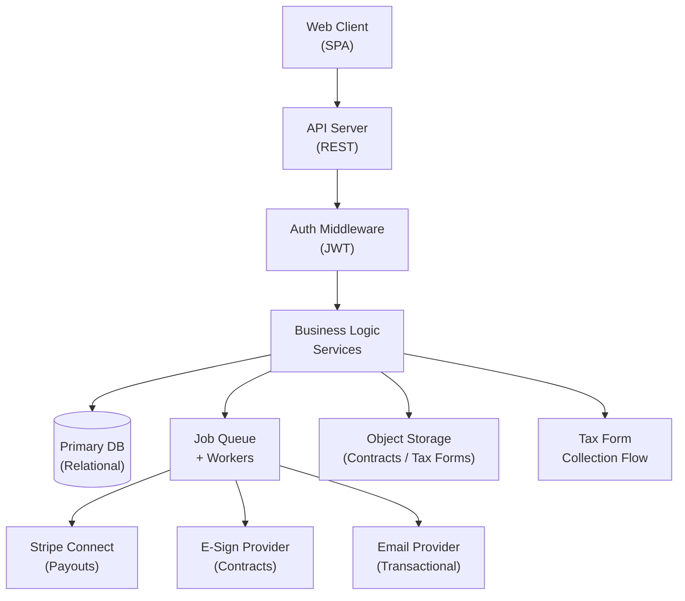
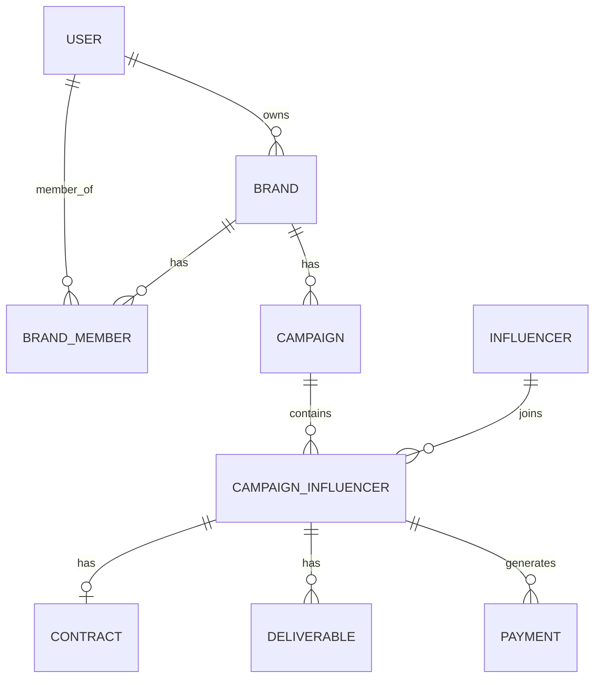

# Architecture Example — PayFlow (Influencer Payments SaaS)

> Continuing from the product-manager-prd example. PRD delivered a Green Light validated idea
> for a B2B SaaS automating influencer payments, contracts, and tax compliance for e-commerce brands.

---

## 🏗️ System Architecture Overview



A brand manager makes a request from the SPA to the REST API. The JWT middleware validates
identity and extracts role context before the request reaches business logic. Synchronous
operations (CRUD, reads, status updates) resolve immediately. Any operation involving external
providers (payment triggers, contract sends, email notifications) is handed off to the job queue
and processed asynchronously. Workers consume queue jobs, interact with external APIs, and
update DB state. The client polls or receives webhook-driven status updates.

---

## 🗂️ Core Domain Model

```
Entity: User
| Field          | Type        | Notes                             |
|----------------|-------------|-----------------------------------|
| id             | UUID        | PK                                |
| email          | String      | unique, indexed                   |
| role           | Enum        | brand_owner | team_member | influencer |
| created_at     | Timestamp   | auto                              |
| deleted_at     | Timestamp   | soft delete                       |

Entity: Brand
| Field          | Type        | Notes                             |
|----------------|-------------|-----------------------------------|
| id             | UUID        | PK                                |
| name           | String      | indexed                           |
| owner_id       | UUID        | FK → User                         |
| plan_tier      | Enum        | free | starter | pro               |
| created_at     | Timestamp   | auto                              |

Relationships: Brand 1:N Campaign, Brand 1:N BrandMember

Entity: Campaign
| Field          | Type        | Notes                             |
|----------------|-------------|-----------------------------------|
| id             | UUID        | PK                                |
| brand_id       | UUID        | FK → Brand, indexed               |
| name           | String      |                                   |
| status         | Enum        | draft | active | completed | archived |
| budget         | Decimal     |                                   |
| start_date     | Date        |                                   |
| end_date       | Date        |                                   |

Relationships: Campaign 1:N CampaignInfluencer

Entity: Influencer
| Field              | Type        | Notes                          |
|--------------------|-------------|--------------------------------|
| id                 | UUID        | PK                             |
| user_id            | UUID        | FK → User, nullable (pre-invite)|
| email              | String      | indexed                        |
| payment_account_id | String      | Stripe Connect account ID      |
| tax_form_status    | Enum        | pending | submitted | verified  |
| w9_file_key        | String      | Object storage key             |

Entity: CampaignInfluencer (join table)
| Field          | Type        | Notes                             |
|----------------|-------------|-----------------------------------|
| id             | UUID        | PK                                |
| campaign_id    | UUID        | FK → Campaign                     |
| influencer_id  | UUID        | FK → Influencer                   |
| fee            | Decimal     | agreed payment amount             |
| status         | Enum        | invited | active | completed        |

Relationships: CampaignInfluencer 1:1 Contract, 1:N Deliverable, 1:N Payment

Entity: Contract
| Field          | Type        | Notes                             |
|----------------|-------------|-----------------------------------|
| id             | UUID        | PK                                |
| ci_id          | UUID        | FK → CampaignInfluencer           |
| file_key       | String      | Object storage key (signed PDF)   |
| status         | Enum        | draft | sent | signed | expired    |
| sent_at        | Timestamp   |                                   |
| signed_at      | Timestamp   |                                   |
| esign_ref      | String      | External e-sign provider reference|

Entity: Deliverable
| Field          | Type        | Notes                             |
|----------------|-------------|-----------------------------------|
| id             | UUID        | PK                                |
| ci_id          | UUID        | FK → CampaignInfluencer           |
| description    | String      |                                   |
| due_date       | Date        |                                   |
| status         | Enum        | pending | submitted | approved | rejected |
| submission_url | String      | Link to post/content              |
| approved_at    | Timestamp   |                                   |

Entity: Payment
| Field              | Type        | Notes                          |
|--------------------|-------------|--------------------------------|
| id                 | UUID        | PK                             |
| ci_id              | UUID        | FK → CampaignInfluencer        |
| amount             | Decimal     |                                |
| status             | Enum        | pending | processing | paid | failed |
| stripe_transfer_id | String      | External reference             |
| idempotency_key    | String      | unique — prevents duplicate pay|
| created_at         | Timestamp   |                                |
| paid_at            | Timestamp   |                                |
```

---

## 🗄️ Database Schema Design



**Schema decisions:**
- `(campaign_id, influencer_id)` composite unique index on CampaignInfluencer — prevents duplicate assignments
- `idempotency_key` on Payment is unique — critical for preventing duplicate Stripe transfers
- Soft delete (`deleted_at`) on User and Brand only — hard delete on operational records (Payments never deleted)
- Payment and Contract get an append-only audit log table — no in-place status updates for financial records
- Deliverable.status uses an enum not a boolean — allows `rejected` state without a separate rejection table
- No partitioning needed at v1 scale; add to Payment table when rows exceed ~10M

---

## 🔌 API Contract Definitions

### Auth
```
POST /api/auth/register
  Body: { email, password, role: "brand_owner" | "influencer" }
  Returns: { user, access_token, refresh_token }

POST /api/auth/login
  Body: { email, password }
  Returns: { user, access_token, refresh_token }

POST /api/auth/refresh
  Body: { refresh_token }
  Returns: { access_token }
```

### Campaigns
```
GET /api/campaigns
  Auth: required (BrandOwner | TeamMember)
  Returns: Campaign[] for caller's brand

POST /api/campaigns
  Auth: required (BrandOwner)
  Body: { name, budget, start_date, end_date }
  Returns: Campaign
  Notes: Created in DRAFT status

PATCH /api/campaigns/:id
  Auth: required (BrandOwner)
  Body: Partial<Campaign>
  Returns: Campaign

POST /api/campaigns/:id/activate
  Auth: required (BrandOwner)
  Returns: Campaign (status → active)
  Errors: 422 if no influencers assigned
```

### Influencers
```
POST /api/influencers/invite
  Auth: required (BrandOwner)
  Body: { email, campaign_id, fee }
  Returns: { influencer, campaign_influencer }
  Side effects: Queues onboarding email to influencer

GET /api/influencers/:id
  Auth: required
  Returns: Influencer (scoped to caller's brand)
```

### Contracts
```
POST /api/contracts
  Auth: required (BrandOwner)
  Body: { ci_id, template_id? }
  Returns: Contract (status: draft)
  Side effects: Generates PDF, stores in object storage

POST /api/contracts/:id/send
  Auth: required (BrandOwner)
  Returns: Contract (status: sent)
  Side effects: Queues e-sign send job

POST /api/contracts/:id/sign  (influencer-facing)
  Auth: required (Influencer)
  Returns: Contract (status: signed)
  Errors: 403 if not the contract's influencer
```

### Deliverables
```
POST /api/deliverables
  Auth: required (BrandOwner)
  Body: { ci_id, description, due_date }
  Returns: Deliverable

POST /api/deliverables/:id/submit  (influencer-facing)
  Auth: required (Influencer)
  Body: { submission_url }
  Returns: Deliverable (status: submitted)

POST /api/deliverables/:id/approve
  Auth: required (BrandOwner | TeamMember)
  Returns: Deliverable (status: approved)
  Side effects: If ci.fee > 0 and no pending payment, queues payment job
```

### Payments
```
GET /api/payments
  Auth: required (BrandOwner)
  Query: { campaign_id?, influencer_id?, status? }
  Returns: Payment[]

POST /api/payments/trigger
  Auth: required (BrandOwner)
  Body: { ci_id }
  Returns: Payment (status: pending)
  Side effects: Queues Stripe payout job
  Notes: Idempotent — returns existing pending payment if one exists

GET /api/payments/:id
  Auth: required
  Returns: Payment
```

### Webhooks (inbound)
```
POST /api/webhooks/stripe
  Auth: Stripe-Signature header verification
  Handles: transfer.paid, transfer.failed
  Notes: Idempotent — deduplicate by stripe_transfer_id

POST /api/webhooks/esign
  Auth: Provider signature verification
  Handles: contract.signed, contract.declined
```

---

## ⚙️ Background Jobs & Async Flows

```
Job: SendOnboardingEmail
  Trigger: POST /api/influencers/invite
  Input: influencer_id, campaign_id
  Steps:
    1. Fetch influencer + campaign details
    2. Generate onboarding token (TTL: 7 days)
    3. Render and send email with onboarding link
    4. Update influencer.invite_sent_at
  Retry: 3x exponential backoff
  Failure: Log + alert brand dashboard

Job: SendContractForSigning
  Trigger: POST /api/contracts/:id/send
  Input: contract_id
  Steps:
    1. Fetch contract PDF from object storage
    2. Submit to e-sign provider API
    3. Store esign_ref on Contract
    4. Update contract.status → sent, sent_at
  Retry: 3x
  Failure: Revert contract status to draft; surface error to brand

Job: ProcessPayout
  Trigger: POST /api/payments/trigger or deliverable approval
  Input: payment_id
  Steps:
    1. Fetch payment + influencer.payment_account_id
    2. Verify influencer has completed Stripe Connect onboarding
    3. Create Stripe Transfer with idempotency_key = payment.idempotency_key
    4. Update payment.stripe_transfer_id, status → processing
    5. Final status updated via Stripe webhook
  Retry: 3x — ONLY on network errors, not on Stripe rejections
  Failure: Set payment.status → failed; notify brand

Job: GenerateTaxReport
  Trigger: Scheduled — annually (Jan 1) or on-demand export
  Input: brand_id, year
  Steps:
    1. Aggregate all paid payments by influencer for the year
    2. Filter influencers where total >= $600 (1099 threshold)
    3. Generate CSV/PDF report
    4. Store in object storage, email download link to brand
```

---

## 🔐 Auth & Authorization Model

**Mechanism**: Stateless JWT (access token, short TTL 15min) + refresh token (long TTL, stored
in DB for revocation). No session state on server.

**Roles**:
- `brand_owner` — full control over their brand's resources
- `team_member` — read + limited write, scoped to their brand
- `influencer` — read + action on their own records only

**Permission Matrix**:
```
| Resource          | brand_owner | team_member   | influencer       |
|-------------------|-------------|---------------|------------------|
| Campaign          | CRUD        | Read, Update  | Read (assigned)  |
| Influencer        | CRUD        | Read          | Read (self)      |
| Contract          | CRUD        | Read          | Read+Sign (own)  |
| Deliverable       | CRUD        | Read+Approve  | Submit (own)     |
| Payment           | Create+Read | Read          | Read (own)       |
| Tax Forms         | Read        | —             | Upload (own)     |
```

**Row-level scoping**: All queries are scoped by `brand_id` extracted from JWT claims.
An influencer can only access records where `influencer_id = jwt.sub`.

---

## 🪜 Step-by-Step Implementation Plan

### Phase 1 — Core Foundation (Weeks 1–6)

```
Step 1: Repo scaffold + CI (Day 1–2)
  - Init monorepo (API + Web client)
  - Configure linter, formatter, test runner
  - CI pipeline: lint + unit tests on PR
  - Deliverable: green CI on empty project

Step 2: DB setup + core schema (Day 2–3)
  - Configure migration tooling
  - Implement migrations: User, Brand, Campaign, Influencer, CampaignInfluencer
  - Seed script with test data
  - Deliverable: local DB running, seed data queryable

Step 3: Auth layer (Day 3–5)
  - Register + login endpoints
  - JWT issuance + refresh token flow
  - Auth middleware (guard + role extractor)
  - Deliverable: full auth flow testable via curl

Step 4: Brand + Campaign CRUD (Day 5–7)
  - All campaign endpoints (GET, POST, PATCH, activate)
  - Brand scoping middleware
  - Unit tests for scoping logic
  - Deliverable: campaign lifecycle works end-to-end

Step 5: Influencer invite flow (Day 7–9)
  - Invite endpoint + CampaignInfluencer creation
  - Onboarding token generation
  - Stub email job (log to console, no real send yet)
  - Deliverable: invite creates DB records correctly

Step 6: Contract generation + object storage (Day 9–12)
  - PDF generation from template
  - Object storage integration (upload/download signed URLs)
  - Contract CRUD endpoints
  - Deliverable: contract PDF created and retrievable

Step 7: E-sign integration (Day 12–16)
  - E-sign provider API integration
  - Send contract job (real send)
  - Inbound webhook handler (signed/declined events)
  - Deliverable: full contract sign flow works in staging

Step 8: Stripe Connect + payout flow (Day 16–22)
  - Stripe Connect onboarding link generation
  - ProcessPayout job (real transfers)
  - Stripe webhook handler
  - Idempotency key implementation
  - Deliverable: end-to-end payout in Stripe test mode

Step 9: W-9 / tax form collection (Day 22–25)
  - Tax form upload endpoint (influencer-facing)
  - Object storage for tax docs
  - Status tracking on Influencer
  - Deliverable: influencer can upload W-9, brand sees status

Step 10: Dashboard API + Web MVP (Day 25–30)
  - Campaign dashboard endpoint (aggregate statuses)
  - Basic web UI: campaigns list, influencer status, payment status
  - Deliverable: brand can see full campaign state in browser
```

### Phase 2 — Growth (Weeks 7–14)

```
Step 11: Deliverable tracking
  - Deliverable CRUD endpoints
  - Submit + approve flow
  - Auto-trigger payment on approval

Step 12: Payment history + receipts
  - Payment list endpoint with filters
  - PDF receipt generation
  - Email receipt on payment success

Step 13: CSV export
  - Payment export by campaign / date range
  - Tax report generation job (manual trigger)

Step 14: Automated payment on deliverable approval
  - Wire deliverable.approve → payment trigger job
  - Idempotency guard (no double-trigger)

Step 15: Real email sending
  - Replace console stubs with real email provider
  - Templates: invite, contract sent, payment sent, payment failed
```

### Phase 3 — Scale (Weeks 15+)

```
Step 16: Multi-user brand accounts
  - BrandMember model + invite flow
  - team_member role enforcement
  - Permission matrix enforcement across all routes

Step 17: Influencer portal
  - Separate auth context for influencers
  - Influencer-facing views: campaigns, contracts, payments, tax status

Step 18: Custom contract templates
  - Template editor (brand-facing)
  - Template versioning

Step 19: Observability + alerting
  - Structured logging on all jobs
  - Error alerting on payment failures
  - Performance monitoring on critical paths
```

---

## 🔗 Integration Architecture

```
Integration: Stripe Connect
  Role: Payout processing to influencer bank accounts
  Pattern: REST API outbound (transfers) + webhook inbound (transfer events)
  Key concerns:
    - Store connected_account_id per Influencer after onboarding
    - All transfer calls use idempotency_key = payment.idempotency_key
    - Verify Stripe-Signature on all inbound webhooks
    - Apply for platform access before dev starts (1–2 week approval)
  Failure mode: Queue retry on network error only; surface failed status to brand dashboard

Integration: E-Sign Provider (HelloSign / DocuSign)
  Role: Contract send + legally binding signature capture
  Pattern: REST API outbound + webhook inbound (signed/declined events)
  Key concerns:
    - Store esign_ref (external envelope ID) on Contract for event correlation
    - Signed document PDF must be fetched and stored in own object storage (don't rely on provider retention)
    - Verify provider webhook signature
  Failure mode: Revert contract to draft; surface error to brand with retry CTA

Integration: Email Provider (Postmark / SendGrid / SES)
  Role: All transactional emails (invites, contracts, payment confirmations)
  Pattern: REST API outbound via async job only — never inline in request cycle
  Key concerns:
    - Use dedicated transactional sending domain (not marketing domain)
    - Track bounces + blocks; disable influencers with hard bounces
  Failure mode: Retry 3x; log failure; don't surface to end user for non-critical emails

Integration: Object Storage (S3-compatible)
  Role: Contract PDFs, signed documents, W-9/W-8 tax forms
  Pattern: Server-side upload (never direct browser upload for sensitive docs)
  Key concerns:
    - All files stored with private ACL; access via signed URLs (TTL: 15 min)
    - Tax forms in separate bucket with stricter access policy
    - Never store file URLs in DB — store keys and generate signed URLs at read time
  Failure mode: Hard fail with 500 — do not proceed if file cannot be stored
```

---

## 📐 Architecture Decision Records (ADRs)

```
ADR-001: Async-only external API calls
  Decision: All calls to Stripe, e-sign, and email providers happen in background jobs only
  Alternatives: Inline in request cycle
  Rationale: External APIs introduce latency and failure modes that degrade UX; async processing
             decouples product reliability from third-party uptime
  Consequences: Payment/contract status is eventual; UI must handle pending states

ADR-002: Idempotency keys on all payment operations
  Decision: Every Payment record has a unique idempotency_key used in Stripe Transfer calls
  Alternatives: Rely on Stripe's deduplication alone
  Rationale: PRD explicitly flags duplicate payment risk; defense in depth protects against
             queue retries, double-submits, and worker crashes mid-job
  Consequences: Payment creation must generate key before enqueueing job

ADR-003: Server-side file handling for sensitive documents
  Decision: All contract PDFs and tax forms are uploaded server-side, never via direct browser upload
  Alternatives: Presigned URL direct upload from browser
  Rationale: Tax documents and signed contracts require audit trail and access control;
             server-side handling ensures consistent ACL enforcement
  Consequences: Slightly higher server bandwidth cost; acceptable at this scale

ADR-004: Row-level brand scoping via middleware
  Decision: brand_id is extracted from JWT and injected into all DB queries via middleware
  Alternatives: Per-route manual scoping
  Rationale: Prevents data leakage between brands; centralizes the security boundary;
             failure is a test failure, not a prod incident
  Consequences: All queries must accept brand_id context; slightly less flexible for admin tools

ADR-005: Append-only audit log for Payment and Contract
  Decision: Payment and Contract status changes are logged to an audit table, not overwritten
  Alternatives: In-place status updates only
  Rationale: Financial and legal records require audit trail for compliance and dispute resolution
  Consequences: Additional table + write on every status change; worth it
```

---

## ⚠️ Technical Risks & Open Questions

```
Risk: Stripe Connect onboarding drop-off
  Impact: Influencers who don't complete onboarding block payment flow
  Mitigation: Track onboarding_status on Influencer; gate payment trigger on completion;
              send automated reminders via email job

Risk: Duplicate payouts from job retry
  Impact: Influencer paid twice — catastrophic trust failure
  Mitigation: Idempotency key on Payment (ADR-002); deduplication check before Stripe call;
              unique constraint on stripe_transfer_id

Risk: E-sign webhook delivery failure
  Impact: Contract stays in "sent" status permanently even after signing
  Mitigation: Polling fallback job — check e-sign API for stale "sent" contracts every 24h;
              manual override endpoint for support

Open question: Do influencers need a full portal in Phase 1, or is email-based flow sufficient?
  Blocks: Influencer auth context (Step 17)
  Decision needed by: Before Phase 2 planning

Open question: Is the $600 1099 threshold the only compliance concern, or do international
  influencers require VAT/withholding handling?
  Blocks: Tax report design
  Decision needed by: Before Step 9
```
