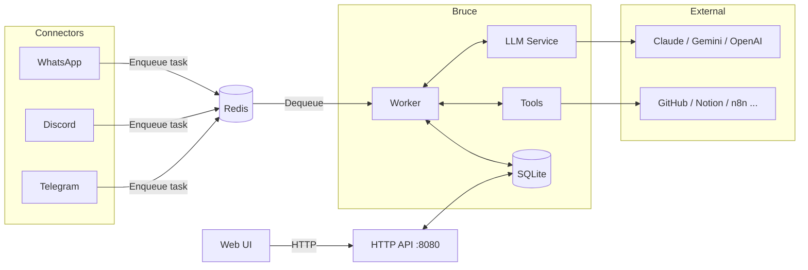
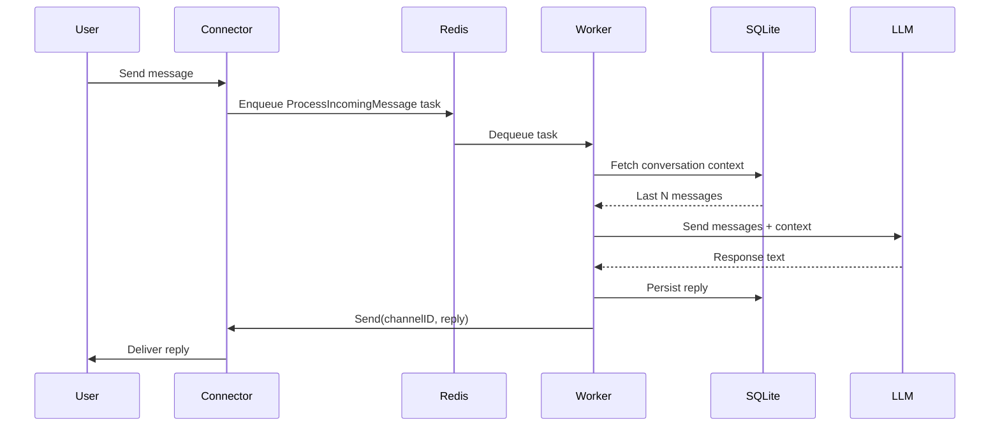

https://media.demitrius-quadros.com/generated/reels/ready/# Bruce

**A personal AI assistant that lives in your messaging apps.**


<p align="center">
  
</p>

---

## What is Bruce?

Bruce is a self-hosted AI assistant you talk to through the apps you already use — WhatsApp, Discord, or Telegram. Send it a message on your phone and get a reply powered by Claude, Gemini, or OpenAI. No new app to install, no subscription to manage, no data leaving your infrastructure unless you decide it does.

Under the hood, Bruce is a single Go binary. It connects to your messaging platforms, queues incoming messages through Redis, processes them with an LLM of your choice, and stores everything in a local SQLite database. The entire conversation history — sessions, messages, config — lives on your machine. You own it.

The web dashboard at `http://localhost:8080` lets you inspect sessions, monitor logs, and manage settings without touching config files. Asynqmon at `/monitor` gives you a live view of the task queue. 

---

## Features

| Category | Details |
|---|---|
| **Connectors** | WhatsApp (whatsmeow), Discord (discordgo), Telegram (long-polling) |
| **LLM Providers** | Anthropic Claude, Google Gemini, OpenAI GPT — switchable via config |
| **Tools** | 11 built-in tools: bash, gmail, calendar, docs, github, git_local, files, notion, trello, http_client, n8n |
| **Storage** | SQLite (WAL mode) — no Postgres, no cloud DB required |
| **UI** | Vanilla JS web dashboard — sessions, logs, connectors, settings tabs |
| **Deployment** | Single binary or Docker Compose — embed all assets, no separate static server |
| **Observability** | Asynqmon task monitor, structured logs |

---

## Architecture Overview

The diagram below shows how the main components relate at runtime.



### End-to-end message flow



---
## WARNING
- The whatsapp connector and telegram connector are not tested yet
## Quick Start

### Option 1 — Local (go run)

```bash
git clone https://github.com/DemitriusQuadros/bruce
cd bruce
cp config.example.yml config.yml
# Edit config.yml — add your LLM API key and enable a connector
go run cmd/bruce/main.go
```

Requires Go 1.23+ and a running Redis instance. The server listens on port `8080`.

### Option 2 — Docker Compose

```bash
cp config.example.yml config.yml
# Edit config.yml
docker compose up -d
```

The Docker Compose stack starts Redis and Bruce together. Bruce is accessible on port `9090` (mapped from container port `8080`). Logs: `docker compose logs -f`.

> **CGO required:** Bruce uses `mattn/go-sqlite3`, which requires CGO. Pre-built binaries are CGO-enabled. If building from source, ensure `CGO_ENABLED=1` (the default on most platforms).

---

## Configuration

Copy `config.example.yml` to `config.yml` and set at minimum an LLM API key and one connector:

```yaml
claude:
  api_key: "sk-ant-..."
  model: "claude-opus-4-6"

llm:
  provider: "claude"

connectors:
  telegram:
    enabled: true
    bot_token: "your-telegram-bot-token"
```

See `config.example.yml` for the full schema including all tools, Google OAuth, and n8n integration.

---

## Connectors

Each connector is enabled independently. Enable one to get started; enable all three to receive messages from any platform simultaneously.

### WhatsApp

Connects via the WhatsApp multi-device protocol. No Meta Business account required — Bruce pairs as a linked device on your personal account.

```yaml
connectors:
  whatsapp:
    enabled: true
    device_store_dsn: "./data/whatsapp.db"
```

On first start, Bruce prints a QR code to the terminal. Scan it in WhatsApp under Settings → Linked Devices. See [docs/connectors/whatsapp.md](docs/connectors/whatsapp.md) for the full setup guide.

### Discord

Connects as a Discord bot. Create a bot in the Developer Portal, copy the token, and invite the bot to a mutual server with the users who will message it.

```yaml
connectors:
  discord:
    enabled: true
    bot_token: "your-discord-bot-token"
```

See [docs/connectors/discord.md](docs/connectors/discord.md) for bot creation steps and chunking behaviour.

### Telegram

Connects via HTTP long-polling. Get a token from @BotFather in Telegram — no portal, no OAuth, no public IP required.

```yaml
connectors:
  telegram:
    enabled: true
    bot_token: "your-telegram-bot-token"
```

See [docs/connectors/telegram.md](docs/connectors/telegram.md) for @BotFather setup, polling behaviour, and resilience details.

---

## Tools

Tools extend what Bruce can do beyond conversation. Each tool is opt-in — enable only what you need.

| Tool | What it does | Requires |
|---|---|---|
| `bash` | Execute shell commands in a sandboxed working directory | `tools.bash.enabled: true` |
| `gmail` | Read and send Gmail messages | Google OAuth (`google.oauth_client_id`) |
| `calendar` | Read and create Google Calendar events | Google OAuth (`google.oauth_client_id`) |
| `docs` | Read and write Google Docs | Google OAuth with documents scope |
| `github` | Manage issues, PRs, and repos via GitHub API | Personal access token |
| `git_local` | Run git commands on local repositories | `tools.git_local.enabled: true` |
| `files` | Read, write, and list files on the local filesystem | `tools.files.enabled: true` |
| `notion` | Query and update Notion pages and databases | Notion integration token |
| `trello` | Read and create Trello cards and lists | Trello API key + user token |
| `http_client` | Make arbitrary HTTP requests to external URLs | Enabled by default |
| `n8n` | Trigger n8n workflows and MCP tools | n8n base URL + API key |

Tool configuration lives under the `tools:` key in `config.yml`. See `config.example.yml` for all options.

---

## Web Dashboard

The dashboard at `http://localhost:8080` provides four tabs: **Connectors** (status and controls), **Sessions** (conversation list and history), **Logs** (live message log), and **Settings** (config key management).

The Asynq task monitor is available at `http://localhost:8080/monitor` — useful for inspecting queued and failed tasks.

API documentation is served at `http://localhost:8080/swagger/`.

---

## Development

```bash
go build ./...          # Compile — must produce zero errors
go test ./...           # Run all tests
go test -race ./...     # Run with race detector
go vet ./...            # Static analysis
gofmt -l .              # Check formatting (empty output = clean)
make test-frontend      # Playwright E2E tests for the web UI
```

Bruce uses `mattn/go-sqlite3`, which requires CGO. If you see `cgo: not found` errors, ensure your system has a C compiler (`gcc` or `clang`) installed and `CGO_ENABLED=1` is set in your environment.

---

## Spec-Driven Development (SDD) with Claude Code

Bruce ships with a 6-stage AI-assisted development pipeline built directly into Claude Code. Open this repository in Claude Code and you get six slash commands — one per stage — that take you from raw idea to deployed, tested feature without leaving your editor.

### The pipeline

```
/business-investor-validator → /product-manager-prd → /software-architect → /go-backend-dev → /frontend-specialist → /qa-specialist
```

| Stage | Command | Input | Output |
|---|---|---|---|
| 1 | `/business-investor-validator` | Raw idea | Investor-grade scorecard — market size, revenue model, moat, risks |
| 2 | `/product-manager-prd` | Validator output | Full PRD — personas, user stories, MVP scope, success metrics |
| 3 | `/software-architect` | PRD | Technical blueprint — system diagram, DB schema, API contracts, ADRs |
| 4 | `/go-backend-dev` | Blueprint | Go packages under `internal/` — handlers, repos, workers, tests |
| 5 | `/frontend-specialist` | Blueprint + API | Vanilla JS UI pages against the Go API on port 8080 |
| 6 | `/qa-specialist` | Spec files in `docs/specs/` | BDD E2E tests (Gherkin + godog) |

### How to use it

Each command is invoked with a description of what you want. The output of each stage feeds directly into the next.

**Stage 1 — Validate the idea**
```
/business-investor-validator I want to build a feature that lets Bruce proactively
alert users when a calendar event is starting in 10 minutes
```

**Stage 2 — Turn it into a PRD**
```
/product-manager-prd [paste the validator output here]
```

**Stage 3 — Get a technical blueprint**
```
/software-architect [paste the PRD here]
```

**Stage 4 — Implement the backend**
```
/go-backend-dev implement the watch-alerts feature from this blueprint: [paste blueprint]
```

**Stage 5 — Build the UI**
```
/frontend-specialist add a Watches tab to the dashboard per this spec: [paste spec]
```

**Stage 6 — Write the tests**
```
/qa-specialist generate BDD tests for docs/specs/30-watch-alerts.md
```

### What each agent knows

Every agent loads the full project context before it responds — architecture rules from `CLAUDE.md`, existing packages, the database schema, and prior specs in `docs/specs/`. You do not need to re-explain the stack at each stage. The agents enforce Bruce's conventions automatically: no FX, no GORM, no Postgres, manual DI in `main.go`.

### Skipping stages

You do not have to run every stage for every change. For a small bug fix, go straight to `/go-backend-dev`. For a UI tweak, go straight to `/frontend-specialist`. The pipeline is a guide, not a requirement.

See `CLAUDE.md` for the full architectural conventions and rules each agent enforces.

---

## Deployment

The provided `docker-compose.yml` is suitable for personal production use:

```bash
docker compose up -d
docker compose logs -f bruce
```

Bruce handles graceful shutdown on `SIGTERM`: the HTTP server stops accepting new requests, the Asynq worker finishes in-flight tasks, and SQLite is closed safely. Allow ~15 seconds for a clean shutdown before force-killing the container.

For single-machine deployments, run Bruce behind a reverse proxy (nginx, Caddy) if you need TLS. Bruce itself serves plain HTTP.

---

## Observability

Structured logs are written to stdout. All log lines include a level prefix (`INFO`, `DEBUG`, `ERROR`, `WARN`) for easy filtering with `grep` or a log aggregator.

---

## Contributing

Bug reports and pull requests are welcome. Open an issue before starting significant work so we can discuss the approach.

Bruce is covered by the MIT License. See `LICENSE` for details.

For Claude Code users: `CLAUDE.md` at the root of this repository documents the architecture, dependency rules, and the full SDD agent pipeline available when you open this project in Claude Code.
