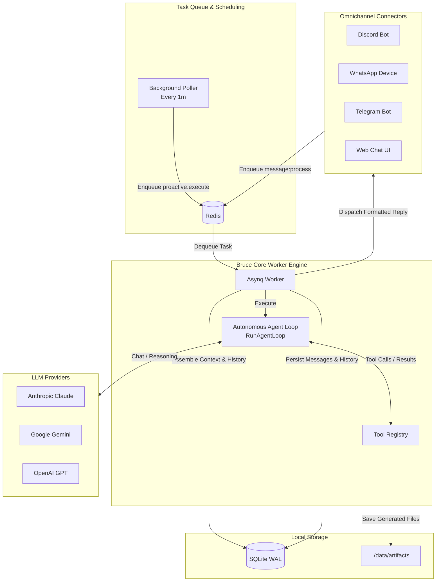
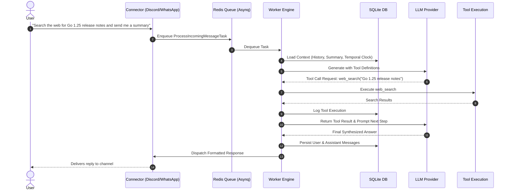

# Bruce

<p align="center">
  
</p>

<p align="center">
  <strong>A self-hosted, autonomous personal AI assistant that lives in your messaging apps.</strong>
</p>

<p align="center">
  <a href="https://golang.org"></a>
  <a href="LICENSE"></a>
  <a href="#features"></a>
  <a href="#connectors"></a>
</p>

---

## Table of Contents

- [What is Bruce?](#what-is-bruce)
- [Key Capabilities](#key-capabilities)
- [Architecture & Message Flow](#architecture--message-flow)
- [Quick Start](#quick-start)
  - [Option 1: Docker Compose (Recommended)](#option-1-docker-compose-recommended)
  - [Option 2: Bare-Metal Go (Local Development)](#option-2-bare-metal-go-local-development)
- [Core Features Walkthrough](#core-features-walkthrough)
  - [1. Autonomous Agent Loop & Multi-Step Tool Chaining](#1-autonomous-agent-loop--multi-step-tool-chaining)
  - [2. Dual-Mode Scheduler & Proactive Tasks](#2-dual-mode-scheduler--proactive-tasks)
  - [3. Standalone HTML Artifact Generation](#3-standalone-html-artifact-generation)
  - [4. Multi-Provider LLM Engine](#4-multi-provider-llm-engine)
  - [5. Omnichannel Messaging](#5-omnichannel-messaging)
- [Built-In Tools Reference](#built-in-tools-reference)
- [Configuration & Web Dashboard](#configuration--web-dashboard)
- [Development & Testing](#development--testing)
- [Documentation Sitemap](#documentation-sitemap)
- [License](#license)

---

## What is Bruce?

Bruce is a private, self-hosted AI assistant that you talk to through the messaging applications you already use every day: **Discord**, **WhatsApp**, **Telegram**, or an embedded **Web Chat**.

Send a message from your phone or desktop, and Bruce will:
- Answer questions using cutting-edge LLMs (**Claude**, **Gemini**, or **OpenAI**).
- Autonomously execute multi-step tool workflows (browse the web, inspect repositories, search emails, execute shell commands).
- Generate interactive, standalone **HTML artifacts** (dashboards, resumes, spreadsheets, visualizations) hosted directly on your server.
- Proactively alert you, monitor conditions in the background, or schedule future messages and briefings using an intelligent **dual-mode scheduler**.

### Why Self-Hosted?
- **Zero Lock-In**: Everything runs as a single Go binary backed by Redis and local SQLite (WAL mode).
- **Data Sovereignty**: Your chat history, tools log, credentials, and artifacts stay on your hardware.
- **Always Accessible**: Message Bruce directly without opening a separate browser tab or mobile app.

---

## Key Capabilities

| Capability | Details |
|---|---|
| **Omnichannel Connectors** | WhatsApp (`whatsmeow` multi-device QR pairing), Discord (`discordgo`), Telegram (long-polling), and Web Chat (`/api/v1/chat`). |
| **Autonomous Agent Loop** | Multi-step tool execution (up to 5 turns per request) with context windowing, automatic long-term session summarization, real-time clock injection, and anti-hallucination guardrails. |
| **Dual-Mode Scheduler** | **Direct Message Delivery** (instant, 0 tokens, for reminders and alarms) vs **Agent Briefing** (AI agent loop with tool execution for daily reports and web monitoring). Supports standard cron and natural relative offsets (`+2m`, `in 5 minutes`). |
| **HTML Artifacts Engine** | Generates standalone HTML dashboards, visual reports, and web apps saved to disk, served at `/artifacts/{id}`, and previewed in the dashboard. |
| **Multi-Provider LLM** | Seamlessly switch between Anthropic Claude, Google Gemini, and OpenAI. Configure different providers for interactive chat vs background proactive tasks. |
| **15+ Built-in Tools** | Web search, bash execution, file I/O, local git, GitHub, Google Workspace (Gmail, Calendar, Docs), Notion, Trello, n8n, HTTP client, and proactive task management. |
| **Web Dashboard** | Responsive management interface for live chat, session history, proactive schedules, artifact gallery, credentials, and settings. |

---

## Architecture & Message Flow

Bruce coordinates messaging connectors, task queues, an autonomous AI loop, and local persistence.


```mermaid
flowchart TD
    subgraph Connectors ["Omnichannel Connectors"]
        DC[Discord Bot]
        WA[WhatsApp Device]
        TG[Telegram Bot]
        WEB[Web Chat UI]
    end

    subgraph Queue ["Task Queue & Scheduling"]
        R[(Redis)]
        P[Background Poller\nEvery 1m]
    end

    subgraph BruceWorker ["Bruce Core Worker Engine"]
        W[Asynq Worker]
        AL[Autonomous Agent Loop\nRunAgentLoop]
        TR[Tool Registry]
    end

    subgraph LLMProviders ["LLM Providers"]
        CL[Anthropic Claude]
        GM[Google Gemini]
        OA[OpenAI GPT]
    end

    subgraph Storage ["Local Storage"]
        DB[(SQLite WAL)]
        ART[./data/artifacts]
    end

    Connectors -->|Enqueue message:process| R
    P -->|Enqueue proactive:execute| R
    R -->|Dequeue Task| W
    W -->|Assemble Context & History| DB
    W -->|Execute| AL
    AL <-->|Tool Calls / Results| TR
    AL <-->|Chat / Reasoning| LLMProviders
    TR -->|Save Generated Files| ART
    W -->|Persist Messages & History| DB
    W -->|Dispatch Formatted Reply| Connectors
```

### End-to-End Execution Sequence


```mermaid
sequenceDiagram
    autonumber
    actor User
    participant Connector as Connector (Discord/WhatsApp)
    participant Redis as Redis Queue (Asynq)
    participant Worker as Worker Engine
    participant SQLite as SQLite DB
    participant LLM as LLM Provider
    participant Tool as Tool Execution

    User->>Connector: "Search the web for Go 1.25 release notes and send me a summary"
    Connector->>Redis: Enqueue ProcessIncomingMessageTask
    Redis->>Worker: Dequeue Task
    Worker->>SQLite: Load Context (History, Summary, Temporal Clock)
    Worker->>LLM: Generate with Tool Definitions
    LLM-->>Worker: Tool Call Request: web_search("Go 1.25 release notes")
    Worker->>Tool: Execute web_search
    Tool-->>Worker: Search Results
    Worker->>SQLite: Log Tool Execution
    Worker->>LLM: Return Tool Result & Prompt Next Step
    LLM-->>Worker: Final Synthesized Answer
    Worker->>SQLite: Persist User & Assistant Messages
    Worker->>Connector: Dispatch Formatted Response
    Connector-->>User: Delivers reply to channel
```

---

## Quick Start

### Option 1: Docker Compose (Recommended)

Docker Compose bundles Bruce and Redis with persistent data volumes.

1. **Clone the repository**:
   ```bash
   git clone https://github.com/DemitriusQuadros/bruce.git
   cd bruce
   ```

2. **Create your configuration**:
   ```bash
   cp config.example.yml config.yml
   ```
   Edit `config.yml` and provide your LLM API key and connector tokens:
   ```yaml
   claude:
     api_key: "sk-ant-api03-..."
     model: "claude-haiku-4-5-20251001"

   llm:
     provider: "claude"
     background_provider: "claude"

   connectors:
     discord:
       enabled: true
       bot_token: "YOUR_DISCORD_BOT_TOKEN"
   ```

3. **Start the stack**:
   ```bash
   docker compose up -d
   ```

4. **Verify installation**:
   - Check health: `curl http://localhost:9090/health`
   - Open Web Dashboard: `http://localhost:9090`
   - Inspect Task Queue: `http://localhost:9090/monitor`
   - View container logs: `docker compose logs -f bruce`

---

### Option 2: Bare-Metal Go (Local Development)

#### Prerequisites
- **Go**: 1.23 or higher
- **C Compiler**: `gcc` or `clang` (required for SQLite `CGO_ENABLED=1`)
- **Redis**: Running locally on `localhost:6379`

1. **Clone & Configure**:
   ```bash
   git clone https://github.com/DemitriusQuadros/bruce.git
   cd bruce
   cp config.example.yml config.yml
   # Configure your API keys in config.yml
   ```

2. **Run Redis**:
   ```bash
   redis-server --daemonize yes
   ```

3. **Build and Run**:
   ```bash
   CGO_ENABLED=1 go run cmd/bruce/main.go
   ```
   Bruce will start the HTTP API and Web Dashboard on `http://localhost:8080`.

---

## Core Features Walkthrough

### 1. Autonomous Agent Loop & Multi-Step Tool Chaining

Bruce does not simply return text — it can reason and chain tools sequentially before answering.

- **Dynamic Context Assembly**: Every prompt automatically receives:
  - **Temporal Clock Context**: Exact date, time, weekday, timezone (`America/Sao_Paulo`, `UTC`, etc.), and user idle gap.
  - **Long-Term Session Summarization**: Older messages are compressed into persistent session summaries to stay within the LLM context window without losing context.
  - **Strict Anti-Hallucination Guidelines**: The AI is forbidden from claiming actions happened (like saving artifacts or scheduling reminders) without an actual successful tool execution in that turn.
- **Multi-Step Execution**: If you ask *"Search for the latest inflation numbers and generate an HTML report"*, Bruce will first execute `web_search`, receive the data, invoke `artifact_save` with standalone HTML, and then return the final summary with a link.

---

### 2. Dual-Mode Scheduler & Proactive Tasks

Bruce features a background poller (evaluating every minute) supporting two execution modes:

```
┌────────────────────────────────────────────────────────┐
│               Scheduled Task (Cron)                    │
└──────────────────────────┬─────────────────────────────┘
                           │
             ┌─────────────┴─────────────┐
             ▼                           ▼
    execution_mode: "message"   execution_mode: "agent"
      (Direct Notification)        (AI Dynamic Task)
             │                           │
     Bypasses LLM                Runs Agent Loop
     0 tokens, 0 latency         Executes tools & compiles report
```

#### Mode A: Direct Message Delivery (`execution_mode: "message"`)
Ideal for alarms, medication reminders, and direct notifications.
- **Bypasses the LLM completely** at execution time.
- **Zero latency, zero token cost**, immune to LLM rate limits or quota errors.
- **Example**: *"Me manda um hello world daqui a dois minutos"* or *"Lembre-me de tomar o remédio às 20h"*.

#### Mode B: Agent Briefing (`execution_mode: "agent"`)
Ideal for dynamic briefings and research.
- Invokes the AI agent loop at the scheduled time to execute tools (web search, GitHub, files) and compile a synthesized briefing.
- **Example**: *"Todo dia às 8h pesquise as notícias de IA e me envie um resumo"*.

#### Flexible Schedule Syntax
- **Relative Offsets**: `+2m`, `10m`, `in 5 minutes`, `daqui a 2 minutos` (automatically converted to concrete 5-token date-specific crons and auto-deactivated after execution).
- **Standard Cron**: `0 9 * * 1-5` (every weekday at 9:00 AM).
- **Ambient Condition Watches (`watch`)**: Periodic polling (minimum 5 minutes) evaluating natural language triggers with hash-based deduplication (`last_result_hash`).

---

### 3. Standalone HTML Artifact Generation

Bruce can generate rich, interactive standalone HTML documents using the `artifact_save` tool:
- **Dashboards, Resumes, Visual Reports, Interactive Charts**.
- Stored safely on disk under `./data/artifacts/<id>/<filename>`.
- Served directly over HTTP at `/artifacts/<id>/<filename>`.
- Previewed live with responsive toggles in the Web Dashboard **Artifacts** tab.

---

### 4. Multi-Provider LLM Engine

Configure different providers on the fly through `config.yml` or the Web Dashboard Settings:
- **Anthropic Claude**: `claude-haiku-4-5-20251001`, `claude-sonnet-4-6`, `claude-opus-4-6`.
- **Google Gemini**: `gemini-2.5-flash`, `gemini-1.5-pro`.
- **OpenAI**: `gpt-4o`, `gpt-4o-mini`.

Separate providers can be assigned for interactive user chat vs background proactive tasks (`llm.background_provider`) to optimize cost and quota limits.

---

### 5. Omnichannel Messaging

| Connector | Mechanism | Setup Highlights |
|---|---|---|
| **Discord** | WebSocket (`discordgo`) | Create bot in Discord Developer Portal, enable Message Content Intent, add bot token. Automatically breaks long replies into 1900-character chunks on word boundaries. |
| **WhatsApp** | Multi-Device Protocol (`whatsmeow`) | Pairs as a linked device on your personal WhatsApp account. Scans QR code printed in terminal on first boot. No Meta Business API required. |
| **Telegram** | HTTP Long-Polling | Create bot with `@BotFather`, copy bot token. No public IP or webhook configuration required. |
| **Web Chat** | HTTP REST & Session API | Embedded web chat interface inside the dashboard at `/`. Supports session creation, history browsing, and markdown rendering. |

---

## Built-In Tools Reference

All tools are modular and opt-in via configuration:

| Tool Name | Description | Key Configuration |
|---|---|---|
| `bash` | Execute shell commands in a sandboxed directory | `tools.bash.enabled: true` |
| `web_search` | Search Google for live web information | `tools.web_search.enabled: true`, `tools.web_search.google_api_key`, `cx` |
| `artifacts` | Generate and host standalone HTML files | `tools.artifacts.enabled: true` |
| `proactive_create` | Create scheduled crons, reminders, and watches | Built-in |
| `proactive_list` | List active and paused proactive tasks | Built-in |
| `proactive_toggle` | Pause or resume a background proactive task | Built-in |
| `proactive_delete` | Delete a scheduled proactive task | Built-in |
| `gmail` | Read, search, and send emails via Gmail API | Google OAuth client ID & secret |
| `calendar` | Read and create Google Calendar events | Google OAuth client ID & secret |
| `docs` | Read, write, and create Google Docs | Google OAuth client ID & secret |
| `github` | Manage issues, pull requests, and repositories | `tools.github.api_token` |
| `git_local` | Run local git commands (status, log, diff, commit) | `tools.git_local.enabled: true` |
| `files` | Read, write, list files on the local filesystem | `tools.files.enabled: true` |
| `notion` | Search and update Notion databases and pages | `tools.notion.api_key` |
| `trello` | Manage Trello boards, lists, and cards | `tools.trello.api_key`, `user_token` |
| `http_client` | Make outbound HTTP requests to APIs | Enabled by default |
| `n8n` | Trigger n8n workflows and webhooks | `tools.n8n.base_url`, `api_key` |

---

## Configuration & Web Dashboard

Bruce supports a hybrid configuration model:
1. **YAML Base Configuration (`config.yml`)**: Seeds initial defaults, secrets, and server configuration.
2. **Dynamic Database Configuration (SQLite)**: Manage and override settings live via the Web UI **Settings** tab or REST API (`PUT /api/v1/config`) without restarting the server!

### Web Dashboard Tabs
- **Chat**: Live interactive web session with markdown formatting.
- **Sessions**: Browse all conversation sessions across WhatsApp, Discord, Telegram, and Web.
- **Schedules**: Inspect, trigger, pause, or create proactive cron tasks and ambient watches with execution mode badges.
- **Artifacts**: Gallery of generated HTML artifacts with live iframe preview.
- **Logs**: Real-time log of tool executions and connector dispatches.
- **Settings**: Dynamic configuration editor with password masking for credentials.

---

## Development & Testing

```bash
# Build the binary
go build ./...

# Run the complete test suite (Unit, Integration, and BDD E2E)
go test -v ./...

# Run tests with race detection
go test -race ./...

# Static analysis and formatting
go vet ./...
gofmt -l -w .

# Run Playwright E2E frontend tests
npm install
npx playwright test
```

---

## Documentation Sitemap

Explore detailed documentation in the [`docs/`](docs/) directory:

- **Architecture**:
  - [`docs/architecture/overview.md`](docs/architecture/overview.md) — System architecture, database schema, and queue mechanics.
  - [`docs/architecture/agent-loop.md`](docs/architecture/agent-loop.md) — Deep dive into the autonomous agent loop, multi-step execution, and anti-hallucination guardrails.
  - [`docs/architecture/memory-and-context.md`](docs/architecture/memory-and-context.md) — Temporal clock injection, context windowing, and session summarization.
- **Features & Guides**:
  - [`docs/features/scheduler-and-proactive.md`](docs/features/scheduler-and-proactive.md) — Proactive tasks, dual execution modes, relative offsets, and poller.
  - [`docs/features/artifacts.md`](docs/features/artifacts.md) — HTML artifact generation and serving.
  - [`docs/features/connectors.md`](docs/features/connectors.md) — Setting up Discord, WhatsApp, Telegram, and Web Chat.
  - [`docs/features/llm-providers.md`](docs/features/llm-providers.md) — Configuring Claude, Gemini, and OpenAI.
  - [`docs/guides/installation-docker.md`](docs/guides/installation-docker.md) — Production Docker Compose deployment guide.
  - [`docs/guides/installation-local.md`](docs/guides/installation-local.md) — Bare-metal installation and local setup.
  - [`docs/tools/reference.md`](docs/tools/reference.md) — Comprehensive reference for all 15+ built-in tools.

---

## License

Bruce is released under the **MIT License**. See [`LICENSE`](LICENSE) for details.
