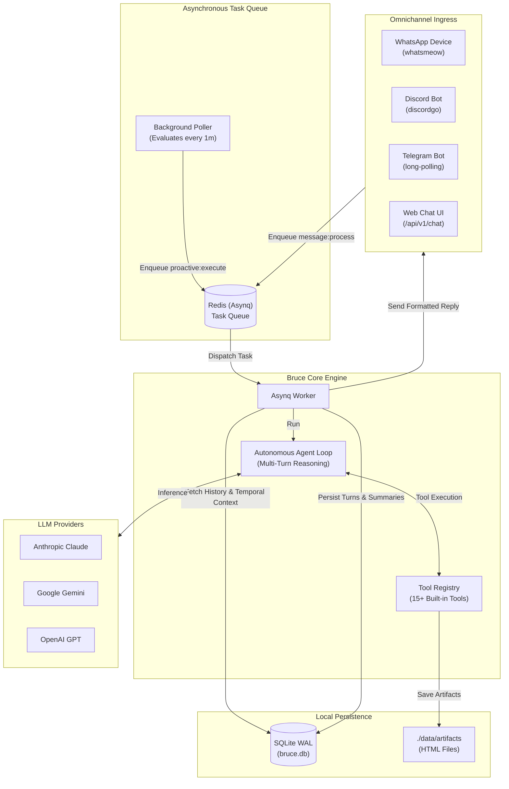

# Bruce

<p align="center">
  
</p>

<p align="center">
  <strong>A self-hosted, autonomous personal AI assistant that lives directly in your messaging apps.</strong>
</p>

<p align="center">
  <a href="https://demitriusquadros.github.io/bruce/"></a>
  <a href="https://golang.org"></a>
  <a href="LICENSE"></a>
  <a href="https://demitriusquadros.github.io/bruce/guides/installation-docker/"></a>
  <a href="https://demitriusquadros.github.io/bruce/features/llm-providers/"></a>
  <a href="https://demitriusquadros.github.io/bruce/features/connectors/"></a>
</p>

> 🌐 **Official Documentation**: Visit **[https://demitriusquadros.github.io/bruce/](https://demitriusquadros.github.io/bruce/)** for comprehensive guides, architectural deep dives, and tutorials in **English**, **Português**, and **Español**.

---

## Table of Contents

- [What is Bruce?](#what-is-bruce)
- [Why Bruce? (The Open Source Advantage)](#why-bruce-the-open-source-advantage)
- [Key Capabilities](#key-capabilities)
- [System Architecture](#system-architecture)
- [Quick Start](#quick-start)
  - [Option 1: Docker Compose (Recommended)](#option-1-docker-compose-recommended)
  - [Option 2: Bare-Metal Go (Local Dev)](#option-2-bare-metal-go-local-dev)
- [Core Primitives](#core-primitives)
  - [1. Autonomous Agent Loop](#1-autonomous-agent-loop)
  - [2. Dual-Mode Scheduler & Proactive Tasks](#2-dual-mode-scheduler--proactive-tasks)
  - [3. Standalone HTML Artifacts](#3-standalone-html-artifacts)
  - [4. Multi-Provider LLM Engine](#4-multi-provider-llm-engine)
  - [5. Omnichannel Messaging](#5-omnichannel-messaging)
- [Built-In Tools Reference](#built-in-tools-reference)
- [Web Dashboard & REST API](#web-dashboard--rest-api)
- [Contributing to Open Source](#contributing-to-open-source)
- [Testing & Quality Assurance](#testing--quality-assurance)
- [Documentation Directory](#documentation-directory)
- [License](#license)

---

## What is Bruce?

**Bruce** is an autonomous, self-hosted personal AI assistant designed to run 24/7 on your own hardware (a home server, Raspberry Pi, homelab, or VPS). Instead of locking you into a walled-garden web chat, Bruce meets you where you already communicate:

* 📱 **WhatsApp** (linked device via QR code pairing)
* 🎮 **Discord** (WebSocket bot)
* ✈️ **Telegram** (long-polling bot)
* 💻 **Web Chat** (embedded dashboard)

Send a quick message from your phone while walking, and Bruce can:
1. **Reason autonomously in multi-step loops** to browse the web, check repositories, search emails, or inspect databases.
2. **Generate and host interactive HTML artifacts** (dashboards, calculators, resumes, visualizations) served directly from your server.
3. **Proactively monitor conditions and schedule alerts** using an intelligent **dual-mode scheduler** that supports zero-token instant reminders or dynamic AI briefings.

---

## Why Bruce? (The Open Source Advantage)

| Feature | Bruce | Traditional Chatbots |
|---|---|---|
| **Data Privacy** | 100% private. Chat histories, tool logs, credentials, and files stay on your machine. | Data stored on third-party servers, used for training. |
| **Messaging Integration** | Lives inside WhatsApp, Discord, Telegram, and Web Chat simultaneously. | Requires opening a dedicated app or browser tab. |
| **Tool Execution** | Autonomous multi-turn reasoning with 15+ real-world tools. | Simple single-turn text completions without actions. |
| **Proactive Scheduling** | Dual-mode background scheduler (zero-token alarms or dynamic AI briefings). | Reactive only; cannot initiate contact. |
| **Rich Artifacts** | Writes, stores, and serves interactive standalone HTML web apps. | Plain text or basic markdown rendering only. |
| **Provider Agnostic** | Swap between Anthropic Claude, Google Gemini, and OpenAI on the fly. | Locked into a single vendor's ecosystem. |

---

## Key Capabilities

* **Omnichannel Connectors**: Seamless multi-platform connectivity via `whatsmeow` (WhatsApp QR pairing without Meta Business API fees), `discordgo` (Discord WebSocket), Telegram HTTP polling, and local Web Chat.
* **Autonomous Agent Loop**: Dynamic reasoning engine that executes tools iteratively (up to 5 turns per request) with strict anti-hallucination guardrails and temporal clock injection.
* **Dual-Mode Background Scheduler**:
  * **Direct Notifications (`message`)**: Instant, zero-token execution for medication alarms, pomodoro timers, and simple reminders.
  * **Agent Briefings (`agent`)**: Autonomous multi-step tool execution for scheduled morning briefings, repository digests, and web monitoring.
* **HTML Artifacts Engine**: Creates and serves standalone HTML applications saved on disk under `./data/artifacts/<id>/` with responsive preview in the web dashboard.
* **Hybrid Context & Memory**: Sliding window of recent conversational turns coupled with background long-term summarization for continuous context.
* **15+ Modular Tools**: Web search, bash execution, file I/O, local git, GitHub, Gmail, Google Calendar, Google Docs, Notion, Trello, n8n workflows, and HTTP client.
* **Responsive Web Dashboard**: Manage live chat sessions, inspect message history, schedule proactive tasks, browse artifacts, and adjust settings in real time.

---

## System Architecture

Bruce is compiled into a **single, lightweight Go binary** backed by a Redis task queue ([Asynq](https://github.com/hibiken/asynq)) and a local SQLite database in Write-Ahead Log (WAL) mode.


```mermaid
flowchart TD
    subgraph Connectors ["Omnichannel Ingress"]
        WA["WhatsApp Device\n(whatsmeow)"]
        DC["Discord Bot\n(discordgo)"]
        TG["Telegram Bot\n(long-polling)"]
        WEB["Web Chat UI\n(/api/v1/chat)"]
    end

    subgraph Queue ["Asynchronous Task Queue"]
        R[("Redis (Asynq)\nTask Queue")]
        P["Background Poller\n(Evaluates every 1m)"]
    end

    subgraph Engine ["Bruce Core Engine"]
        W["Asynq Worker"]
        AL["Autonomous Agent Loop\n(Multi-Turn Reasoning)"]
        TR["Tool Registry\n(15+ Built-in Tools)"]
    end

    subgraph Intelligence ["LLM Providers"]
        CL["Anthropic Claude"]
        GM["Google Gemini"]
        OA["OpenAI GPT"]
    end

    subgraph Storage ["Local Persistence"]
        DB[("SQLite WAL\n(bruce.db)")]
        ART["./data/artifacts\n(HTML Files)"]
    end

    Connectors -->|Enqueue message:process| R
    P -->|Enqueue proactive:execute| R
    R -->|Dispatch Task| W
    W -->|Fetch History & Temporal Context| DB
    W -->|Run| AL
    AL <-->|Tool Execution| TR
    AL <-->|Inference| Intelligence
    TR -->|Save Artifacts| ART
    W -->|Persist Turns & Summaries| DB
    W -->|Send Formatted Reply| Connectors
```

> 📖 Read the full [Architecture & System Overview](https://demitriusquadros.github.io/bruce/architecture/overview/) on our documentation site.

---

## Quick Start

### Option 1: Docker Compose (Recommended)

The fastest way to deploy Bruce with persistent storage and Redis is using Docker Compose.

1. **Clone the repository**:
   ```bash
   git clone https://github.com/DemitriusQuadros/bruce.git
   cd bruce
   ```

2. **Configure your environment**:
   ```bash
   cp config.example.yml config.yml
   ```
   Edit `config.yml` with your favorite text editor to configure your LLM API key and connectors:
   ```yaml
   claude:
     api_key: "sk-ant-api03-..."
     model: "claude-haiku-4-5-20251001"

   llm:
     provider: "claude"
     background_provider: "claude"

   connectors:
     discord:
       enabled: true
       bot_token: "YOUR_DISCORD_BOT_TOKEN"
   ```

3. **Start the containers**:
   ```bash
   docker compose up -d
   ```

4. **Access Bruce**:
   * **Web Dashboard**: Open [http://localhost:9090](http://localhost:9090) in your browser.
   * **Health Check**: `curl http://localhost:9090/health`
   * **Container Logs**: `docker compose logs -f bruce`

> 📘 Full setup walkthrough: [Docker Compose Deployment Guide](https://demitriusquadros.github.io/bruce/guides/installation-docker/).

---

### Option 2: Bare-Metal Go (Local Dev)

#### Prerequisites
* **Go**: 1.23 or higher
* **C Compiler**: `gcc` or `clang` (required for SQLite `CGO_ENABLED=1`)
* **Redis**: Running locally on `localhost:6379`

```bash
# 1. Clone repository
git clone https://github.com/DemitriusQuadros/bruce.git
cd bruce

# 2. Configure settings
cp config.example.yml config.yml

# 3. Start local Redis
redis-server --daemonize yes

# 4. Build and run Bruce
CGO_ENABLED=1 go run cmd/bruce/main.go
```

The Web Dashboard will be available at [http://localhost:8080](http://localhost:8080).

> 📘 Full setup walkthrough: [Bare-Metal Local Development Guide](https://demitriusquadros.github.io/bruce/guides/installation-local/).

---

## Core Primitives

### 1. Autonomous Agent Loop
Bruce doesn't simply answer prompts in a single turn. When given a complex objective, it initiates a multi-turn reasoning loop:
1. **Clock & Context Assembly**: Injects real-time temporal awareness (weekday, timezone, user idle duration) and relevant long-term session summaries.
2. **Tool Selection & Execution**: Decides which tools to run, executes them with validated parameters, and logs outputs.
3. **Synthesis & Reply**: Iterates until the task is complete, ensuring actions are verifiable without hallucinations.

> 📖 Deep dive: [Autonomous Agent Loop Documentation](https://demitriusquadros.github.io/bruce/architecture/agent-loop/).

### 2. Dual-Mode Scheduler & Proactive Tasks
Bruce features a background poller that inspects scheduled tasks every minute:
* **Mode A: Direct Notification (`execution_mode: "message"`)**: Completely bypasses the LLM at execution time. Instant delivery, zero token cost, and immune to rate limits. Perfect for alarms and medication reminders.
* **Mode B: Agent Briefing (`execution_mode: "agent"`)**: Invokes the full agent loop at the scheduled time to browse the web, read files, or check GitHub, delivering a fresh AI-synthesized report.
* **Natural Language Offsets**: Supports standard cron (`0 9 * * 1-5`) as well as relative syntax (`+2m`, `in 10 minutes`, `daqui a 2 minutos`).

> 📖 Deep dive: [Proactive Tasks & Scheduler Guide](https://demitriusquadros.github.io/bruce/features/scheduler-and-proactive/).

### 3. Standalone HTML Artifacts
Using the built-in `artifact_save` tool, Bruce can generate complete, standalone HTML web pages:
* Hosted locally at `/artifacts/{id}/{filename}`.
* Previewed interactively inside the web dashboard.
* Ideal for dynamic dashboards, financial calculators, SVG diagrams, and generated resumes.

> 📖 Deep dive: [Standalone HTML Artifacts Guide](https://demitriusquadros.github.io/bruce/features/artifacts/).

### 4. Multi-Provider LLM Engine
Switch providers dynamically in `config.yml` or through the Web UI Settings tab:
* **Anthropic Claude**: `claude-haiku-4-5`, `claude-sonnet-4-6`, `claude-opus-4-6`.
* **Google Gemini**: `gemini-2.5-flash`, `gemini-1.5-pro`.
* **OpenAI**: `gpt-4o`, `gpt-4o-mini`.

Configure separate providers for user chat vs background proactive tasks to optimize cost and quota.

> 📖 Deep dive: [Multi-Provider LLM Engine Guide](https://demitriusquadros.github.io/bruce/features/llm-providers/).

### 5. Omnichannel Messaging
* **WhatsApp**: Pairs directly to your phone via QR code using `whatsmeow`. No Meta Business API or monthly fees.
* **Discord**: Full-featured bot with chunked messages, typing indicators, and markdown formatting.
* **Telegram**: Long-polling bot with zero public IP or webhook requirements.
* **Web Chat**: Built-in real-time chat interface embedded in the dashboard.

> 📖 Deep dive: [Omnichannel Connectors Guide](https://demitriusquadros.github.io/bruce/features/connectors/).

---

## Built-In Tools Reference

| Tool | Purpose | Documentation |
|---|---|---|
| `bash` | Execute shell commands in a sandboxed directory | [Bash Tool Guide](https://demitriusquadros.github.io/bruce/tools/reference/#3-system--filesystem) |
| `web_search` | Search the web in real-time via Google Custom Search | [Search Tool Guide](https://demitriusquadros.github.io/bruce/tools/reference/#1-core--productivity) |
| `artifacts` | Generate and host standalone interactive HTML applications | [Artifacts Guide](https://demitriusquadros.github.io/bruce/features/artifacts/) |
| `proactive_create` | Schedule crons, reminders, and ambient watches | [Proactive Guide](https://demitriusquadros.github.io/bruce/features/scheduler-and-proactive/) |
| `gmail` | Search, read, and draft emails via Google OAuth | [Gmail Tool Guide](https://demitriusquadros.github.io/bruce/tools/reference/#1-core--productivity) |
| `calendar` | Query and create Google Calendar events | [Calendar Tool Guide](https://demitriusquadros.github.io/bruce/tools/reference/#1-core--productivity) |
| `docs` | Read and write Google Docs documents | [Docs Tool Guide](https://demitriusquadros.github.io/bruce/tools/reference/#1-core--productivity) |
| `github` | Inspect issues, pull requests, and repositories | [GitHub Tool Guide](https://demitriusquadros.github.io/bruce/tools/reference/#4-integrations--third-party-apis) |
| `git_local` | Run local git commands (status, log, diff, commit) | [Git Local Tool Guide](https://demitriusquadros.github.io/bruce/tools/reference/#3-system--filesystem) |
| `files` | Read, write, and list local filesystem files | [Files Tool Guide](https://demitriusquadros.github.io/bruce/tools/reference/#3-system--filesystem) |
| `notion` | Query and update Notion databases and blocks | [Notion Tool Guide](https://demitriusquadros.github.io/bruce/tools/reference/#4-integrations--third-party-apis) |
| `trello` | Manage boards, lists, and task cards | [Trello Tool Guide](https://demitriusquadros.github.io/bruce/tools/reference/#4-integrations--third-party-apis) |
| `n8n` | Trigger n8n automated workflows and webhooks | [n8n Tool Guide](https://demitriusquadros.github.io/bruce/tools/reference/#4-integrations--third-party-apis) |
| `http_client` | Dispatch arbitrary HTTP requests | [HTTP Client Guide](https://demitriusquadros.github.io/bruce/tools/reference/#4-integrations--third-party-apis) |

---

## Web Dashboard & REST API

Bruce includes an embedded web dashboard and REST API:
* **Chat Tab**: Real-time web conversation interface.
* **Sessions Tab**: Filter and browse conversation history across all channels.
* **Schedules Tab**: Visually inspect, pause, resume, or trigger proactive jobs.
* **Artifacts Tab**: Responsive gallery with interactive live preview.
* **Logs Tab**: Auditable stream of tool executions and connector events.
* **Settings Tab**: Live database configuration editor with credential masking.

> 📖 Deep dive: [Web Dashboard & REST API Guide](https://demitriusquadros.github.io/bruce/features/dashboard-and-api/).

---

## Contributing to Open Source

We welcome contributions from developers of all skill levels! Whether you want to add a new tool, implement a messaging connector, improve documentation, or report an issue:

1. **Fork the Repository**:
   Click the "Fork" button on GitHub and clone your fork locally:
   ```bash
   git clone https://github.com/<your-username>/bruce.git
   cd bruce
   ```

2. **Create a Feature Branch**:
   ```bash
   git checkout -b feature/my-new-tool
   ```

3. **Make Your Changes**:
   * Add modular tools under `internal/tools/`.
   * Add connector implementations under `internal/connectors/`.
   * Follow idiomatic Go patterns and format code with `gofmt`.

4. **Run Tests**:
   Ensure all tests pass before opening a Pull Request:
   ```bash
   go test -v -race ./...
   ```

5. **Submit a Pull Request**:
   Push your branch and open a PR against `master`. Please provide a clear description of what changed and any relevant issue references.

> 🐛 **Found a bug or have an idea?** Open an issue on our [GitHub Issues](https://github.com/DemitriusQuadros/bruce/issues) page!

---

## Testing & Quality Assurance

Bruce maintains test coverage across unit, integration, and end-to-end suites:

```bash
# Run all Go tests
go test -v ./...

# Run tests with race condition detector
go test -race ./...

# Code vet and formatting check
go vet ./...
gofmt -l -w .

# Run Playwright E2E frontend test suite
npm install
npx playwright test
```

---

## Documentation Directory

The complete documentation is hosted live at **[https://demitriusquadros.github.io/bruce/](https://demitriusquadros.github.io/bruce/)**.

| Topic | Description | Link |
|---|---|---|
| **Overview** | Introduction and core philosophy | [Read Overview](https://demitriusquadros.github.io/bruce/) |
| **System Architecture** | Architecture, SQLite WAL, Asynq | [Read Architecture](https://demitriusquadros.github.io/bruce/architecture/overview/) |
| **Agent Loop** | Multi-turn tool execution loop | [Read Agent Loop](https://demitriusquadros.github.io/bruce/architecture/agent-loop/) |
| **Memory & Context** | Temporal clock and summarization | [Read Memory & Context](https://demitriusquadros.github.io/bruce/architecture/memory-and-context/) |
| **Scheduler & Proactive** | Crons, reminders, and watches | [Read Scheduler](https://demitriusquadros.github.io/bruce/features/scheduler-and-proactive/) |
| **HTML Artifacts** | Interactive generated HTML | [Read Artifacts](https://demitriusquadros.github.io/bruce/features/artifacts/) |
| **LLM Providers** | Claude, Gemini, OpenAI | [Read LLM Providers](https://demitriusquadros.github.io/bruce/features/llm-providers/) |
| **Connectors** | WhatsApp, Discord, Telegram, Web | [Read Connectors](https://demitriusquadros.github.io/bruce/features/connectors/) |
| **Docker Compose** | Production deployment guide | [Read Docker Guide](https://demitriusquadros.github.io/bruce/guides/installation-docker/) |
| **Local Dev** | Bare-metal Go development | [Read Local Guide](https://demitriusquadros.github.io/bruce/guides/installation-local/) |
| **Homelab & VPS** | Self-hosting on a home server or VPS | [Read Homelab Guide](https://demitriusquadros.github.io/bruce/guides/deployment-homelab/) |
| **Tools Reference** | Complete guide to all 15+ tools | [Read Tools Reference](https://demitriusquadros.github.io/bruce/tools/reference/) |

---

## License

Bruce is licensed under the **[MIT License](LICENSE)**. Feel free to use, modify, distribute, and self-host for personal or commercial projects.

<p align="center">
  <sub>Built with ❤️ for privacy, autonomy, and open source. If you like Bruce, please ⭐ <strong>star the repository</strong>!</sub>
</p>
