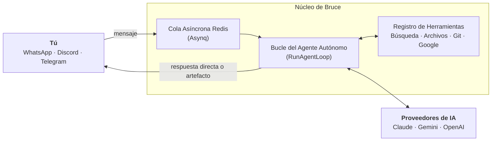

  
  

    
Asistente de IA Personal

    <h1 class="intro-title">Introducción</h1>
    
Un asistente de IA personal, autónomo y autohospedado que vive directamente en tus aplicaciones de mensajería con razonamiento multipaso, programación proactiva y más de 15 herramientas del mundo real.

  

La mayoría de interfaces de chat son simples generadores de texto: haces una pregunta, devuelven texto. Cuando necesitas que una IA realice acciones reales en tu nombre — programar recordatorios, revisar pull requests, consultar bases de datos o crear paneles interactivos —, necesitas un sistema autónomo que razone en bucles de múltiples turnos y utilice herramientas directamente.

Bruce se ejecuta como un único binario Go autónomo con los recursos del panel web integrados y una base de datos SQLite local en modo Write-Ahead Log (WAL). Los mensajes recibidos de tus plataformas se desacoplan mediante una cola de tareas asíncrona en Redis (Asynq), lo que permite a Bruce realizar tareas de larga duración, encadenamiento de herramientas y alertas programadas sin bloquearse ni perder mensajes.

## Primitivas Principales

Bruce está diseñado en torno a cinco primitivas esenciales pensadas para la automatización personal y la productividad:

| Primitiva | Propósito | Cómo Funciona |
| --- | --- | --- |
| [**Bucle Autónomo**](architecture/agent-loop.md) | Razonamiento multipaso | Ejecuta herramientas en secuencia dinámicamente hasta resolver instrucciones complejas. |
| [**Programador Proactivo**](features/scheduler-and-proactive.md) | Tareas programadas y alertas | Ejecución en modo dual: recordatorios directos sin tokens (`message`) o informes dinámicos de IA (`agent`). |
| [**Artefactos HTML**](features/artifacts.md) | Documentos web interactivos | Genera paneles, calculadoras e informes HTML independientes servidos en `/artifacts/...`. |
| [**Memoria Híbrida**](architecture/memory-and-context.md) | Continuidad de contexto | Ventana deslizante de mensajes recientes + resumen automático a largo plazo en segundo plano. |
| [**Conectores Omnicanal**](features/connectors.md) | Una sola IA, en todas partes | Conexión simultánea a Discord, WhatsApp, Telegram y Web Chat integrado. |

## Navegación Rápida

  <a href="guides/installation-docker/" class="card">
    🚀
    Inicio Rápido con Docker
    Despliega Bruce en menos de 2 minutos con almacenamiento persistente y Redis.
  </a>
  <a href="architecture/overview/" class="card">
    🏛️
    Arquitectura del Sistema
    Conoce la persistencia SQLite WAL, colas Asynq y ciclos de vida resilientes.
  </a>
  <a href="features/scheduler-and-proactive/" class="card">
    ⚡
    Programador y Recordatorios
    Programa recordatorios directos o informes de IA recurrentes mediante lenguaje natural.
  </a>
  <a href="tools/reference/" class="card">
    🛠️
    Referencia de Herramientas
    Explora las más de 15 herramientas integradas para búsqueda, bash, git y Google Workspace.
  </a>

## Código Abierto y Comunidad

Bruce es un proyecto 100% de código abierto publicado bajo la licencia **MIT**.

- 🐙 **Código Fuente**: [Repositorio en GitHub (DemitriusQuadros/bruce)](https://github.com/DemitriusQuadros/bruce)
- 🐛 **Problemas y Sugerencias**: [Abre una incidencia en GitHub](https://github.com/DemitriusQuadros/bruce/issues)
- 💡 **Contribuye**: ¡Las contribuciones con nuevas herramientas, conectores o documentación son bienvenidas!
- ⭐ **Apoya**: Si Bruce te resulta útil, ¡apoya el proyecto con [una estrella en GitHub](https://github.com/DemitriusQuadros/bruce)!
