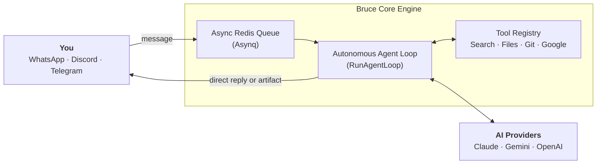

  
  

    
Personal AI Assistant

    <h1 class="intro-title">Introduction</h1>
    
A self-hosted, autonomous personal AI assistant that lives directly in your messaging apps with multi-step reasoning, proactive scheduling, and 12+ real-world tools.

  

Most AI chat interfaces are simple text generators: you ask a question, they return text. When you need an AI to take real-world action on your behalf—scheduling reminders, checking pull requests, querying databases, or building interactive dashboards—you need an autonomous system that reasons in multi-step loops and interfaces directly with tools.

Bruce runs as a single, self-contained Go binary with embedded web dashboard assets and a local SQLite database in Write-Ahead Log (WAL) mode. Incoming messages from your messaging platforms are decoupled via an asynchronous Redis task queue (Asynq), allowing Bruce to handle long-running research, tool chaining, and scheduled tasks without dropping messages or blocking.

## Core Primitives

Bruce is built around five core primitives designed for personal automation and daily productivity:

| Primitive | Purpose | How It Works |
| --- | --- | --- |
| [**Autonomous Loop**](architecture/agent-loop.md) | Multi-step reasoning | Dynamically executes tools in sequence until complex instructions are solved. |
| [**Proactive Scheduler**](features/scheduler-and-proactive.md) | Timed tasks & alerts | Dual-mode execution: direct zero-token reminders (`message`) or dynamic AI briefings (`agent`). |
| [**HTML Artifacts**](features/artifacts.md) | Interactive web documents | Generates standalone HTML dashboards, calculators, and reports served via `/artifacts/...`. |
| [**Hybrid Memory**](architecture/memory-and-context.md) | Never forgets context | Sliding window of recent turns + automatic background long-term summarization. |
| [**Omnichannel Connectors**](features/connectors.md) | Single AI, everywhere | Connects simultaneously to Discord, WhatsApp, Telegram, and embedded Web Chat. |

## Quick Navigation

  <a href="guides/installation-docker/" class="card">
    🚀
    Docker Compose Quickstart
    Deploy Bruce in under 2 minutes with persistent storage and Redis.
  </a>
  <a href="architecture/overview/" class="card">
    🏛️
    System Architecture
    Learn about SQLite WAL persistence, Asynq queues, and graceful lifecycles.
  </a>
  <a href="features/scheduler-and-proactive/" class="card">
    ⚡
    Scheduler & Reminders
    Schedule direct reminders or recurrent AI briefings via natural language.
  </a>
  <a href="tools/reference/" class="card">
    🛠️
    Built-In Tools Reference
    Explore the 15+ built-in tools for search, bash, git, and Google Workspace.
  </a>

