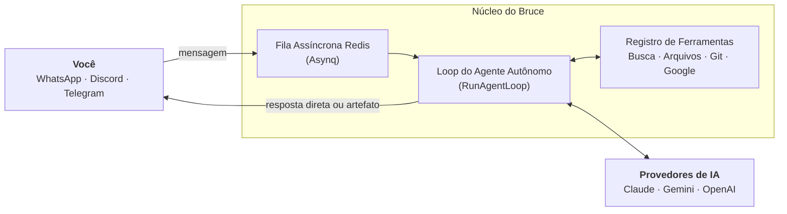

  
  

    
Assistente de IA Pessoal

    <h1 class="intro-title">Introdução</h1>
    
Um assistente de IA pessoal autônomo e auto-hospedado que vive diretamente nos seus aplicativos de mensagens com raciocínio multi-etapas, agendamento proativo e mais de 12 ferramentas do mundo real.

  

A maioria das interfaces de chat com IA são simples geradores de texto: você faz uma pergunta, elas retornam texto. Quando você precisa que uma IA execute ações no mundo real em seu nome — agendar lembretes, revisar pull requests, consultar bancos de dados ou construir painéis interativos —, você precisa de um sistema autônomo que raciocine em loops multi-etapas e utilize ferramentas diretamente.

O Bruce roda como um binário Go único e independente com os recursos do painel web embutidos e um banco SQLite local em modo Write-Ahead Log (WAL). As mensagens recebidas das suas plataformas de chat são desacopladas por uma fila assíncrona no Redis (Asynq), permitindo que o Bruce realize pesquisas longas, encadeamento de ferramentas e tarefas agendadas sem travar ou perder mensagens.

## Primitivas Principais

O Bruce foi construído com base em cinco primitivas fundamentais projetadas para automação pessoal e produtividade diária:

| Primitiva | Finalidade | Como Funciona |
| --- | --- | --- |
| [**Loop Autônomo**](architecture/agent-loop.md) | Raciocínio multi-etapas | Executa dinamicamente ferramentas em sequência até solucionar comandos complexos. |
| [**Agendador Proativo**](features/scheduler-and-proactive.md) | Tarefas temporizadas & alertas | Execução em modo duplo: lembretes diretos sem tokens (`message`) ou relatórios inteligentes (`agent`). |
| [**Artefatos HTML**](features/artifacts.md) | Documentos web interativos | Gera dashboards, calculadoras e relatórios HTML autônomos acessíveis via `/artifacts/...`. |
| [**Memória Híbrida**](architecture/memory-and-context.md) | Continuidade de contexto | Janela deslizante de mensagens recentes + sumarização automática de longo prazo em background. |
| [**Conectores Omnichannel**](features/connectors.md) | Uma só IA, em todo lugar | Conecta-se simultaneamente ao Discord, WhatsApp, Telegram e Web Chat integrado. |

## Navegação Rápida

  <a href="guides/installation-docker/" class="card">
    🚀
    Início Rápido com Docker
    Implante o Bruce em menos de 2 minutos com dados persistentes e Redis.
  </a>
  <a href="architecture/overview/" class="card">
    🏛️
    Arquitetura do Sistema
    Entenda a persistência SQLite WAL, filas Asynq e ciclos de vida resilientes.
  </a>
  <a href="features/scheduler-and-proactive/" class="card">
    ⚡
    Agendador & Lembretes
    Agende lembretes diretos ou briefings recorrentes de IA usando linguagem natural.
  </a>
  <a href="tools/reference/" class="card">
    🛠️
    Referência de Ferramentas
    Conheça as mais de 15 ferramentas nativas para busca, bash, git e Google Workspace.
  </a>

