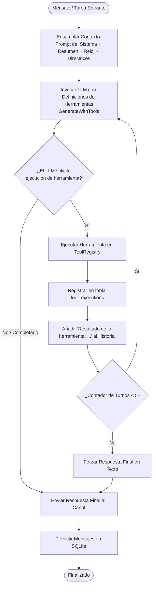

# El Bucle del Agente Autónomo (`RunAgentLoop`)

Este documento describe cómo opera el bucle de razonamiento de IA autónomo de Bruce, cómo se ejecuta el encadenamiento de herramientas en múltiples pasos y cómo se aplican las salvaguardas contra alucinaciones.

---

## 1. Visión General

En lugar de actuar como un simple bot de respuesta única ("pregunta entra, respuesta sale"), Bruce ejecuta un **bucle autónomo de múltiples turnos** (`ai.RunAgentLoop`).

Cuando una solicitud del usuario requiere varias operaciones (por ejemplo: buscar en la web, analizar datos y generar un panel HTML completo), el bucle del agente coordina el LLM y el registro de herramientas a lo largo de turnos secuenciales hasta completar la tarea.



---

## 2. Ensamblaje e Inyección de Contexto

Antes de invocar el LLM, el worker construye un **Prompt de Sistema Efectivo** compuesto por cuatro capas distintas:

```
┌─────────────────────────────────────────────────────────────────┐
│                     Prompt Base del Sistema                     │
│  "Eres Bruce, un asistente de IA personal y proactivo..."       │
│  (Configurado en Ajustes o definido en config.yml)              │
├─────────────────────────────────────────────────────────────────┤
│                   <conversation_context>                        │
│  Resumen conciso en markdown de conversaciones pasadas si la    │
│  sesión supera los límites de tokens (session_summaries).       │
├─────────────────────────────────────────────────────────────────┤
│                     <temporal_context>                          │
│  Fecha y Hora Actuales: Domingo, 2026-09-27 19:15:00 -0300.     │
│  Zona horaria: America/Sao_Paulo. Inactividad: 4 horas.         │
├─────────────────────────────────────────────────────────────────┤
│                 <tool_execution_guidelines>                     │
│  Reglas multipaso, requisitos de artefactos, instrucciones del   │
│  programador en modo dual y directrices contra alucinaciones.   │
└─────────────────────────────────────────────────────────────────┘
```

### El Contexto Temporal en Tiempo Real
Un fallo común en los agentes conversacionales es la "ceguera temporal" — el modelo desconoce qué día u hora es.
Bruce calcula e inyecta dinámicamente la hora exacta de la aplicación:
```go
temporalContext := ai.FormatTemporalContext(time.Now(), appTimezone, timeGapNotice)
effectiveSystemPrompt := ai.BuildEffectiveSystemPrompt(basePrompt, summary, temporalContext)
```
Esto permite a Bruce calcular desfases relativos con precisión (ej: *"envíame un hola mundo en dos minutos"*) y responder preguntas temporales (ej: *"¿qué día cae el próximo martes?"*).

---

## 3. Ciclo de Ejecución Paso a Paso

Firma de la función del bucle del agente:
```go
func RunAgentLoop(
    ctx context.Context,
    llm LLMService,
    tools ToolRegistry,
    systemPrompt string,
    history []domain.Message,
    maxTurns int, // predeterminado: 5
) (string, error)
```

### Paso 1: Declaración de Herramientas
El `ToolRegistry` transforma todas las herramientas habilitadas en esquemas JSON Schema (`ToolDefinition`) según el proveedor activo (Claude tool schema, Gemini function declarations o OpenAI functions).

### Paso 2: Generación con Herramientas
El LLM evalúa el prompt del sistema, el historial y las herramientas disponibles:
- Si no necesita herramientas: El LLM retorna `Complete = true` con el texto final.
- Si necesita herramientas: El LLM retorna uno o más objetos `ToolCall` (nombre, argumentos JSON).

### Paso 3: Ejecución y Auditoría de Herramientas
Cada herramienta se busca en el `ToolRegistry` y se ejecuta:
```go
result, err := tools.Execute(ctx, call.Name, call.Input)
```
Cada ejecución de herramienta queda registrada en la tabla SQLite `tool_executions` para auditoría en la pestaña **Logs** del Panel Web.

### Paso 4: Inyección de Retroalimentación
La salida de la herramienta se serializa y se añade al historial de mensajes:
```text
Role: user
Content: Tool 'web_search' result: [Search results for Go 1.25 release notes...]
```
El bucle incrementa el contador de turnos e invoca nuevamente al LLM.

### Paso 5: Finalización
El bucle termina cuando:
1. El LLM genera una respuesta final sin solicitar más herramientas.
2. El contador alcanza `maxTurns` (predeterminado 5), forzando una síntesis textual final.

---

## 4. Ejemplo de Encadenamiento de Herramientas (Tool Chaining)

Ejemplo de cómo Bruce encadena varias herramientas:

**Instrucción del Usuario**:
> *"Busca noticias recientes de tecnología en España, resume las 3 principales y genera un panel HTML llamado news.html."*

1. **Turno 1**:
   - El modelo recibe la instrucción.
   - Determina que requiere datos en tiempo real.
   - Invoca `web_search(query="ultimas noticias tecnologia espana")`.
2. **Turno 2**:
   - Recibe los resultados de búsqueda.
   - Evalúa que tiene la información necesaria para el panel.
   - Invoca `artifact_save(filename="news.html", title="Tech News", content="<!DOCTYPE html><html>...")`.
3. **Turno 3**:
   - Recibe confirmación: `Artifact saved at /artifacts/1234-abcd/news.html`.
   - Genera la respuesta final para el usuario:
     > *"Aquí tienes las 3 noticias principales de tecnología [...]. He generado tu panel: [Ver Panel](/artifacts/1234-abcd/news.html)."*

---

## 5. Salvaguardas Estrictas contra Alucinaciones

Para evitar que los modelos inventen acciones que no han ocurrido:

```text
<tool_execution_guidelines>
1. Ejecución Multipaso y Encadenamiento:
   - Cuando una petición requiera varios pasos (ej: buscar datos Y crear un archivo HTML),
     DEBES ejecutar todas las herramientas en secuencia a lo largo de los turnos.
2. Generación de HTML y Artefactos:
   - Cuando el usuario solicite un documento o informe HTML, DEBES invocar la herramienta 'artifact_save'.
3. Programación y Recordatorios Proactivos:
   - Para recordatorios directos, utiliza 'execution_mode': 'message'.
   - Para resúmenes generados por IA, utiliza 'execution_mode': 'agent'.
4. Cero Alucinaciones:
   - NUNCA afirmes haber creado, guardado o programado nada a menos que hayas llamado a la
     herramienta correspondiente ('artifact_save', 'proactive_create') con éxito en esta sesión.
   - NUNCA inventes URLs falsas como '/artifacts/...' sin haber ejecutado la herramienta previamente.
</tool_execution_guidelines>
```
