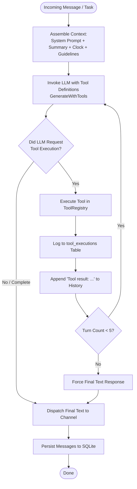

# The Autonomous Agent Loop (`RunAgentLoop`)

This document describes how Bruce's autonomous AI reasoning loop operates, how multi-step tool chaining is executed, and how anti-hallucination guardrails are enforced.

---

## 1. Overview

Rather than acting as a simple one-shot "question-in, answer-out" chatbot, Bruce executes an **autonomous multi-turn agent loop** (`ai.RunAgentLoop`).

When a user request requires multiple operations (for example: searching the web, analyzing data, and generating a standalone HTML dashboard), the agent loop coordinates the LLM and the tool registry over sequential turns until the task is complete.



---

## 2. Context Assembly & Injection

Before the LLM is invoked, the worker constructs an **Effective System Prompt** composed of four distinct layers:

```
┌─────────────────────────────────────────────────────────────────┐
│                      Base System Prompt                         │
│  "You are Bruce, a proactive personal AI assistant..."          │
│  (Configured dynamically in Settings or seeded via config.yml)  │
├─────────────────────────────────────────────────────────────────┤
│                   <conversation_context>                        │
│  Concise markdown summary of past interactions if session       │
│  exceeds context window limits (from session_summaries table).  │
├─────────────────────────────────────────────────────────────────┤
│                     <temporal_context>                          │
│  Current Date & Time: Sunday, 2026-09-27 19:15:00 -0300.        │
│  Timezone: America/Sao_Paulo. Idle Gap: 4 hours since last msg. │
├─────────────────────────────────────────────────────────────────┤
│                 <tool_execution_guidelines>                     │
│  Multi-step rules, artifact requirements, dual-mode scheduler   │
│  instructions, and strict anti-hallucination mandates.          │
└─────────────────────────────────────────────────────────────────┘
```

### The Real-Time Temporal Context
A common failure in conversational agents is "temporal blindness" — the model does not know what day, hour, or minute it is.
Bruce dynamically calculates and injects the exact server/application time:
```go
temporalContext := ai.FormatTemporalContext(time.Now(), appTimezone, timeGapNotice)
effectiveSystemPrompt := ai.BuildEffectiveSystemPrompt(basePrompt, summary, temporalContext)
```
This enables Bruce to correctly calculate relative offsets (e.g., *"me manda um hello world daqui a dois minutos"*) and resolve temporal queries (e.g., *"what day is next Tuesday?"*).

---

## 3. Step-by-Step Execution Cycle

The agent loop function signature:
```go
func RunAgentLoop(
    ctx context.Context,
    llm LLMService,
    tools ToolRegistry,
    systemPrompt string,
    history []domain.Message,
    maxTurns int, // default: 5
) (string, error)
```

### Step 1: Tool Declaration
The `ToolRegistry` converts all enabled tools into JSON Schema declarations (`ToolDefinition`) expected by the active LLM provider (Claude tool schema, Gemini function declarations, or OpenAI functions).

### Step 2: Generation with Tools
The LLM evaluates the system prompt, history, and available tools:
- If no tool is needed: The LLM returns `Complete = true` with final text.
- If tools are needed: The LLM returns one or more `ToolCall` objects (name, arguments JSON).

### Step 3: Tool Execution & Auditing
Each tool is looked up in the `ToolRegistry` and executed:
```go
result, err := tools.Execute(ctx, call.Name, call.Input)
```
Every tool execution is recorded in the `tool_executions` SQLite table for debugging and auditing via the Web Dashboard **Logs** tab.

### Step 4: Feedback Injection
The tool execution output is serialized and appended to the message history:
```text
Role: user
Content: Tool 'web_search' result: [Search results for Go 1.25 release notes...]
```
The loop then increments the turn counter and calls the LLM again.

### Step 5: Termination
The loop terminates when:
1. The LLM produces a final answer without requesting further tools.
2. The turn counter reaches `maxTurns` (default 5), in which case a final text synthesis call is forced.

---

## 4. Multi-Step Tool Chaining Example

Here is how Bruce chains multiple tools for complex instructions:

**User Prompt**:
> *"Search for recent tech news in Brazil, summarize the top 3 stories, and generate an HTML dashboard called news.html."*

1. **Turn 1**:
   - Model receives prompt.
   - Decides it needs live data.
   - Calls `web_search(query="ultimas noticias tecnologia brasil")`.
2. **Turn 2**:
   - Model receives search results.
   - Decides it now has enough information to build the dashboard.
   - Calls `artifact_save(filename="news.html", title="Tech News Brazil", content="<!DOCTYPE html><html>...")`.
3. **Turn 3**:
   - Model receives artifact confirmation: `Artifact saved at /artifacts/1234-abcd/news.html`.
   - Synthesizes the final answer for the user:
     > *"Here are today's top 3 tech stories in Brazil [...]. I have also generated your dashboard: [View Dashboard](/artifacts/1234-abcd/news.html)."*

---

## 5. Strict Anti-Hallucination Guardrails

To prevent LLMs from fabricating actions that never took place, the agent prompt enforces explicit guardrails:

```text
<tool_execution_guidelines>
1. Multi-Step Execution & Tool Chaining:
   - When a request requires multiple steps (e.g. reading/searching AND creating an HTML document),
     you MUST execute all required tools in sequence across turns of the loop before finishing.
2. Generating HTML & Artifacts:
   - When the user asks for an HTML document or report, you MUST invoke the 'artifact_save' tool
     with complete HTML content in the 'content' field.
3. Scheduling & Proactive Reminders:
   - When the user asks to schedule a reminder or task, you MUST invoke 'proactive_create'.
   - For direct reminders, use 'execution_mode': 'message'.
   - For agent briefings, use 'execution_mode': 'agent'.
4. Strict Anti-Hallucination:
   - NEVER pretend or claim to have created, saved, or published a file, artifact, or scheduled
     task unless you have actually called the corresponding tool ('artifact_save', 'proactive_create')
     and received a successful result in this session.
   - NEVER generate fake URLs like '/artifacts/...' without executing the tool first.
</tool_execution_guidelines>
```

If the model attempts to claim it scheduled something without calling `proactive_create`, the worker logs a warning and the system prompt prevents fake success confirmations.
