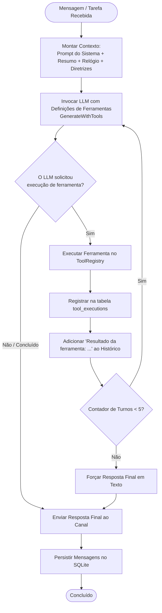

# O Loop do Agente Autônomo (`RunAgentLoop`)

Este documento descreve como o loop de raciocínio de IA autônomo do Bruce opera, como o encadeamento de ferramentas multi-etapas é executado e como as salvaguardas anti-alucinação são aplicadas.

---

## 1. Visão Geral

Em vez de atuar como um simples chatbot de disparo único ("pergunta entra, resposta sai"), o Bruce executa um **loop autônomo multi-turnos** (`ai.RunAgentLoop`).

Quando uma solicitação do usuário exige múltiplas operações (por exemplo: buscar na web, analisar dados e gerar um painel HTML completo), o loop do agente coordena o LLM e o registro de ferramentas ao longo de turnos sequenciais até a conclusão da tarefa.



---

## 2. Montagem e Injeção de Contexto

Antes de o LLM ser invocado, o worker constrói um **Prompt de Sistema Efetivo** composto por quatro camadas distintas:

```
┌─────────────────────────────────────────────────────────────────┐
│                   Prompt Base do Sistema                        │
│  "Você é o Bruce, um assistente de IA pessoal proativo..."      │
│  (Configurado na aba Configurações ou definido via config.yml)  │
├─────────────────────────────────────────────────────────────────┤
│                   <conversation_context>                        │
│  Resumo markdown conciso das conversas anteriores se a sessão   │
│  exceder o limite da janela de contexto (session_summaries).    │
├─────────────────────────────────────────────────────────────────┤
│                     <temporal_context>                          │
│  Data e Hora Atuais: Domingo, 27/09/2026 19:15:00 -0300.        │
│  Fuso: America/Sao_Paulo. Intervalo ocioso: 4h sem mensagens.   │
├─────────────────────────────────────────────────────────────────┤
│                 <tool_execution_guidelines>                     │
│  Regras multi-etapas, requisitos de artefatos, instruções do    │
│  agendador de modo duplo e diretrizes anti-alucinação.          │
└─────────────────────────────────────────────────────────────────┘
```

### O Contexto Temporal em Tempo Real
Uma falha comum em agentes de conversação é a "cegueira temporal" — o modelo não sabe que dia, hora ou minuto é hoje.
O Bruce calcula e injeta dinamicamente o horário exato da aplicação/servidor:
```go
temporalContext := ai.FormatTemporalContext(time.Now(), appTimezone, timeGapNotice)
effectiveSystemPrompt := ai.BuildEffectiveSystemPrompt(basePrompt, summary, temporalContext)
```
Isso permite ao Bruce calcular com precisão offsets relativos (ex: *"me manda um hello world daqui a dois minutos"*) e responder a perguntas temporais (ex: *"que dia é na próxima terça-feira?"*).

---

## 3. Ciclo de Execução Passo a Passo

Assinatura da função do loop do agente:
```go
func RunAgentLoop(
    ctx context.Context,
    llm LLMService,
    tools ToolRegistry,
    systemPrompt string,
    history []domain.Message,
    maxTurns int, // padrão: 5
) (string, error)
```

### Passo 1: Declaração de Ferramentas
O `ToolRegistry` converte todas as ferramentas habilitadas em declarações JSON Schema (`ToolDefinition`) esperadas pelo provedor de LLM ativo (Claude tool schema, Gemini function declarations ou OpenAI functions).

### Passo 2: Geração com Ferramentas
O LLM avalia o prompt do sistema, o histórico e as ferramentas disponíveis:
- Se nenhuma ferramenta for necessária: O LLM retorna `Complete = true` com o texto final.
- Se ferramentas forem necessárias: O LLM retorna um ou mais objetos `ToolCall` (nome, argumentos em JSON).

### Passo 3: Execução e Auditoria da Ferramenta
Cada ferramenta é consultada no `ToolRegistry` e executada:
```go
result, err := tools.Execute(ctx, call.Name, call.Input)
```
Toda execução de ferramenta é gravada na tabela SQLite `tool_executions` para auditoria e depuração na aba **Logs** do Painel Web.

### Passo 4: Injeção de Feedback
A saída da ferramenta é serializada e anexada ao histórico de mensagens:
```text
Role: user
Content: Tool 'web_search' result: [Search results for Go 1.25 release notes...]
```
O loop incrementa o contador de turnos e invoca o LLM novamente.

### Passo 5: Conclusão
O loop é encerrado quando:
1. O LLM produz uma resposta final sem solicitar novas ferramentas.
2. O contador atinge `maxTurns` (padrão 5), forçando uma chamada final de síntese textual.

---

## 4. Exemplo de Encadeamento de Ferramentas (Tool Chaining)

Veja como o Bruce encadeia múltiplas ferramentas para solicitações complexas:

**Prompt do Usuário**:
> *"Pesquise notícias recentes de tecnologia no Brasil, resuma as 3 principais e gere um dashboard em HTML chamado news.html."*

1. **Turno 1**:
   - O modelo recebe o prompt.
   - Identifica a necessidade de dados em tempo real.
   - Invoca `web_search(query="ultimas noticias tecnologia brasil")`.
2. **Turno 2**:
   - O modelo recebe os resultados da busca.
   - Avalia que possui informações suficientes para criar o painel.
   - Invoca `artifact_save(filename="news.html", title="Notícias Tech Brasil", content="<!DOCTYPE html><html>...")`.
3. **Turno 3**:
   - O modelo recebe a confirmação do salvamento: `Artifact saved at /artifacts/1234-abcd/news.html`.
   - Sintetiza a resposta final para o usuário:
     > *"Aqui estão as 3 principais notícias de tecnologia no Brasil [...]. Gere também o seu painel interativo: [Ver Dashboard](/artifacts/1234-abcd/news.html)."*

---

## 5. Salvaguardas Anti-Alucinação Estritas

Para evitar que modelos de linguagem inventem ações que nunca ocorreram, o prompt do sistema impõe regras estritas:

```text
<tool_execution_guidelines>
1. Execução Multi-Etapas & Encadeamento:
   - Quando um pedido exigir múltiplos passos (ex: buscar dados E criar arquivo HTML),
     você DEVE executar todas as ferramentas necessárias em sequência ao longo dos turnos.
2. Geração de HTML & Artefatos:
   - Quando o usuário pedir um documento ou relatório HTML, você DEVE invocar a ferramenta 'artifact_save'.
3. Agendamento & Lembretes Proativos:
   - Para lembretes diretos, use 'execution_mode': 'message'.
   - Para briefings dinâmicos de IA, use 'execution_mode': 'agent'.
4. Anti-Alucinação Estrita:
   - NUNCA afirme ter criado, salvo ou agendado nada a menos que você tenha chamado a ferramenta
     correspondente ('artifact_save', 'proactive_create') e recebido retorno de sucesso nesta sessão.
   - NUNCA invente URLs falsas como '/artifacts/...' sem executar a ferramenta previamente.
</tool_execution_guidelines>
```
