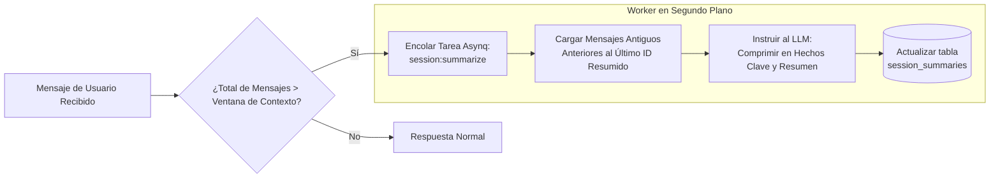

# Memoria, Contexto y Resumen

Este documento explica cómo Bruce gestiona el historial de conversaciones, evita agotar la ventana de contexto, comprime la memoria a largo plazo y realiza el seguimiento de la continuidad temporal.

---

## 1. El Reto del Contexto

Las ventanas de contexto de los modelos de lenguaje son finitas y costosas. A medida que las conversaciones crecen a lo largo de días y semanas:
1. Enviar todo el historial satura los límites de tokens.
2. Los costes aumentan de forma lineal o cuadrática.
3. La latencia se incrementa notablemente.
4. Por contra, truncar el historial provoca que la IA olvide preferencias clave del usuario e instrucciones previas.

Bruce resuelve esto con un **sistema de memoria híbrido en dos niveles**:
1. **Ventana de Contexto Deslizante** (memoria exacta a corto plazo).
2. **Resumen Asíncrono de Sesiones** (memoria comprimida a largo plazo).

---

## 2. Ventana de Contexto Deslizante

Cuando el usuario envía un mensaje, Bruce recupera los últimos $N$ mensajes desde la base de datos SQLite:
```go
// Obtiene los últimos N mensajes (configurados en claude.context_window, predeterminado: 15)
history, err := messageRepo.GetContextWindow(sessionID, cfg.Claude.ContextWindow)
```
- **Orden Cronológico**: La base de datos guarda los mensajes en riguroso orden temporal.
- **Tamaño Configurable**: Modificable mediante `claude.context_window` en `config.yml` o desde la configuración web.
- **Fidelidad Total**: Estos mensajes recientes contienen el redactado exacto, retornos de herramientas y bloques de código.

---

## 3. Resumen Asíncrono de Sesiones

Cuando una conversación supera el umbral de la ventana de contexto, Bruce no descarta los mensajes antiguos. En su lugar, programa una tarea en segundo plano en Asynq para resumirlos:



### La Tabla `session_summaries`
```sql
CREATE TABLE IF NOT EXISTS session_summaries (
    session_id             TEXT PRIMARY KEY,
    summary                TEXT NOT NULL DEFAULT '',
    last_summarized_msg_id TEXT NOT NULL DEFAULT '',
    message_count          INTEGER NOT NULL DEFAULT 0,
    updated_at             DATETIME NOT NULL DEFAULT (datetime('now')),
    FOREIGN KEY (session_id) REFERENCES sessions(id) ON DELETE CASCADE
);
```

### Inyección de Contexto
En cada turno, el worker comprueba si existe un resumen para la sesión actual. Si existe, lo inyecta al inicio del prompt:
```text
<conversation_context>
A continuación se muestra un resumen conciso del historial anterior y hechos clave de esta sesión:
- El usuario está desarrollando un proyecto en Go llamado Bruce.
- El servidor se ejecuta en la IP 192.168.1.12 con Docker Compose.
- El usuario prefiere respuestas en español o inglés según el contexto.
</conversation_context>
```

Esto garantiza que Bruce recuerde detalles importantes a lo largo de cientos de mensajes.

---

## 4. Conciencia Temporal y Detección de Inactividad

Las interacciones ocurren a lo largo del tiempo real. Saber *cuándo* se envió un mensaje es esencial para:
- Interpretar adecuadamente expresiones relativas (*"mañana"*, *"el próximo viernes"*, *"anoche"*).
- Reconocer el tiempo transcurrido (*"¡De vuelta por aquí! Han pasado varios días desde la última charla"*).

Bruce calcula dinámicamente:
1. **Reloj y Zona Horaria**:
   ```go
   t := now.In(loc)
   "Current Date & Time: Monday, 2026-09-28 10:15:00 -0300 (2026-09-28 10:15). Timezone: America/Sao_Paulo."
   ```
2. **Detección de Brecha de Inactividad**:
   ```go
   gap := now.Sub(lastMessageTime)
   if gap > 24*time.Hour {
       notice = fmt.Sprintf("Notice: %d days have elapsed since the user's last message.", int(gap.Hours()/24))
   }
   ```

Estos datos se inyectan en `<temporal_context>` para cada mensaje entrante.

---

## 5. Aislamiento de Sesiones por Conector

Cada plataforma mantiene un estado de sesión independiente identificado por:
- **Discord**: ID del Canal (para DMs, el ID del canal directo).
- **WhatsApp**: JID Remoto / Número de teléfono (ej: `5511999999999@s.whatsapp.net`).
- **Telegram**: ID del Chat (ej: `123456789`).
- **Web Chat**: UUID de sesión generado por el navegador.

Las sesiones se pueden inspeccionar, renombrar o eliminar desde la pestaña **Sessions** del Panel Web o vía API REST (`DELETE /api/v1/sessions/{id}`), lo que elimina en cascada los mensajes y tareas proactivas asociadas.
