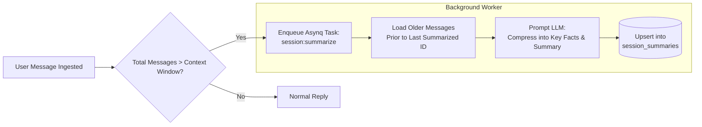

# Memory, Context & Summarization

This document explains how Bruce manages conversation history, avoids context window exhaustion, compresses long-term memory, and tracks temporal continuity.

---

## 1. The Context Challenge

LLM context windows are finite and costly. As conversations grow over days and weeks:
1. Sending the entire chat history causes token limits to be exceeded.
2. Costs scale linearly or quadratically.
3. Latency increases noticeably.
4. Conversely, truncating history causes the AI to forget critical user preferences, instructions, and context established earlier.

Bruce solves this using a **two-tiered hybrid memory system**:
1. **Sliding Context Window** (short-term exact memory).
2. **Asynchronous Session Summarization** (long-term compressed memory).

---

## 2. Sliding Context Window

When a user sends a message, Bruce loads the latest $N$ messages from the SQLite database:
```go
// Fetch last N messages (configured via claude.context_window, default: 15)
history, err := messageRepo.GetContextWindow(sessionID, cfg.Claude.ContextWindow)
```
- **Chronological Ordering**: The database stores messages in chronological order.
- **Configurable Size**: Adjusted via `claude.context_window` in `config.yml` or through database settings.
- **Full Fidelity**: These recent messages contain exact wording, tool responses, code blocks, and conversation nuances.

---

## 3. Asynchronous Session Summarization

When a conversation exceeds the context window threshold, Bruce does not discard old messages. Instead, it schedules an asynchronous background job to compress them:



### The `session_summaries` Table
```sql
CREATE TABLE IF NOT EXISTS session_summaries (
    session_id             TEXT PRIMARY KEY,
    summary                TEXT NOT NULL DEFAULT '',
    last_summarized_msg_id TEXT NOT NULL DEFAULT '',
    message_count          INTEGER NOT NULL DEFAULT 0,
    updated_at             DATETIME NOT NULL DEFAULT (datetime('now')),
    FOREIGN KEY (session_id) REFERENCES sessions(id) ON DELETE CASCADE
);
```

### Context Injection
On every turn, the worker checks if a summary exists for the current session. If present, it injects it at the top of the prompt:
```text
<conversation_context>
Below is a concise summary of previous conversation history and key facts for this session:
- User is building a Go microservices project named Bruce.
- Server is running on IP 192.168.1.12 with Docker Compose.
- User prefers responses in Portuguese or English depending on context.
</conversation_context>
```

This guarantees that Bruce remembers important context even across hundreds of turns.

---

## 4. Temporal Awareness & Idle Gap Tracking

Conversations with an AI assistant happen across real-world time. Knowing *when* a message is sent is critical for:
- Correctly interpreting relative phrases (*"tomorrow"*, *"next Friday"*, *"last night"*).
- Acknowledging time elapsed (*"Welcome back! It's been a few days since we spoke"*).

Bruce dynamically computes:
1. **Clock & Timezone**:
   ```go
   t := now.In(loc)
   "Current Date & Time: Monday, 2026-09-28 10:15:00 -0300 (2026-09-28 10:15). Timezone: America/Sao_Paulo."
   ```
2. **Idle Gap Detection**:
   ```go
   gap := now.Sub(lastMessageTime)
   if gap > 24*time.Hour {
       notice = fmt.Sprintf("Notice: %d days have elapsed since the user's last message.", int(gap.Hours()/24))
   }
   ```

These are combined and injected into `<temporal_context>` for every incoming message.

---

## 5. Session Isolation Across Connectors

Each platform maintains distinct session state identified by:
- **Discord**: Channel ID (for DMs, the direct message channel ID).
- **WhatsApp**: Remote JID / phone number (e.g. `5511999999999@s.whatsapp.net`).
- **Telegram**: Chat ID (e.g. `123456789`).
- **Web Chat**: Generated session UUID.

Sessions can be inspected, renamed, or deleted via the Web Dashboard **Sessions** tab or REST API (`DELETE /api/v1/sessions/{id}`), which cascades and cleans up associated messages and proactive tasks.
