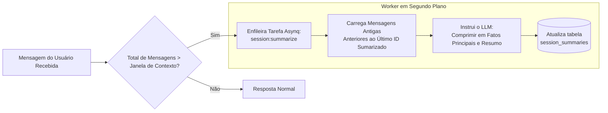

# Memória, Contexto & Sumarização

Este documento explica como o Bruce gerencia o histórico de conversas, evita o esgotamento da janela de contexto, comprime a memória de longo prazo e rastreia a continuidade temporal.

---

## 1. O Desafio do Contexto

As janelas de contexto dos modelos de linguagem são finitas e custosas. À medida que as conversas crescem ao longo de dias e semanas:
1. Enviar todo o histórico de mensagens estoura os limites de tokens.
2. Os custos sobem linear ou quadraticamente.
3. A latência aumenta perceptivelmente.
4. Por outro lado, truncar o histórico faz com que a IA esqueça preferências críticas do usuário, instruções e contexto estabelecido anteriormente.

O Bruce resolve esse problema com um **sistema de memória híbrido de dois níveis**:
1. **Janela Deslizante de Contexto** (memória exata de curto prazo).
2. **Sumarização Assíncrona de Sessões** (memória comprimida de longo prazo).

---

## 2. Janela Deslizante de Contexto

Quando um usuário envia uma mensagem, o Bruce carrega as últimas $N$ mensagens do banco SQLite:
```go
// Busca as últimas N mensagens (configuradas via claude.context_window, padrão: 15)
history, err := messageRepo.GetContextWindow(sessionID, cfg.Claude.ContextWindow)
```
- **Ordem Cronológica**: O banco armazena as mensagens em ordem estrita de ocorrência.
- **Tamanho Configurável**: Ajustado via `claude.context_window` no `config.yml` ou pelas configurações no banco de dados.
- **Fidelidade Total**: Essas mensagens recentes contêm a redação exata, retornos de ferramentas, blocos de código e nuances da conversa.

---

## 3. Sumarização Assíncrona de Sessões

Quando uma conversa ultrapassa o limite da janela de contexto, o Bruce não descarta mensagens antigas. Em vez disso, agenda um trabalho em segundo plano no Asynq para resumi-las:



### A Tabela `session_summaries`
```sql
CREATE TABLE IF NOT EXISTS session_summaries (
    session_id             TEXT PRIMARY KEY,
    summary                TEXT NOT NULL DEFAULT '',
    last_summarized_msg_id TEXT NOT NULL DEFAULT '',
    message_count          INTEGER NOT NULL DEFAULT 0,
    updated_at             DATETIME NOT NULL DEFAULT (datetime('now')),
    FOREIGN KEY (session_id) REFERENCES sessions(id) ON DELETE CASCADE
);
```

### Injeção de Contexto
A cada turno, o worker verifica se já existe um resumo para a sessão atual. Se existir, ele é injetado no topo do prompt:
```text
<conversation_context>
Abaixo está um resumo conciso do histórico de conversas anteriores e fatos-chave desta sessão:
- O usuário está construindo um projeto em Go chamado Bruce.
- O servidor roda no IP 192.168.1.12 com Docker Compose.
- O usuário prefere respostas em português ou inglês dependendo do contexto.
</conversation_context>
```

Isso garante que o Bruce lembre de detalhes importantes mesmo após centenas de interações.

---

## 4. Percepção Temporal & Detecção de Intervalos Ociosos

As interações com um assistente acontecem ao longo do tempo real. Saber *quando* uma mensagem foi enviada é fundamental para:
- Interpretar corretamente termos relativos (*"amanhã"*, *"próxima sexta"*, *"ontem à noite"*).
- Reconhecer o tempo decorrido (*"Bem-vindo de volta! Já faz alguns dias que não nos falamos"*).

O Bruce calcula dinamicamente:
1. **Relógio & Fuso Horário**:
   ```go
   t := now.In(loc)
   "Current Date & Time: Monday, 2026-09-28 10:15:00 -0300 (2026-09-28 10:15). Timezone: America/Sao_Paulo."
   ```
2. **Detecção de Intervalo Ocioso**:
   ```go
   gap := now.Sub(lastMessageTime)
   if gap > 24*time.Hour {
       notice = fmt.Sprintf("Notice: %d days have elapsed since the user's last message.", int(gap.Hours()/24))
   }
   ```

Esses dados são unificados e injetados em `<temporal_context>` para cada mensagem recebida.

---

## 5. Isolamento de Sessões Entre Conectores

Cada conector mantém seu próprio estado de sessão identificado por:
- **Discord**: ID do Canal (para DMs, o ID do canal de mensagem direta).
- **WhatsApp**: JID Remoto / Número de telefone (ex: `5511999999999@s.whatsapp.net`).
- **Telegram**: ID do Chat (ex: `123456789`).
- **Web Chat**: UUID da sessão gerado pelo navegador.

As sessões podem ser visualizadas, renomeadas ou excluídas pela aba **Sessions** do Painel Web ou via API REST (`DELETE /api/v1/sessions/{id}`), o que remove em cascata as mensagens e tarefas proativas associadas.
