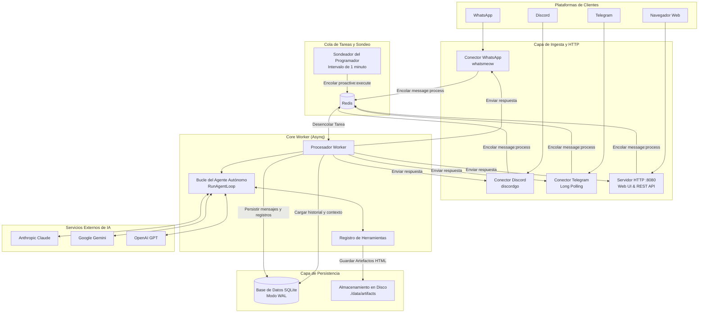

# Visión General de la Arquitectura del Sistema

Este documento describe la arquitectura de alto nivel, los componentes en tiempo de ejecución, el esquema de la base de datos y el modelo de colas de Bruce.

---

## 1. Filosofía de Arquitectura

Bruce está diseñado en torno a cinco principios fundamentales:

1. **Binario Único Autónomo**: Compilado como un único ejecutable Go independiente con todos los recursos del panel web integrados mediante `go:embed`. No requiere runtime de Node.js, dependencias de Python ni servidor web estático externo.
2. **Inyección Explícita de Dependencias**: Sin marcos mágicos de reflexión, contenedores DI (como Uber FX) ni ORM pesados. Todos los componentes se instancian y configuran explícitamente en `cmd/bruce/main.go`.
3. **Soberanía de Datos Local-First**: Todo el estado (sesiones, mensajes, tareas proactivas, resúmenes, configuraciones) reside en una base de datos local **SQLite** operando en modo Write-Ahead Logging (`WAL`).
4. **Desacoplamiento Asíncrono vía Redis**: Los mensajes entrantes de todos los conectores se convierten en tareas serializables y se envían a Redis a través de **Asynq**. Los conectores nunca se bloquean esperando llamadas lentas a LLM, ejecuciones de herramientas o reintentos de API.
5. **Abstracción de IA Multiproveedor**: El worker central interactúa con los LLM a través de interfaces estandarizadas (`LLMService`), lo que permite alternar sin problemas entre Claude, Gemini y OpenAI.

---

## 2. Arquitectura de Ejecución en Alto Nivel



---

## 3. Cola de Tareas Asynq y Tipos de Trabajos

Bruce utiliza [Asynq](https://github.com/hibiken/asynq) sobre Redis para garantizar una ejecución en segundo plano confiable, reintentos automáticos y resiliencia ante límites de frecuencia.

| Tipo de Tarea | Carga Útil de Cola | Tiempo Límite | Descripción |
|---|---|---|---|
| `message:process` | `ProcessIncomingMessagePayload` | 180s | Ingesta un mensaje de usuario desde Discord, WhatsApp, Telegram o Web Chat, ejecuta el bucle del agente y envía la respuesta. |
| `proactive:execute_report` | `ExecuteScheduledReportPayload` | 180s | Ejecuta una tarea programada vencida. Si `mode: "message"`, envía directamente. Si `mode: "agent"`, ejecuta el bucle con herramientas. |
| `proactive:evaluate_watch` | `EvaluateWatchPayload` | 45s | Evalúa una condición ambiental con herramientas específicas y comprueba cambios de hash. |
| `session:summarize` | `SummarizeSessionPayload` | 60s | Comprime periódicamente el historial antiguo de conversaciones largas en un resumen conciso en Markdown. |

---

## 4. Esquema de Base de Datos SQLite

Bruce utiliza SQLite con claves foráneas y modo WAL habilitado (`_journal_mode=WAL&_busy_timeout=5000`).

### Tablas Principales:

```
┌──────────────────┐       ┌──────────────────────┐
│     sessions     │◀─────┼│       messages       │
├──────────────────┤ 1   N ├──────────────────────┤
│ id (PK)          │       │ id (PK)              │
│ connector_type   │       │ session_id (FK)      │
│ channel_id       │       │ role (user/assistant)│
│ is_active        │       │ content              │
│ system_prompt    │       │ timestamp            │
└────────┬─────────┘       └──────────────────────┘
         │
         │ 1
         │
         ▼ N
┌─────────────────────────┐       ┌──────────────────────┐
│     proactive_tasks     │       │  session_summaries   │
├─────────────────────────┤       ├──────────────────────┤
│ id (PK)                 │       │ session_id (PK, FK)  │
│ session_id (FK)         │       │ summary              │
│ title                   │       │ last_summarized_msg  │
│ task_type (cron/watch)  │       │ message_count        │
│ execution_mode (msg/agt)│       │ updated_at           │
│ schedule_expr           │       └──────────────────────┘
│ prompt_condition        │
│ is_active               │       ┌──────────────────────┐
│ next_run_at             │       │   tool_executions    │
└─────────────────────────┘       ├──────────────────────┤
                                  │ id (PK)              │
┌─────────────────────────┐       │ session_id           │
│     config_entries      │       │ tool_name            │
├─────────────────────────┤       │ input_json           │
│ key (PK)                │       │ output_json          │
│ value                   │       │ executed_at          │
│ updated_at              │       └──────────────────────┘
└─────────────────────────┘
```

1. **`sessions`**: Representa una conversación individual identificada por `(connector_type, channel_id)`.
2. **`messages`**: Registro cronológico de mensajes del usuario y respuestas del asistente.
3. **`proactive_tasks`**: Programaciones y monitoreos de condiciones con modo de ejecución (`message` vs `agent`).
4. **`session_summaries`**: Resúmenes continuos de conversaciones pasadas para mantener el contexto más allá del límite de tokens.
5. **`tool_executions`**: Registro de auditoría de cada ejecución de herramienta, entradas y resultados.
6. **`config_entries`**: Modificaciones dinámicas de configuración administradas mediante la interfaz web y la API.
7. **`oauth_tokens`**: Tokens de acceso y actualización cifrados para integraciones de Google Workspace.

---

## 5. Ciclos de Vida y Cierre Controlado (Graceful Shutdown)

Cuando Bruce recibe una señal de terminación (`SIGINT` o `SIGTERM`):
1. **Servidor HTTP**: Llama a `server.Shutdown(ctx)` con un tiempo límite de 10 segundos, rechazando nuevas conexiones mientras completa las solicitudes en curso.
2. **Sondeador del Programador**: Detiene el ticker de 1 minuto.
3. **Procesamiento de Asynq**: Llama a `asynqServer.Shutdown()`, esperando que los workers activos completen sus tareas sin pérdida de datos.
4. **Conectores**:
   - Discord: Cierra la sesión WebSocket de la pasarela (`discordgo.Close()`).
   - WhatsApp: Desconecta el cliente `whatsmeow` de forma segura.
   - Telegram: Detiene el bucle de sondeo (long-polling).
5. **Base de Datos**: Cierra de forma segura el grupo de conexiones de SQLite, realizando el punto de control de los archivos WAL.
