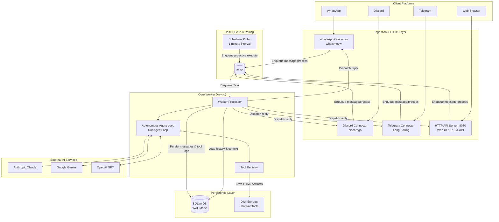

# System Architecture Overview

This document describes the high-level architecture, runtime components, database schema, and queuing model of Bruce.

---

## 1. Architectural Philosophy

Bruce is engineered around five fundamental principles:

1. **Self-Contained Single Binary**: Compiled as a standalone Go binary with all web dashboard assets embedded via `go:embed`. No Node.js runtime, Python dependency, or external static web server is required.
2. **Explicit Dependency Injection**: No magical reflection frameworks, DI containers (e.g. Uber FX), or heavy ORMs. All components are instantiated and wired explicitly in `cmd/bruce/main.go`.
3. **Local-First Data Sovereignty**: All state (sessions, messages, proactive tasks, summaries, config entries) lives in a local **SQLite** database operating in Write-Ahead Logging (`WAL`) mode.
4. **Asynchronous Decoupling via Redis**: Incoming messages from all connectors are converted into serializable tasks and pushed to Redis via **Asynq**. Connectors never block on slow LLM calls, tool executions, or API retries.
5. **Multi-Provider AI Abstraction**: The core worker interacts with LLMs through standardized interfaces (`LLMService`), making switching between Claude, Gemini, and OpenAI transparent.

---

## 2. High-Level Runtime Architecture



---

## 3. Asynq Task Queue & Job Types

Bruce uses [Asynq](https://github.com/hibiken/asynq) on top of Redis to guarantee reliable background execution, retries, and rate-limiting resilience.

| Task Type | Queue Payload | Timeout | Description |
|---|---|---|---|
| `message:process` | `ProcessIncomingMessagePayload` | 180s | Ingests a user message from Discord, WhatsApp, Telegram, or Web Chat, executes the agent loop, and dispatches the answer. |
| `proactive:execute_report` | `ExecuteScheduledReportPayload` | 180s | Executes a due cron task. If `mode: "message"`, dispatches directly. If `mode: "agent"`, runs the agent loop with tools. |
| `proactive:evaluate_watch` | `EvaluateWatchPayload` | 45s | Evaluates an ambient monitoring condition using targeted tools and checks for hash changes. |
| `session:summarize` | `SummarizeSessionPayload` | 60s | Periodically compresses older conversation history in long sessions into a concise markdown summary. |

---

## 4. SQLite Database Schema

Bruce uses SQLite with foreign keys and WAL mode enabled (`_journal_mode=WAL&_busy_timeout=5000`).

### Core Tables:

```
┌──────────────────┐       ┌──────────────────────┐
│     sessions     │◀─────┼│       messages       │
├──────────────────┤ 1   N ├──────────────────────┤
│ id (PK)          │       │ id (PK)              │
│ connector_type   │       │ session_id (FK)      │
│ channel_id       │       │ role (user/assistant)│
│ is_active        │       │ content              │
│ system_prompt    │       │ timestamp            │
└────────┬─────────┘       └──────────────────────┘
         │
         │ 1
         │
         ▼ N
┌─────────────────────────┐       ┌──────────────────────┐
│     proactive_tasks     │       │  session_summaries   │
├─────────────────────────┤       ├──────────────────────┤
│ id (PK)                 │       │ session_id (PK, FK)  │
│ session_id (FK)         │       │ summary              │
│ title                   │       │ last_summarized_msg  │
│ task_type (cron/watch)  │       │ message_count        │
│ execution_mode (msg/agt)│       │ updated_at           │
│ schedule_expr           │       └──────────────────────┘
│ prompt_condition        │
│ is_active               │       ┌──────────────────────┐
│ next_run_at             │       │   tool_executions    │
└─────────────────────────┘       ├──────────────────────┤
                                  │ id (PK)              │
┌─────────────────────────┐       │ session_id           │
│     config_entries      │       │ tool_name            │
├─────────────────────────┤       │ input_json           │
│ key (PK)                │       │ output_json          │
│ value                   │       │ executed_at          │
│ updated_at              │       └──────────────────────┘
└─────────────────────────┘
```

1. **`sessions`**: Represents a distinct conversation thread keyed by `(connector_type, channel_id)`.
2. **`messages`**: Chronological log of user prompts and assistant replies.
3. **`proactive_tasks`**: Background schedules and condition watches with execution mode (`message` vs `agent`).
4. **`session_summaries`**: Running compact summaries of past conversations to preserve context beyond the context window.
5. **`tool_executions`**: Audit log of every tool execution, inputs, and results.
6. **`config_entries`**: Dynamic key-value configuration overrides managed through the Web UI and API.
7. **`oauth_tokens`**: Encrypted access and refresh tokens for Google Workspace integrations.

---

## 5. Lifecycles & Graceful Shutdown

When Bruce receives a termination signal (`SIGINT` or `SIGTERM`):
1. **HTTP Server**: Calls `server.Shutdown(ctx)` with a 10-second timeout, refusing new connections while finishing in-flight requests.
2. **Scheduler Poller**: Stops the 1-minute ticker.
3. **Asynq Processing**: Calls `asynqServer.Shutdown()`, waiting for active workers to complete their in-flight tasks without dropping work.
4. **Connectors**:
   - Discord: Disconnects the gateway WebSocket session (`discordgo.Close()`).
   - WhatsApp: Disconnects the `whatsmeow` client safely.
   - Telegram: Stops the long-polling loop.
5. **Database**: Closes the SQLite connection pool safely, checkpointing WAL files.
