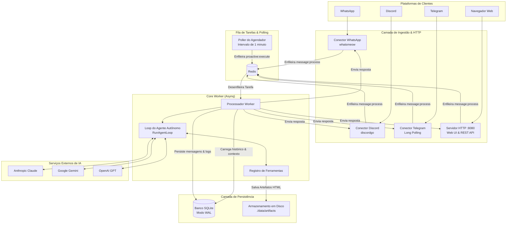

# Visão Geral da Arquitetura do Sistema

Este documento descreve a arquitetura de alto nível, os componentes de execução, o esquema do banco de dados e o modelo de filas do Bruce.

---

## 1. Filosofia de Arquitetura

O Bruce é desenvolvido em torno de cinco princípios fundamentais:

1. **Binário Único Autossuficiente**: Compilado como um executável Go independente com todos os assets do painel web embutidos via `go:embed`. Não requer runtime Node.js, dependências Python ou servidor web estático externo.
2. **Injeção Explícita de Dependências**: Sem frameworks mágicos de reflexão, contêineres de DI (como Uber FX) ou ORMs pesados. Todos os componentes são instanciados e conectados explicitamente em `cmd/bruce/main.go`.
3. **Soberania de Dados Local-First**: Todo o estado (sessões, mensagens, tarefas proativas, resumos, configurações) reside em um banco **SQLite** local operando no modo Write-Ahead Logging (`WAL`).
4. **Desacoplamento Assíncrono via Redis**: Mensagens recebidas de todos os conectores são convertidas em tarefas serializáveis e enfileiradas no Redis através do **Asynq**. Os conectores nunca bloqueiam esperando chamadas lentas de LLM, execuções de ferramentas ou retentativas de API.
5. **Abstração de IA Multi-Provedor**: O worker principal interage com LLMs através de interfaces padronizadas (`LLMService`), permitindo alternar de forma transparente entre Claude, Gemini e OpenAI.

---

## 2. Arquitetura de Execução em Alto Nível



---

## 3. Fila de Tarefas Asynq & Tipos de Tarefas

O Bruce utiliza o [Asynq](https://github.com/hibiken/asynq) sobre o Redis para garantir execução resiliente em segundo plano, retentativas automáticas e controle de taxa.

| Tipo de Tarefa | Payload da Fila | Timeout | Descrição |
|---|---|---|---|
| `message:process` | `ProcessIncomingMessagePayload` | 180s | Recebe mensagem de usuário do Discord, WhatsApp, Telegram ou Web Chat, executa o loop do agente e envia a resposta. |
| `proactive:execute_report` | `ExecuteScheduledReportPayload` | 180s | Executa uma tarefa agendada vencida. Se `mode: "message"`, envia diretamente. Se `mode: "agent"`, executa o loop do agente com ferramentas. |
| `proactive:evaluate_watch` | `EvaluateWatchPayload` | 45s | Avalia uma condição de monitoramento ambiental usando ferramentas direcionadas e verifica mudanças de hash. |
| `session:summarize` | `SummarizeSessionPayload` | 60s | Comprime periodicamente o histórico mais antigo de conversas longas em um resumo markdown conciso. |

---

## 4. Esquema do Banco de Dados SQLite

O Bruce usa SQLite com chaves estrangeiras e modo WAL ativado (`_journal_mode=WAL&_busy_timeout=5000`).

### Tabelas Principais:

```
┌──────────────────┐       ┌──────────────────────┐
│     sessions     │◀─────┼│       messages       │
├──────────────────┤ 1   N ├──────────────────────┤
│ id (PK)          │       │ id (PK)              │
│ connector_type   │       │ session_id (FK)      │
│ channel_id       │       │ role (user/assistant)│
│ is_active        │       │ content              │
│ system_prompt    │       │ timestamp            │
└────────┬─────────┘       └──────────────────────┘
         │
         │ 1
         │
         ▼ N
┌─────────────────────────┐       ┌──────────────────────┐
│     proactive_tasks     │       │  session_summaries   │
├─────────────────────────┤       ├──────────────────────┤
│ id (PK)                 │       │ session_id (PK, FK)  │
│ session_id (FK)         │       │ summary              │
│ title                   │       │ last_summarized_msg  │
│ task_type (cron/watch)  │       │ message_count        │
│ execution_mode (msg/agt)│       │ updated_at           │
│ schedule_expr           │       └──────────────────────┘
│ prompt_condition        │
│ is_active               │       ┌──────────────────────┐
│ next_run_at             │       │   tool_executions    │
└─────────────────────────┘       ├──────────────────────┤
                                  │ id (PK)              │
┌─────────────────────────┐       │ session_id           │
│     config_entries      │       │ tool_name            │
├─────────────────────────┤       │ input_json           │
│ key (PK)                │       │ output_json          │
│ value                   │       │ executed_at          │
│ updated_at              │       └──────────────────────┘
└─────────────────────────┘
```

1. **`sessions`**: Representa uma conversa individual identificada por `(connector_type, channel_id)`.
2. **`messages`**: Histórico cronológico de mensagens do usuário e respostas do assistente.
3. **`proactive_tasks`**: Agendamentos e monitoramentos de condições com modo de execução (`message` vs `agent`).
4. **`session_summaries`**: Resumos contínuos de conversas anteriores para preservar contexto além da janela máxima de tokens.
5. **`tool_executions`**: Log de auditoria de cada execução de ferramenta, parâmetros de entrada e retornos.
6. **`config_entries`**: Substituições dinâmicas de configuração gerenciadas via painel Web e API.
7. **`oauth_tokens`**: Tokens de acesso e refresh criptografados para integrações com o Google Workspace.

---

## 5. Ciclos de Vida e Encerramento Gracioso (Graceful Shutdown)

Quando o Bruce recebe um sinal de encerramento (`SIGINT` ou `SIGTERM`):
1. **Servidor HTTP**: Chama `server.Shutdown(ctx)` com timeout de 10 segundos, recusando novas conexões enquanto finaliza requisições em andamento.
2. **Poller do Agendador**: Para o ticker de 1 minuto.
3. **Processamento Asynq**: Chama `asynqServer.Shutdown()`, aguardando que os workers ativos concluam suas tarefas sem perda de dados.
4. **Conectores**:
   - Discord: Desconecta a sessão WebSocket do gateway (`discordgo.Close()`).
   - WhatsApp: Desconecta o cliente `whatsmeow` com segurança.
   - Telegram: Interrompe o loop de long-polling.
5. **Banco de Dados**: Fecha com segurança o pool de conexões SQLite, executando o checkpoint dos arquivos WAL.
