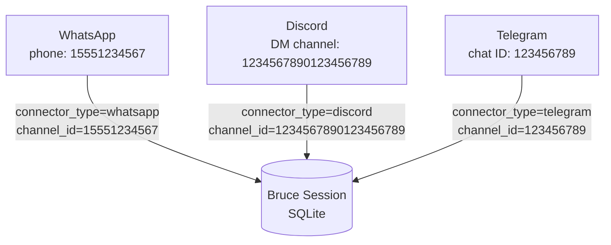

# Connectors

Bruce connects to messaging platforms using **connectors** — thin adapters that translate platform-specific events into a common internal task format. Each connector runs independently; you can enable one or all three simultaneously.

---

## Comparison

| Connector | Protocol | Auth | Message scope | Chunking | Session ID format |
|---|---|---|---|---|---|
| [WhatsApp](./whatsapp.md) | WebSocket (whatsmeow) | QR code scan | DMs only | None (WhatsApp handles delivery) | Raw phone number (e.g. `15551234567`) |
| [Discord](./discord.md) | WebSocket (discordgo) | Bot Token | DMs only | 1900-char word-boundary chunks | Discord DM channel ID (e.g. `1234567890123456789`) |
| [Telegram](./telegram.md) | HTTP long-polling | Bot Token | Private chats only | None (Telegram has no hard limit at this scale) | Chat ID as decimal string (e.g. `123456789`) |

---

## How Sessions Work

Every connector maps its platform-specific identifier to a Bruce **Session** stored in SQLite. A session is the unit of conversation — it holds the message history that Bruce sends to the LLM as context.

When a message arrives:

1. The connector extracts a stable `channel_id` from the platform event.
2. Bruce looks up (or creates) a Session in SQLite keyed on `(connector_type, channel_id)`.
3. The last N messages from that session (controlled by `claude.context_window`) are sent to the LLM along with the new message.
4. The LLM's response is persisted to the session and sent back to the platform.

This means each user gets their own persistent conversation thread, regardless of which connector they use to reach Bruce.

---

## Channel ID → Session Mapping

Each platform identity maps to exactly one session. A user who messages Bruce on both WhatsApp and Telegram gets two separate sessions — there is no cross-connector session merging.

---

## Connector Docs

- [WhatsApp](./whatsapp.md) — QR code setup, auth flow, message processing, troubleshooting
- [Discord](./discord.md) — Bot creation, DM processing, message chunking
- [Telegram](./telegram.md) — @BotFather setup, long-polling, backoff behaviour, troubleshooting
