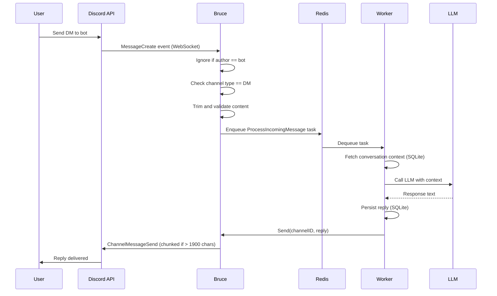
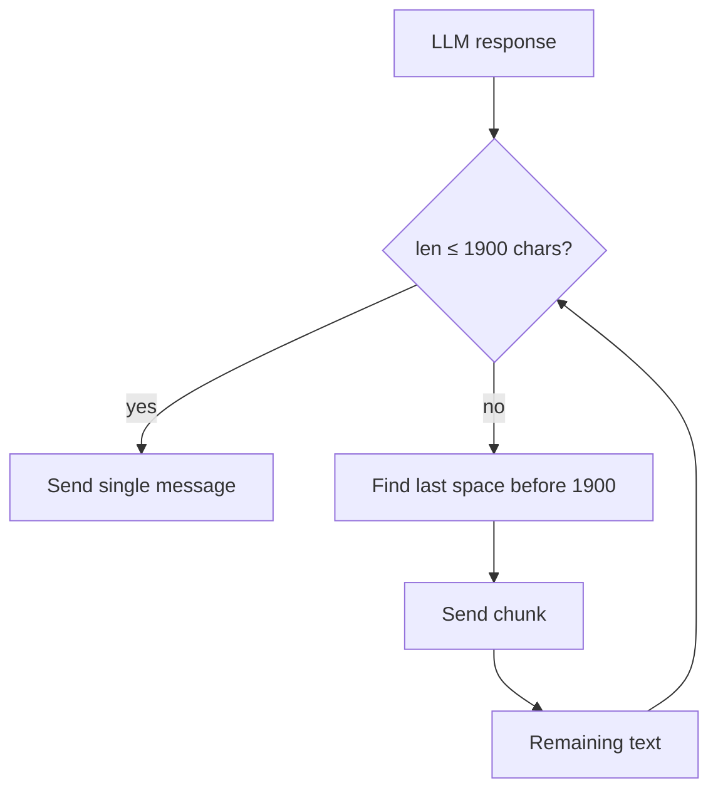

# Discord Connector

Bruce connects to Discord using [discordgo](https://github.com/bwmarrin/discordgo) via a persistent WebSocket connection. It runs as a Discord bot that processes direct messages and routes them through the standard Bruce message pipeline.

---

## Overview

- **Protocol:** Discord WebSocket (discordgo)
- **Auth:** Bot Token
- **Scope:** Direct messages only (guild/server messages are ignored)
- **Media:** Text messages only; embeds and attachments without text content are silently ignored

---

## Prerequisites

- A Discord account
- Access to the [Discord Developer Portal](https://discord.com/developers/applications)
- Bruce running locally with Redis available

---

## Creating the Bot

**1. Go to the [Discord Developer Portal](https://discord.com/developers/applications) and click "New Application".** Give it a name (e.g. "Bruce").

**2. Navigate to the "Bot" section.** Click "Reset Token" and copy the token — you won't see it again.

**3. Disable "Public Bot"** if you don't want others to add your bot to their servers.

**4. Generate an invite URL.** Go to OAuth2 → URL Generator. Select the `bot` scope. No guild permissions are needed for DM-only use. Copy the generated URL and open it in your browser to add the bot to a server you own.

> Bruce must share at least one server with a user before that user can DM it. This is a Discord platform requirement.

**5. Enable the connector in `config.yml`:**

```yaml
connectors:
  discord:
    enabled: true
    bot_token: "your-bot-token-here"
```

**6. Start Bruce and DM the bot.** You should receive a reply within a few seconds.

---

## How DM Processing Works

The sequence below shows the full path from a Discord DM to Bruce's reply.



---

## Message Chunking

Discord enforces a 2000-character limit per message. Bruce chunks responses at 1900 characters (leaving a 100-character buffer for formatting) and breaks on word boundaries where possible to avoid cutting words mid-word.



Hard cuts at exactly 1900 characters are used only when no space is found within the window (e.g. a very long URL or code token).

---

## Limitations

| Limitation | Detail |
|---|---|
| DMs only | Guild/channel messages are ignored at the event handler level |
| Shared server required | Discord requires bots and users to share at least one server before DMing |
| Text only | Messages with only attachments or embeds (no text content) are silently dropped |
| No slash commands | Bruce responds to plain text messages only |
| Single bot account | One bot token, one identity per Bruce instance |

---

## Troubleshooting

| Symptom | Cause | Fix |
|---|---|---|
| `discord bot token is required` on startup | `bot_token` is empty or connector disabled | Set `connectors.discord.enabled: true` and `bot_token` |
| Bot online but no reply to DM | You don't share a server with the bot | Add the bot to a mutual server via the OAuth2 invite URL |
| `failed to fetch channel` errors in logs | Rare Discord API issue | Transient; the channel is fetched directly if not in state cache |
| Replies are cut off mid-sentence | Chunking split on a very long token | This is expected behavior — Bruce avoids mid-word cuts where possible |
| `discord_rate_limited_total` counter incrementing | High message volume | discordgo handles rate limits internally; the counter is informational |
| Bot appears offline in Discord | WebSocket failed to open | Check that the bot token is valid and Redis is running |
