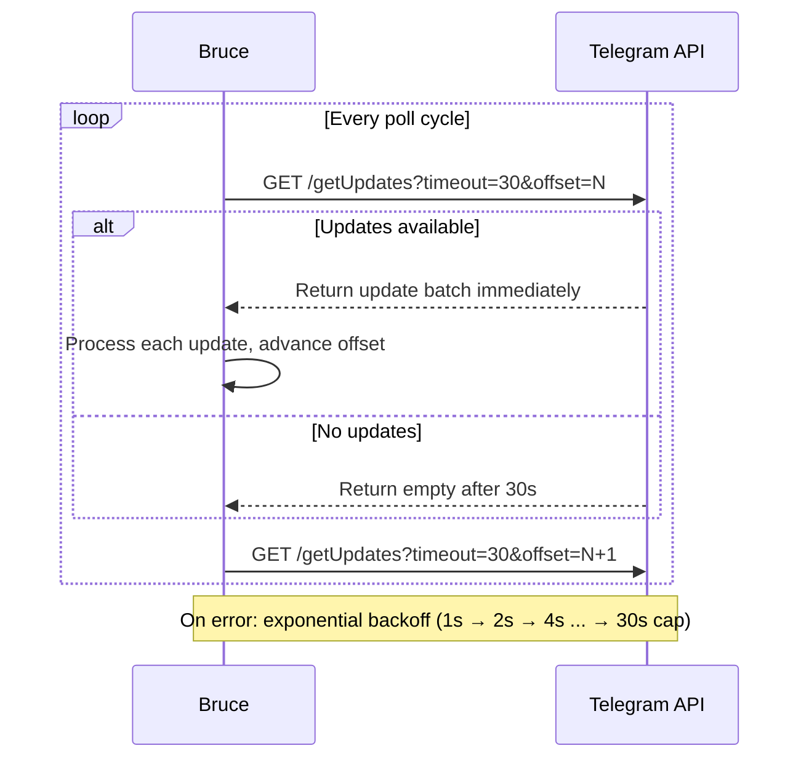
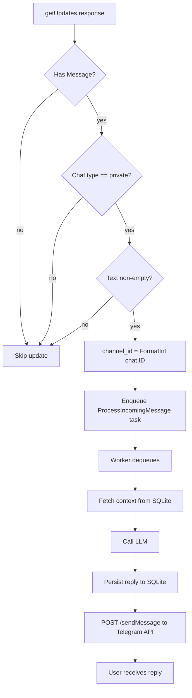

# Telegram Connector

Telegram is the easiest connector to get running — all you need is a Telegram account and five minutes with @BotFather. No app registration portal, no OAuth flow, no WebSocket library. Bruce polls the Telegram Bot API directly over HTTPS.

---

## Overview

- **Protocol:** HTTP long-polling (`getUpdates` with 30s timeout)
- **Auth:** Bot Token from @BotFather
- **Scope:** Private (DM) chats only
- **Media:** Text messages only; other message types are silently ignored
- **No external library required:** Bruce uses the standard `net/http` client directly

---

## Prerequisites

- A Telegram account (any platform)
- That's it.

---

## Creating the Bot

**1. Open Telegram and search for [@BotFather](https://t.me/BotFather).** This is the official Telegram bot for creating and managing bots.

**2. Send `/newbot`.** BotFather will walk you through two prompts:
   - **Name** — the display name for your bot (e.g. "Bruce")
   - **Username** — must end in `bot` (e.g. `mybruce_bot`)

**3. Copy the bot token.** It looks like `110201543:AAHdqTcvCH1vGWJxfSeofSAs0K5PALDsaw`. Store it securely.

**4. Enable the connector in `config.yml`:**

```yaml
connectors:
  telegram:
    enabled: true
    bot_token: "110201543:AAHdqTcvCH1vGWJxfSeofSAs0K5PALDsaw"  # from @BotFather
```

**5. Start Bruce** and send your bot a message in Telegram. Bruce will reply within a few seconds.

---

## How Long-Polling Works

Unlike webhooks (where Telegram pushes updates to your server), Bruce polls Telegram for new messages. Each call to `getUpdates` sets `timeout=30`, telling Telegram to hold the connection open for up to 30 seconds before returning an empty response. Bruce's HTTP client has a 45-second timeout to accommodate this.

This approach works without a public IP address or TLS certificate — ideal for running Bruce locally.

The sequence below shows the long-polling loop:



---

## Processing Flow

Each update received from Telegram is routed through this pipeline:



---

## Resilience and Backoff

When `getUpdates` returns an error (network failure, API outage, invalid token), Bruce applies exponential backoff before retrying:

| Attempt | Wait before retry |
|---|---|
| 1st error | 1 second |
| 2nd error | 2 seconds |
| 3rd error | 4 seconds |
| 4th error | 8 seconds |
| 5th+ errors | 30 seconds (cap) |

The backoff resets to 1 second after any successful poll. Bruce continues polling indefinitely — it does not give up after a fixed number of retries.

---

## Session ID Format

Bruce identifies each conversation by a `channel_id`. For Telegram, this is the Telegram chat ID formatted as a decimal string using `strconv.FormatInt(chat.ID, 10)`.

For example, if your Telegram chat ID is `-1001234567890`, the `channel_id` stored in SQLite is `"-1001234567890"`. Since Bruce only processes private chats in phase 1, all `channel_id` values are positive integers representing individual user IDs.

---

## Limitations

| Limitation | Detail |
|---|---|
| Private chats only | Group chats, supergroups, and channels are filtered out |
| Text only | Photos, documents, voice messages, stickers, and other media types are ignored |
| No webhooks | Bruce uses long-polling; a public HTTPS endpoint is not required |
| No slash commands | Bruce responds to plain text messages only |
| Single bot per instance | One bot token per Bruce process |

---

## Troubleshooting

| Symptom | Cause | Fix |
|---|---|---|
| `getUpdates status 401` error in logs | Invalid or revoked bot token | Generate a new token with `/token` in @BotFather |
| No reply to messages | Connector not enabled | Set `connectors.telegram.enabled: true` in config |
| Long delay before first reply | Poll cycle in progress | Normal — up to 30 seconds if a poll just started |
| Repeated backoff errors in logs | Network issue or Telegram API outage | Check internet connectivity; backoff will retry automatically |
| `invalid channel_id` error in logs | Corrupt state in database | Rare; the channel ID format (`int64` as decimal string) must be consistent |
| Bruce replies to old messages on restart | `offset` resets to 0 | Expected on first start; Bruce will re-process unacknowledged updates once, then advance the offset |
