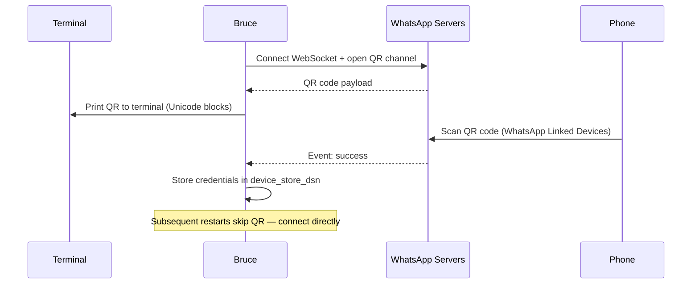
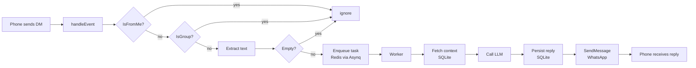

# WhatsApp Connector

Bruce connects to WhatsApp using [whatsmeow](https://github.com/tulir/whatsmeow), a pure-Go implementation of the WhatsApp Web multi-device protocol. No Meta Business API, no cloud setup — Bruce authenticates as a linked device on your personal WhatsApp account via a QR code scan.

---

## Overview

- **Protocol:** WhatsApp Web WebSocket (multi-device)
- **Auth:** QR code scan, credentials persisted locally
- **Scope:** Direct messages only (group messages are silently ignored)
- **Media:** Text messages only; voice, images, and other media are silently ignored

---

## Prerequisites

- A phone with an active WhatsApp account
- Bruce running locally with Redis available
- The `device_store_dsn` path must be writable by the Bruce process

---

## Setup

**1. Enable the connector in `config.yml`:**

```yaml
connectors:
  whatsapp:
    enabled: true
    device_store_dsn: "./data/whatsapp.db"
```

**2. Start Bruce:**

```bash
go run cmd/bruce/main.go
```

**3. Bruce prints a QR code to the terminal.** You will see Unicode block characters forming a scannable QR pattern.

**4. On your phone, open WhatsApp → Settings → Linked Devices → Link a Device.**

**5. Scan the QR code.** Bruce logs `INFO: whatsapp: QR pairing successful` and begins accepting messages. Send yourself a DM in WhatsApp to test.

---

## Authentication Flow

The sequence below shows how Bruce and WhatsApp negotiate a linked-device session on first run.



---

## How Messages Are Processed

Once paired, every incoming message travels through this pipeline:



The `channel_id` Bruce uses to identify the conversation is the sender's raw phone number (e.g. `15551234567`), stripped of the WhatsApp JID suffix.

---

## Persistence Between Restarts

Credentials are stored in the SQLite database at `device_store_dsn`. When Bruce restarts and the device store already contains a valid session, it reconnects directly — no QR scan needed. If you see `INFO: whatsapp: reconnecting with stored credentials` in the logs, the stored session is being reused.

The device store is deleted automatically when WhatsApp logs out the linked device (e.g. you remove it from Linked Devices on your phone). The next restart will prompt a new QR scan.

---

## Limitations

| Limitation | Detail |
|---|---|
| DMs only | Group messages are filtered out at the event handler level |
| Text only | Voice notes, images, stickers, and documents are silently ignored |
| One account per instance | whatsmeow manages a single WhatsApp identity |
| Personal account | No Meta Business API or WhatsApp Business account required or supported |
| QR timeout | If you don't scan within ~60 seconds, restart Bruce to get a fresh QR code |

---

## Troubleshooting

| Symptom | Cause | Fix |
|---|---|---|
| QR code not printed | `enabled: false` in config | Set `connectors.whatsapp.enabled: true` |
| `QR code timed out` error | Scan window expired | Restart Bruce; a new QR is generated |
| No reply from Bruce | Redis or worker not running | Check `docker compose up -d` and worker logs |
| `failed to delete device store` in logs | File permission issue on `device_store_dsn` | Ensure the path is writable by the process |
| Messages stop arriving after phone reset | WhatsApp logged out the linked device | Delete `whatsapp.db`, restart Bruce, re-scan QR |
| Bruce sends messages but phone shows blank | Non-text media was sent | WhatsApp connector only processes text content |
