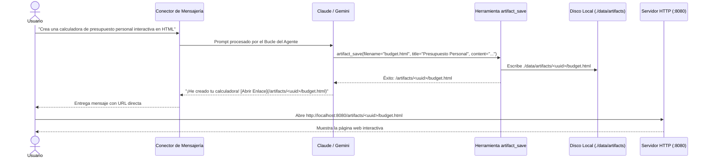

# Motor de Artefactos HTML Autónomos

Bruce puede crear, guardar y alojar **Artefactos HTML** interactivos directamente en tu servidor.

---

## 1. ¿Por Qué Usar Artefactos?

Las aplicaciones de mensajería como WhatsApp, Discord y Telegram están limitadas al texto simple y markdown básico:
- Sin botones interactivos, formularios ni calculadoras dinámicas.
- Sin gráficos interactivos, visualizaciones de datos ni tablas ordenables.
- Tablas, facturas o currículos se ven comprimidos en pantallas de móviles.

Con el **Motor de Artefactos**, Bruce genera documentos web completos e interactivos y te envía inmediatamente un enlace privado para abrirlos en tu navegador.

---

## 2. Ciclo de Vida de Generación y Alojamiento

---

## 3. Almacenamiento y Servidor de Archivos Estáticos

- **Ruta en el Sistema de Archivos**: Los artefactos se guardan en `./data/artifacts/<uuid>/<filename>` (o `./bruce_data/artifacts` en Docker).
- **Endpoint HTTP**: Servidos directamente por el servidor Go en `/artifacts/{id}/{filename}`.
- **API REST**:
  - `GET /api/v1/artifacts` — Lista todos los artefactos con metadatos (ID, título, nombre de archivo, tamaño, fecha).
  - `GET /api/v1/artifacts/{id}` — Obtiene metadados de un artefacto específico.
  - `DELETE /api/v1/artifacts/{id}` — Elimina el artefacto y limpia los archivos de disco.

---

## 4. Galería en el Panel Web

El Panel Web (`http://localhost:8080`) cuenta con una pestaña dedicada a **Artefactos**:
- **Vista de Galería**: Tarjetas con todos los artefactos generados, títulos, fechas y tamaños.
- **Vista Previa Interactiva**: Prueba cualquier artefacto directamente en un iframe integrado.
- **Modos de Vista Adaptable**: Comprueba el comportamiento en Escritorio, Tableta y Móvil.
- **Acciones Rápidas**: Abrir en nueva pestaña, copiar enlace o descargar el archivo HTML.

---

## 5. Seguridad y Aislamiento (Sandboxing)

1. **Protección contra Path Traversal**: Las rutas se validan y limpian estrictamente con `filepath.Clean` respecto al directorio raíz de artefactos.
2. **Aislamiento en Iframe**: En el panel web, los artefactos se muestran en un `iframe` con `sandbox="allow-scripts allow-forms allow-same-origin"`.
3. **Validación de MIME Type**: Content-Type configurado estrictamente como `text/html; charset=utf-8` con encabezados de seguridad estándar.

---

## 6. Cómo Solicitar Artefactos a Bruce

Puedes pedirle a Bruce que construya artefactos utilizando lenguaje cotidiano:

- **Dashboards**: *"Resume estas ventas trimestrales en un panel HTML interactivo con gráficos de barra usando Chart.js."*
- **Currículos y Portafolios**: *"Convierte mi experiencia de LinkedIn en un currículo web moderno y minimalista con botón de modo oscuro."*
- **Calculadoras y Simuladores**: *"Construye una calculadora de hipotecas en HTML con barras deslizantes para monto, tasa y plazo."*
- **Informes Visuales**: *"Busca las últimas novedades sobre SpaceX y genera un informe visual en HTML con tarjetas e imágenes."*
