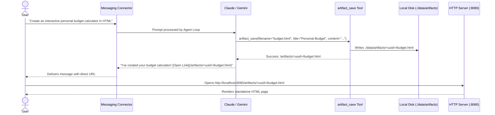

# Standalone HTML Artifacts Engine

Bruce can create, save, and host rich, interactive standalone **HTML Artifacts** directly on your server.

---

## 1. Why Artifacts?

Messaging apps like WhatsApp, Discord, and Telegram are constrained by plain text and limited markdown formatting:
- No interactive buttons, forms, or calculators.
- No dynamic charts, data visualizations, or interactive tables.
- Tables, invoices, and resumes format poorly on small mobile screens.

With the **Artifacts Engine**, Bruce can generate complete, beautiful web documents and immediately send you a private link to open and interact with them in your browser.

---

## 2. Generation & Hosting Lifecycle

---

## 3. Storage & Static File Serving

- **File System Location**: Artifacts are persisted on the host at `./data/artifacts/<uuid>/<filename>` (or `./bruce_data/artifacts` in Docker).
- **HTTP Endpoint**: Served directly by the Go HTTP server at `/artifacts/{id}/{filename}`.
- **REST API**:
  - `GET /api/v1/artifacts` — List all created artifacts with metadata (ID, title, filename, size, creation date).
  - `GET /api/v1/artifacts/{id}` — Fetch specific artifact metadata.
  - `DELETE /api/v1/artifacts/{id}` — Delete artifact and clean up disk files.

---

## 4. Web Dashboard Gallery

The Web Dashboard (`http://localhost:8080`) features a dedicated **Artifacts** tab:
- **Gallery View**: Cards showing all generated artifacts with titles, timestamps, and file sizes.
- **Live Interactive Preview**: Preview any artifact directly inside an embedded iframe.
- **Responsive Mode Toggles**: Test how the generated artifact displays on Desktop, Tablet, and Mobile viewport widths.
- **Direct Actions**: Open in a new tab, copy shareable link, or download the raw HTML file.

---

## 5. Security & Sandboxing

1. **Path Traversal Protection**: File paths are strictly cleaned and validated using `filepath.Clean` and checked against the base artifact root directory.
2. **Iframe Sandboxing**: In the dashboard, artifacts are rendered inside an `iframe` with `sandbox="allow-scripts allow-forms allow-same-origin"`.
3. **MIME Type Validation**: Content-Type is strictly set to `text/html; charset=utf-8` with standard security headers.

---

## 6. How to Prompt Bruce for Artifacts

You can ask Bruce to build artifacts using everyday natural language:

- **Dashboards**: *"Summarize these quarterly revenue figures in an interactive HTML dashboard with a bar chart using Chart.js."*
- **Resumes & Portfolios**: *"Take my LinkedIn experience text and format it into a modern, minimalist HTML resume with a dark mode toggle."*
- **Calculators & Tools**: *"Build me a mortgage payment calculator in HTML with sliders for loan amount, interest rate, and term."*
- **Visual Briefings**: *"Search for the latest news on SpaceX, and generate a visual HTML report with image cards and links."*
