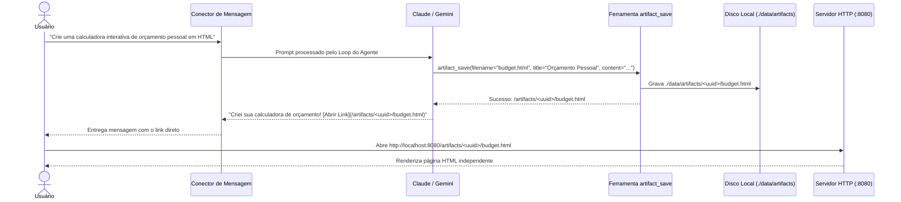

# Motor de Artefatos HTML Autônomos

O Bruce pode criar, salvar e hospedar **Artefatos HTML** ricos e interativos diretamente no seu servidor.

---

## 1. Por que Usar Artefatos?

Aplicativos de mensagens como WhatsApp, Discord e Telegram possuem limitações severas de texto simples e formatação markdown:
- Sem botões interativos, formulários ou calculadoras.
- Sem gráficos dinâmicos, visualizações de dados ou tabelas responsivas.
- Tabelas, faturas e currículos ficam difíceis de ler em telas pequenas de celular.

Com o **Motor de Artefatos**, o Bruce gera documentos web completos e visualmente atraentes e envia imediatamente um link privado para você abrir e interagir no navegador.

---

## 2. Ciclo de Vida de Geração e Hospedagem

---

## 3. Armazenamento & Servidor de Arquivos Estáticos

- **Local no Sistema de Arquivos**: Os artefatos são salvos no host em `./data/artifacts/<uuid>/<filename>` (ou `./bruce_data/artifacts` no Docker).
- **Endpoint HTTP**: Servidos diretamente pelo servidor Go em `/artifacts/{id}/{filename}`.
- **API REST**:
  - `GET /api/v1/artifacts` — Lista todos os artefatos com metadados (ID, título, nome de arquivo, tamanho, data).
  - `GET /api/v1/artifacts/{id}` — Obtém metadados de um artefato específico.
  - `DELETE /api/v1/artifacts/{id}` — Exclui o artefato e limpa os arquivos em disco.

---

## 4. Galeria no Painel Web

O Painel Web (`http://localhost:8080`) possui uma aba dedicada a **Artefatos**:
- **Visualização em Galeria**: Cards com todos os artefatos gerados, títulos, timestamps e tamanhos.
- **Pré-visualização Interativa**: Teste qualquer artefato diretamente dentro de um iframe embutido.
- **Alternador de Responsividade**: Visualize como o artefato se comporta em Desktop, Tablet e Celular.
- **Ações Diretas**: Abrir em nova aba, copiar link ou baixar o arquivo HTML bruto.

---

## 5. Segurança & Isolamento (Sandboxing)

1. **Proteção contra Path Traversal**: Caminhos de arquivos são estritamente limpos e validados com `filepath.Clean` e validados contra a raiz base de artefatos.
2. **Isolamento de Iframe**: No painel, artefatos rodam dentro de um `iframe` com `sandbox="allow-scripts allow-forms allow-same-origin"`.
3. **Validação de MIME Type**: Cabeçalho Content-Type estritamente definido como `text/html; charset=utf-8` com cabeçalhos de segurança padrão.

---

## 6. Como Pedir Artefatos ao Bruce

Você pode pedir ao Bruce para criar artefatos usando linguagem natural:

- **Dashboards**: *"Resuma estes dados de vendas trimestrais em um dashboard HTML interativo com gráficos de barra usando Chart.js."*
- **Currículos & Portfólios**: *"Pegue o texto da minha experiência do LinkedIn e formate em um currículo HTML moderno e minimalista com alternador de modo escuro."*
- **Calculadoras**: *"Crie uma calculadora de amortização de financiamento em HTML com controles deslizantes para valor, juros e prazo."*
- **Relatórios Visuais**: *"Pesquise as últimas notícias sobre a SpaceX e gere um relatório visual em HTML com cards de imagens e links."*
