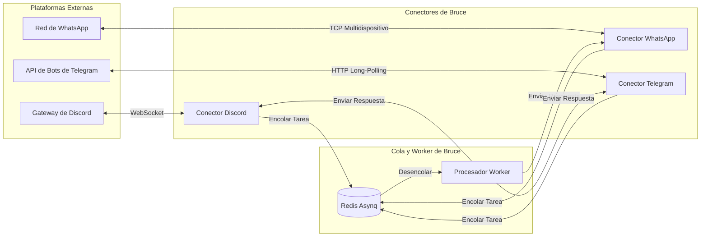

# Guía de Conectores Omnicanal

Bruce se conecta directamente con tus plataformas de mensajería favoritas: **Discord**, **WhatsApp**, **Telegram** y un **Web Chat** integrado.

---

## 1. Arquitectura de Conectores

Los conectores funcionan como pasarelas desacopladas y ligeras:
1. **Ingesta**: Escucha los mensajes entrantes, normaliza el formato y añade una tarea `message:process` a Redis.
2. **Envío (Dispatch)**: Registra un `ConnectorDispatcher` en el worker para responder a través de la plataforma correspondiente.
3. **División de Mensajes (Chunking)**: Divide automáticamente los textos largos que superen los límites de caracteres de cada plataforma (ej: 2.000 caracteres en Discord).



---

## 2. Conector Discord

### Pasos de Configuración:
1. Accede al [Portal de Desarrolladores de Discord](https://discord.com/developers/applications).
2. Haz clic en **New Application**, dale un nombre (ej: `Bruce`) y navega hasta la sección **Bot**.
3. En **Privileged Gateway Intents**, activa:
   - ✅ **Message Content Intent** (Obligatorio para que Bruce pueda leer el contenido de los mensajes directos).
4. Pulsa en **Reset Token** y copia el token generado.
5. En **OAuth2 → URL Generator**:
   - Ámbitos: `bot`
   - Permisos del Bot: `Send Messages`, `Read Messages/View Channels`, `Read Message History`.
   - Abre la URL generada en tu navegador e invita al bot a tu servidor privado.
6. Configura `config.yml`:
   ```yaml
   connectors:
     discord:
       enabled: true
       bot_token: "TU_TOKEN_DE_DISCORD"
   ```

### Características y Comportamiento:
- **Mensajes Directos (DMs)**: Bruce responde cuando le envías un mensaje privado.
- **División Automática (Auto-Chunking)**: Discord tiene un límite de 2.000 caracteres por mensaje. Bruce revisa los envíos y divide automáticamente los textos extensos en bloques de menos de 1.900 caracteres respetando palabras y bloques de código.

---

## 3. Conector WhatsApp

Bruce se conecta a WhatsApp mediante la librería `whatsmeow`, que implementa el protocolo oficial multidispositivo. Vinculas a Bruce como un dispositivo asociado en tu móvil personal — **sin API de Meta Business y sin suscripciones de pago**.

### Pasos de Configuración:
1. Configura `config.yml`:
   ```yaml
   connectors:
     whatsapp:
       enabled: true
       device_store_dsn: "./data/whatsapp.db"
   ```
2. Inicia Bruce:
   ```bash
   docker compose up -d && docker compose logs -f bruce
   ```
3. Se mostrará un código QR en los registros del terminal.
4. En tu teléfono, abre **WhatsApp → Ajustes → Dispositivos vinculados → Vincular un dispositivo**.
5. Escanea el código QR que aparece en la consola.
6. Bruce guardará las claves de cifrado en `./data/whatsapp.db`. En los siguientes arranques, la conexión será inmediata y sin necesidad de escanear de nuevo.

---

## 4. Conector Telegram

Bruce se conecta a Telegram mediante **HTTP Long-Polling**. Esto significa que **no** necesitas una IP pública fija, dominio ni abrir puertos en tu router o cortafuegos.

### Pasos de Configuración:
1. En Telegram, contacta con `@BotFather`.
2. Envía `/newbot`, elige un nombre visible y un nombre de usuario que termine en `bot`.
3. `@BotFather` te facilitará el Bot Token (ej: `123456789:ABCdefGhIJKlmNoPQRsTUVwxyZ`).
4. Configura `config.yml`:
   ```yaml
   connectors:
     telegram:
       enabled: true
       bot_token: "TU_TOKEN_DE_TELEGRAM"
   ```
5. Inicia Bruce y envía un mensaje a tu nuevo bot en Telegram.

---

## 5. Web Chat

Para conversar directamente en el navegador sin aplicaciones externas, Bruce incluye un chat web en la raíz del panel (`http://localhost:8080/`):
- Creación de hilos de conversación independientes.
- Renderizado de markdown en tiempo real con resaltado de código.
- Basado en los endpoints REST `POST /api/v1/chat` y `GET /api/v1/chat/sessions`.
