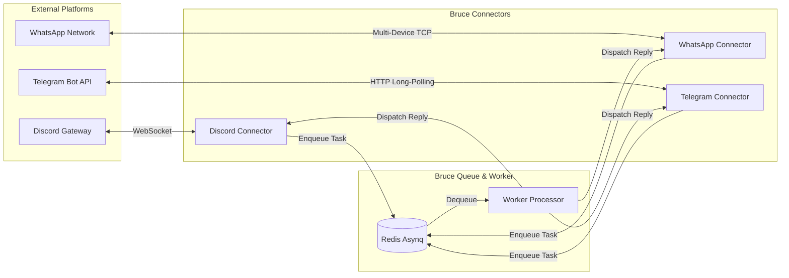

# Omnichannel Connectors Guide

Bruce connects directly to your favorite messaging platforms: **Discord**, **WhatsApp**, **Telegram**, and an embedded **Web Chat**.

---

## 1. Connector Architecture

Connectors act as lightweight, decoupled bridges:
1. **Ingestion**: Listens for incoming user messages, normalizes them, and pushes a `message:process` task to Redis.
2. **Dispatch**: Registers a `ConnectorDispatcher` in the worker to deliver responses back to the target platform.
3. **Chunking**: Automatically fragments messages that exceed platform character limits (e.g. Discord 2,000 characters).



---

## 2. Discord Connector

### Setup Steps:
1. Open the [Discord Developer Portal](https://discord.com/developers/applications).
2. Click **New Application**, give it a name (e.g. `Bruce`), and navigate to **Bot**.
3. Under **Privileged Gateway Intents**, enable:
   - ✅ **Message Content Intent** (Mandatory so Bruce can read DM messages).
4. Click **Reset Token** and copy the bot token.
5. In **OAuth2 → URL Generator**:
   - Scopes: `bot`
   - Bot Permissions: `Send Messages`, `Read Messages/View Channels`, `Read Message History`.
   - Open the generated URL in your browser and invite the bot to a personal server.
6. Configure `config.yml`:
   ```yaml
   connectors:
     discord:
       enabled: true
       bot_token: "YOUR_DISCORD_BOT_TOKEN"
   ```

### Features & Behavior:
- **Direct Messages (DMs)**: Bruce responds when you send it a private direct message.
- **Auto-Chunking**: Discord has a strict 2,000 character limit per message. Bruce automatically inspects outgoing replies and breaks long responses into chunks under 1,900 characters on clean word boundaries, ensuring code blocks and formatting remain readable.

---

## 3. WhatsApp Connector

Bruce connects to WhatsApp using the `whatsmeow` library implementing the official WhatsApp Multi-Device protocol. You pair Bruce as a linked device on your personal phone — **no Meta Business API or monthly fees required**.

### Setup Steps:
1. Configure `config.yml`:
   ```yaml
   connectors:
     whatsapp:
       enabled: true
       device_store_dsn: "./data/whatsapp.db"
   ```
2. Start Bruce:
   ```bash
   docker compose up -d && docker compose logs -f bruce
   ```
3. A QR code will be printed to the terminal logs.
4. On your mobile phone, open **WhatsApp → Settings → Linked Devices → Link a Device**.
5. Scan the QR code displayed in the terminal.
6. Bruce will save the session cryptographic keys in `./data/whatsapp.db`. On subsequent restarts, Bruce connects automatically without re-scanning.

---

## 4. Telegram Connector

Bruce connects to Telegram via **HTTP Long-Polling**. This means you do **not** need a static IP, domain name, or open incoming firewall ports.

### Setup Steps:
1. In Telegram, search for `@BotFather`.
2. Send `/newbot`, choose a display name and username ending in `bot`.
3. `@BotFather` will reply with your Bot Token (e.g. `123456789:ABCdefGhIJKlmNoPQRsTUVwxyZ`).
4. Configure `config.yml`:
   ```yaml
   connectors:
     telegram:
       enabled: true
       bot_token: "YOUR_TELEGRAM_BOT_TOKEN"
   ```
5. Start Bruce and send a message to your new bot in Telegram.

---

## 5. Web Chat

For browser-based chatting without using messaging apps, Bruce provides an embedded web chat interface directly at the dashboard root (`http://localhost:8080/`):
- Create multiple independent conversation threads.
- Real-time markdown rendering and code syntax highlighting.
- Powered by the REST endpoints `POST /api/v1/chat` and `GET /api/v1/chat/sessions`.
