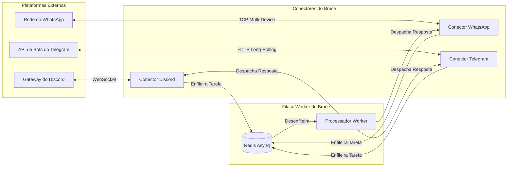

# Guia de Conectores Omnichannel

O Bruce se conecta diretamente às suas plataformas de mensagens favoritas: **Discord**, **WhatsApp**, **Telegram** e um **Web Chat** integrado.

---

## 1. Arquitetura dos Conectores

Os conectores atuam como pontes leves e desacopladas:
1. **Ingestão**: Ouve mensagens recebidas, normaliza o payload e envia uma tarefa `message:process` para o Redis.
2. **Despacho (Dispatch)**: Registra um `ConnectorDispatcher` no worker para entregar as respostas de volta à plataforma correta.
3. **Divisão em Partes (Chunking)**: Fragmenta automaticamente respostas longas que excedam os limites de caracteres de cada plataforma (ex: 2.000 caracteres no Discord).



---

## 2. Conector Discord

### Passos de Configuração:
1. Acesse o [Portal de Desenvolvedores do Discord](https://discord.com/developers/applications).
2. Clique em **New Application**, defina o nome (ex: `Bruce`) e vá para a aba **Bot**.
3. Em **Privileged Gateway Intents**, habilite:
   - ✅ **Message Content Intent** (Obrigatório para que o Bruce possa ler o conteúdo das mensagens).
4. Clique em **Reset Token** e copie o token gerado.
5. Em **OAuth2 → URL Generator**:
   - Escopos: `bot`
   - Permissões do Bot: `Send Messages`, `Read Messages/View Channels`, `Read Message History`.
   - Abra o link gerado no seu navegador e convide o bot para o seu servidor pessoal.
6. Configure o `config.yml`:
   ```yaml
   connectors:
     discord:
       enabled: true
       bot_token: "SEU_TOKEN_DO_DISCORD"
   ```

### Recursos & Comportamento:
- **Mensagens Diretas (DMs)**: O Bruce responde quando você envia uma mensagem privada direta.
- **Divisão Automática de Mensagens (Auto-Chunking)**: O Discord impõe um limite estrito de 2.000 caracteres por mensagem. O Bruce inspeciona as respostas e as quebra automaticamente em partes menores que 1.900 caracteres em limites de palavras limpos, preservando blocos de código e formatação.

---

## 3. Conector WhatsApp

O Bruce conecta ao WhatsApp usando a biblioteca `whatsmeow`, que implementa o protocolo oficial do WhatsApp Multi-Device. Você vincula o Bruce como um aparelho conectado no seu celular — **sem API do Meta Business e sem custos mensais**.

### Passos de Configuração:
1. Configure o `config.yml`:
   ```yaml
   connectors:
     whatsapp:
       enabled: true
       device_store_dsn: "./data/whatsapp.db"
   ```
2. Inicie o Bruce:
   ```bash
   docker compose up -d && docker compose logs -f bruce
   ```
3. Um QR Code será impresso nos logs do terminal.
4. No seu smartphone, abra o **WhatsApp → Configurações → Aparelhos conectados → Conectar um aparelho**.
5. Escaneie o QR Code exibido no terminal.
6. O Bruce salvará as chaves criptográficas em `./data/whatsapp.db`. Nas próximas reinicializações, ele se conectará automaticamente sem precisar ler o QR Code de novo.

---

## 4. Conector Telegram

O Bruce se conecta ao Telegram via **HTTP Long-Polling**. Isso significa que você **não** precisa de IP público fixo, domínio nem portas abertas no firewall.

### Passos de Configuração:
1. No Telegram, converse com o `@BotFather`.
2. Envie o comando `/newbot`, escolha o nome e um username terminado em `bot`.
3. O `@BotFather` responderá com o Token do Bot (ex: `123456789:ABCdefGhIJKlmNoPQRsTUVwxyZ`).
4. Configure o `config.yml`:
   ```yaml
   connectors:
     telegram:
       enabled: true
       bot_token: "SEU_TOKEN_DO_TELEGRAM"
   ```
5. Inicie o Bruce e envie uma mensagem para o bot recém-criado.

---

## 5. Web Chat

Para conversar pelo navegador sem depender de mensageiros externos, o Bruce oferece uma interface de chat web embutida na raiz do painel (`http://localhost:8080/`):
- Criação de múltiplos tópicos de conversas independentes.
- Renderização em tempo real de markdown e destaque de sintaxe em blocos de código.
- Alimentado pelos endpoints REST `POST /api/v1/chat` e `GET /api/v1/chat/sessions`.
