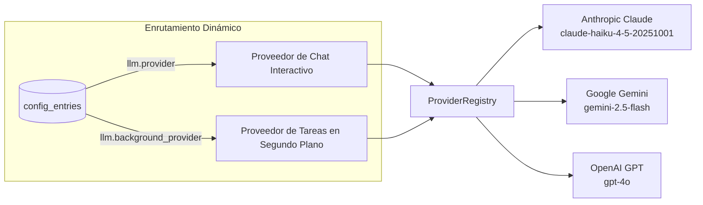

# Motor LLM Multiproveedor

Bruce cuenta con una arquitectura de proveedores de IA modular y unificada que permite alternar dinámicamente entre **Anthropic Claude**, **Google Gemini** y **OpenAI GPT**.

---

## 1. Arquitectura: El `ProviderRegistry`

En lugar de vincular el sistema a una única API de IA, Bruce utiliza la interfaz abstracta `LLMService`:

```go
type LLMService interface {
    GenerateResponse(ctx context.Context, systemPrompt string, history []domain.Message) (string, error)
    GenerateWithTools(ctx context.Context, systemPrompt string, history []domain.Message, tools []ToolDefinition) (*ToolCallResponse, error)
}
```

El `ProviderRegistry` registra cada proveedor configurado durante el arranque:



---

## 2. Separación de Proveedores: Chat vs Segundo Plano

Una capacidad destacada de Bruce es desacoplar el **Proveedor de Chat Interactivo** del **Proveedor de Tareas en Segundo Plano**:

| Ajuste | Propósito | Elección Recomendada |
|---|---|---|
| `llm.provider` | Gestiona los mensajes del usuario en Discord, WhatsApp, Telegram y Web. Requiere mayor capacidad analítica. | `claude` (Sonnet o Haiku) u `openai` (`gpt-4o`) |
| `llm.background_provider` | Evalúa monitoreos periódicos, resúmenes en segundo plano e informes programados. | `gemini` (`gemini-2.5-flash`) o `claude` (Haiku) |

### ¿Por Qué Desacoplarlos?
1. **Optimización de Costos**: Las tareas de monitoreo ambiental pueden ejecutarse cada 15 minutos comprobando correos o páginas web. Usar un modelo rápido y asequible como `gemini-2.5-flash` o `claude-haiku` mantiene tus costes prácticamente a cero.
2. **Aislamiento de Cuotas y Límites**: Si se agota la cuota de tu clave principal de chat, tus alarmas, tareas en segundo plano y recordatorios siguen funcionando sin interrupción.

---

## 3. Modelos Compatibles y Credenciales

### A. Anthropic Claude
```yaml
claude:
  api_key: "sk-ant-api03-..."
  model: "claude-haiku-4-5-20251001" # o claude-sonnet-4-6, claude-opus-4-6
  max_tokens: 8192
  context_window: 15
```

### B. Google Gemini
```yaml
gemini:
  api_key: "AIzaSy..."
  model: "gemini-2.5-flash" # o gemini-1.5-pro
```

### C. OpenAI
```yaml
openai:
  api_key: "sk-proj-..."
  model: "gpt-4o" # o gpt-4o-mini
```

---

## 4. Cambio de Proveedor en Caliente (Sin Reiniciar)

No es necesario reiniciar Bruce ni editar `config.yml` para cambiar de modelo:

1. Abre el Panel Web en `http://localhost:8080`.
2. Dirígete a la pestaña **Settings**.
3. Cambia `llm.provider` a `gemini` o `claude`.
4. Haz clic en **Save Settings**.

Bruce lee las modificaciones desde SQLite en cada tarea, dirigiendo los siguientes mensajes de forma inmediata al nuevo proveedor.

---

## 5. Unificación de Llamadas a Herramientas (Tool Calling)

Cada proveedor estructura las llamadas a herramientas de forma diferente:
- **Claude**: Devuelve bloques `tool_use` con JSON.
- **Gemini**: Devuelve structs protobuf `FunctionCall`.
- **OpenAI**: Devuelve `tool_calls` con argumentos en JSON.

Los adaptadores de Bruce normalizan estas respuestas en un formato único `ai.ToolCall`:
```go
type ToolCall struct {
    ID    string                 `json:"id"`
    Name  string                 `json:"name"`
    Input map[string]interface{} `json:"input"`
}
```
Esto garantiza que las más de 15 herramientas nativas funcionen de forma idéntica sin importar qué proveedor esté activo.
