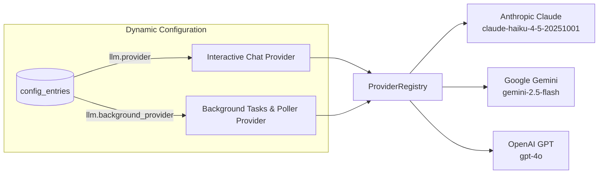

# Multi-Provider LLM Engine

Bruce features a unified, pluggable AI provider architecture that allows you to seamlessly switch between **Anthropic Claude**, **Google Gemini**, and **OpenAI GPT**.

---

## 1. Architecture: The `ProviderRegistry`

Rather than hardcoding calls to a single AI vendor, Bruce uses an abstract `LLMService` interface:

```go
type LLMService interface {
    GenerateResponse(ctx context.Context, systemPrompt string, history []domain.Message) (string, error)
    GenerateWithTools(ctx context.Context, systemPrompt string, history []domain.Message, tools []ToolDefinition) (*ToolCallResponse, error)
}
```

The `ProviderRegistry` registers each configured provider at startup:



---

## 2. Separate Chat vs Background Providers

A unique feature of Bruce is the ability to decouple your **Interactive Chat Provider** from your **Background Task Provider**:

| Setting | Purpose | Recommended Choice |
|---|---|---|
| `llm.provider` | Handles user messages in Discord, WhatsApp, Telegram, and Web. Requires higher reasoning depth. | `claude` (Sonnet or Haiku) or `openai` (`gpt-4o`) |
| `llm.background_provider` | Evaluates periodic condition watches, background summaries, and scheduled reports. | `gemini` (`gemini-2.5-flash`) or `claude` (Haiku) |

### Why Decouple Them?
1. **Cost Optimization**: Background ambient watches can run every 15 minutes checking emails or web conditions. Using a high-speed, cost-effective model like `gemini-2.5-flash` or `claude-haiku` keeps your daily costs near zero.
2. **Quota & Rate Limit Isolation**: If your interactive chat quota is exhausted, your background condition monitoring and proactive reminders will not stop functioning (especially when combined with Direct Message mode).

---

## 3. Supported Models & Credentials

### A. Anthropic Claude
```yaml
claude:
  api_key: "sk-ant-api03-..."
  model: "claude-haiku-4-5-20251001" # or claude-sonnet-4-6, claude-opus-4-6
  max_tokens: 8192
  context_window: 15
```

### B. Google Gemini
```yaml
gemini:
  api_key: "AIzaSy..."
  model: "gemini-2.5-flash" # or gemini-1.5-pro
```

### C. OpenAI
```yaml
openai:
  api_key: "sk-proj-..."
  model: "gpt-4o" # or gpt-4o-mini
```

---

## 4. Live Provider Switching (No Restart Needed)

You do not need to restart Bruce or edit `config.yml` to switch models. 

1. Open the Web Dashboard at `http://localhost:8080`.
2. Navigate to the **Settings** tab.
3. Update `llm.provider` to `gemini` or `claude`.
4. Click **Save Settings**. 

Bruce reads dynamic overrides from SQLite on every task invocation, immediately routing subsequent messages through the newly chosen provider.

---

## 5. Tool Call Unification

Each LLM provider formats tool calling differently:
- **Claude**: Returns `tool_use` content blocks with JSON inputs.
- **Gemini**: Returns `FunctionCall` protobuf structs.
- **OpenAI**: Returns `tool_calls` with function JSON arguments.

Bruce's adapters normalize these into a uniform `ai.ToolCall` format:
```go
type ToolCall struct {
    ID    string                 `json:"id"`
    Name  string                 `json:"name"`
    Input map[string]interface{} `json:"input"`
}
```
This guarantees that all 15+ built-in tools work identically regardless of which AI provider is currently active.
