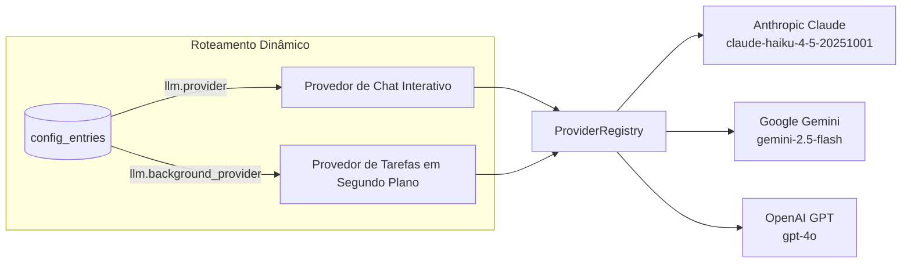

# Motor LLM Multi-Provedor

O Bruce conta com uma arquitetura de provedores de IA unificada e modular que permite alternar dinamicamente entre **Anthropic Claude**, **Google Gemini** e **OpenAI GPT**.

---

## 1. Arquitetura: O `ProviderRegistry`

Em vez de codificar chamadas rígidas para um único serviço de IA, o Bruce usa uma interface abstrata `LLMService`:

```go
type LLMService interface {
    GenerateResponse(ctx context.Context, systemPrompt string, history []domain.Message) (string, error)
    GenerateWithTools(ctx context.Context, systemPrompt string, history []domain.Message, tools []ToolDefinition) (*ToolCallResponse, error)
}
```

O `ProviderRegistry` registra cada provedor configurado durante a inicialização:



---

## 2. Separação de Provedores para Chat vs Segundo Plano

Um diferencial do Bruce é a capacidade de desacoplar o **Provedor de Chat Interativo** do **Provedor de Tarefas em Segundo Plano**:

| Configuração | Finalidade | Escolha Recomendada |
|---|---|---|
| `llm.provider` | Processa mensagens de usuários no Discord, WhatsApp, Telegram e Web. Exige maior capacidade de raciocínio. | `claude` (Sonnet ou Haiku) ou `openai` (`gpt-4o`) |
| `llm.background_provider` | Avalia monitoramentos periódicos, resumos de sessão em background e relatórios agendados. | `gemini` (`gemini-2.5-flash`) ou `claude` (Haiku) |

### Por que Separar?
1. **Otimização de Custos**: Watches de monitoramento podem rodar a cada 15 minutos checando e-mails ou condições na web. Usar um modelo ultra-rápido e econômico como `gemini-2.5-flash` ou `claude-haiku` mantém seus custos diários próximos de zero.
2. **Isolamento de Cotas & Limites de Taxa**: Se a cota da sua chave principal se esgotar durante uma conversa, seus agendamentos e alertas em segundo plano continuam funcionando normalmente.

---

## 3. Modelos Suportados & Credenciais

### A. Anthropic Claude
```yaml
claude:
  api_key: "sk-ant-api03-..."
  model: "claude-haiku-4-5-20251001" # ou claude-sonnet-4-6, claude-opus-4-6
  max_tokens: 8192
  context_window: 15
```

### B. Google Gemini
```yaml
gemini:
  api_key: "AIzaSy..."
  model: "gemini-2.5-flash" # ou gemini-1.5-pro
```

### C. OpenAI
```yaml
openai:
  api_key: "sk-proj-..."
  model: "gpt-4o" # ou gpt-4o-mini
```

---

## 4. Troca de Provedor a Quente (Sem Reiniciar)

Você não precisa reiniciar o Bruce nem editar o arquivo `config.yml` para alternar modelos:

1. Abra o Painel Web em `http://localhost:8080`.
2. Vá até a aba **Settings**.
3. Atualize `llm.provider` para `gemini` ou `claude`.
4. Clique em **Save Settings**.

O Bruce lê as configurações diretamente do SQLite a cada tarefa, redirecionando imediatamente as próximas mensagens para o novo provedor escolhido.

---

## 5. Unificação de Chamadas de Ferramentas (Tool Calling)

Cada provedor de LLM formata chamadas de ferramentas de forma distinta:
- **Claude**: Retorna blocos `tool_use` com JSON.
- **Gemini**: Retorna structs protobuf `FunctionCall`.
- **OpenAI**: Retorna `tool_calls` com argumentos em JSON.

Os adaptadores do Bruce convertem esses retornos em uma estrutura uniforme `ai.ToolCall`:
```go
type ToolCall struct {
    ID    string                 `json:"id"`
    Name  string                 `json:"name"`
    Input map[string]interface{} `json:"input"`
}
```
Isso assegura que todas as mais de 15 ferramentas nativas funcionem de forma idêntica independentemente do provedor de IA ativo no momento.
