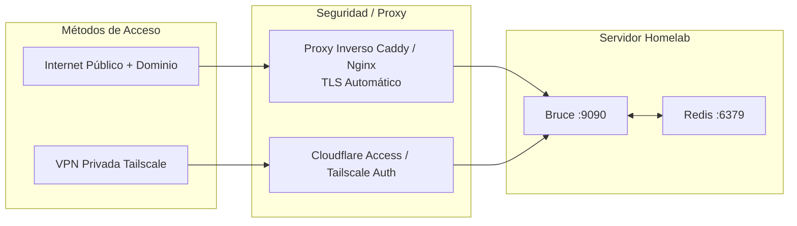

# Guía de Despliegue en Homelab y Producción

Esta guía describe patrones de implementación de nivel de producción para Bruce en tu homelab personal, servidor doméstico o VPS en la nube.

---

## 1. Topología de Red y Patrones de Acceso

Bruce expone HTTP en el puerto `8080` (o `9090` con Docker Compose). Para producción, se aconseja situarlo tras un proxy inverso o acceder de forma privada a través de una red VPN mallada (mesh VPN).



---

## 2. Proxy Inverso con Caddy (Recomendado)

[Caddy](https://caddyserver.com) ofrece gestión automática de certificados HTTPS y una configuración concisa.

### Ejemplo de Caddyfile:
```caddyfile
bruce.tudominio.com {
    # Autenticación básica opcional para el panel web
    # Genera el hash con: caddy hash-password
    basicauth / {
        admin $2a$14$Zkx19XLi...
    }

    # Proxy hacia el contenedor Docker de Bruce
    reverse_proxy 127.0.0.1:9090
}
```

---

## 3. Acceso Privado mediante Tailscale (Sin Apertura de Puertos)

Si prefieres no exponer Bruce a internet, puedes acceder de forma segura desde tus dispositivos con [Tailscale](https://tailscale.com):

1. Instala Tailscale en tu servidor.
2. Expón Bruce en tu red privada Tailnet:
   ```bash
   tailscale serve --bg 9090
   ```
3. Abre `https://<nombre-servidor>.<tailnet>.ts.net` en el navegador de cualquier equipo autorizado en tu Tailscale.
4. Los bots de Discord, WhatsApp y Telegram seguirán funcionando con normalidad ya que inician conexiones salientes hacia sus servidores.

---

## 4. Servicio Systemd Bare-Metal (Sin Docker)

Para ejecutar Bruce de forma nativa en Linux:

1. Copia el binario a `/usr/local/bin/bruce`.
2. Crea el usuario y directorios del sistema:
   ```bash
   sudo useradd -r -s /bin/false bruce
   sudo mkdir -p /var/lib/bruce /etc/bruce
   sudo chown -R bruce:bruce /var/lib/bruce /etc/bruce
   ```
3. Crea `/etc/systemd/system/bruce.service`:
   ```ini
   [Unit]
   Description=Bruce AI Assistant
   After=network.target redis.service
   Wants=redis.service

   [Service]
   Type=simple
   User=bruce
   Group=bruce
   WorkingDirectory=/var/lib/bruce
   ExecStart=/usr/local/bin/bruce --config /etc/bruce/config.yml
   Restart=always
   RestartSec=5s
   LimitNOFILE=65535

   # Seguridad y Aislamiento
   ProtectSystem=full
   ProtectHome=true
   NoNewPrivileges=true

   [Install]
   WantedBy=multi-user.target
   ```
4. Activa e inicia el servicio:
   ```bash
   sudo systemctl daemon-reload
   sudo systemctl enable --now bruce
   sudo systemctl status bruce
   ```

---

## 5. Monitoreo y Verificación de Estado

- **Endpoint de Salud**: `GET http://localhost:9090/health`
  - Devuelve HTTP `200` con el tiempo de actividad.
  - Compatible con Uptime Kuma, Prometheus u otras herramientas de monitorización.
- **Visualización de Registros**:
  - En Docker: `docker compose logs -f --tail 100 bruce`
  - En Systemd: `journalctl -u bruce -f -n 100`
- **Inspección de Colas**: Accede a Asynqmon en `http://localhost:9090/monitor` para examinar el estado de las tareas, reintentos y latencias.
