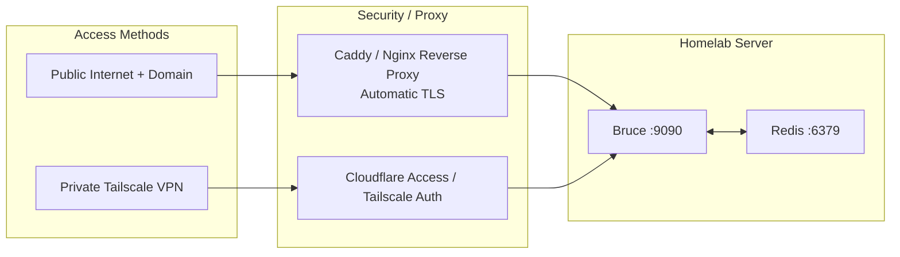

# Homelab & Production Deployment Guide

This guide covers production-grade deployment patterns for Bruce on your personal homelab, home server, or cloud VPS.

---

## 1. Network Topology & Access Patterns

Bruce serves plain HTTP on port `8080` (or `9090` via Docker Compose). For production use, you should put Bruce behind a reverse proxy or access it securely over a private mesh VPN.



---

## 2. Reverse Proxy with Caddy (Recommended)

[Caddy](https://caddyserver.com) provides automatic HTTPS certificates and simple configuration.

### Caddyfile Example:
```caddyfile
bruce.yourdomain.com {
    # Optional basic authentication for dashboard access
    # Generate hash using: caddy hash-password
    basicauth / {
        admin $2a$14$Zkx19XLi...
    }

    # Proxy to Bruce Docker container
    reverse_proxy 127.0.0.1:9090
}
```

---

## 3. Private Access via Tailscale (Zero Port Forwarding)

If you do not want to expose Bruce to the public internet, you can access it securely from your phone and laptop using [Tailscale](https://tailscale.com):

1. Install Tailscale on your server.
2. Serve Bruce over your private Tailnet:
   ```bash
   tailscale serve --bg 9090
   ```
3. Open `https://<server-name>.<tailnet>.ts.net` in any browser on your authorized Tailscale devices.
4. Your Discord, WhatsApp, and Telegram bots will continue to work normally because they make outbound connections to the messaging gateways.

---

## 4. Bare-Metal Systemd Service (Non-Docker)

If you run Bruce as a standalone binary on Linux:

1. Copy the compiled binary to `/usr/local/bin/bruce`.
2. Create system user and directory:
   ```bash
   sudo useradd -r -s /bin/false bruce
   sudo mkdir -p /var/lib/bruce /etc/bruce
   sudo chown -R bruce:bruce /var/lib/bruce /etc/bruce
   ```
3. Create `/etc/systemd/system/bruce.service`:
   ```ini
   [Unit]
   Description=Bruce AI Assistant
   After=network.target redis.service
   Wants=redis.service

   [Service]
   Type=simple
   User=bruce
   Group=bruce
   WorkingDirectory=/var/lib/bruce
   ExecStart=/usr/local/bin/bruce --config /etc/bruce/config.yml
   Restart=always
   RestartSec=5s
   LimitNOFILE=65535

   # Security Sandboxing
   ProtectSystem=full
   ProtectHome=true
   NoNewPrivileges=true

   [Install]
   WantedBy=multi-user.target
   ```
4. Enable and start:
   ```bash
   sudo systemctl daemon-reload
   sudo systemctl enable --now bruce
   sudo systemctl status bruce
   ```

---

## 5. Monitoring & Healthchecks

- **Health Endpoint**: `GET http://localhost:9090/health`
  - Returns HTTP `200` with uptime.
  - Can be monitored by Uptime Kuma, Prometheus, or healthcheck monitors.
- **Log Aggregation**:
  - In Docker: `docker compose logs -f --tail 100 bruce`
  - In Systemd: `journalctl -u bruce -f -n 100`
- **Queue Inspection**: Access Asynqmon at `http://localhost:9090/monitor` to view queue latency, retry counts, and payload dumps.
