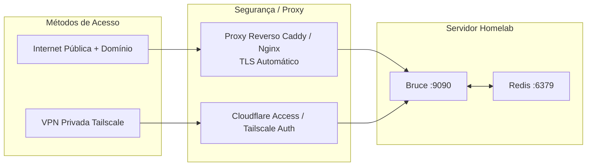

# Guia de Deploy em Homelab & Produção

Este guia aborda padrões de implantação em nível de produção para o Bruce no seu homelab pessoal, servidor doméstico ou VPS na nuvem.

---

## 1. Topologia de Rede & Padrões de Acesso

O Bruce serve HTTP puro na porta `8080` (ou `9090` via Docker Compose). Para uso em produção, recomenda-se colocá-lo atrás de um proxy reverso ou acessá-lo de forma segura através de uma VPN de malha privada (mesh VPN).



---

## 2. Proxy Reverso com Caddy (Recomendado)

O [Caddy](https://caddyserver.com) fornece certificados HTTPS automáticos e configuração simples.

### Exemplo de Caddyfile:
```caddyfile
bruce.seudominio.com {
    # Autenticação básica opcional para acesso ao painel
    # Gere o hash usando: caddy hash-password
    basicauth / {
        admin $2a$14$Zkx19XLi...
    }

    # Proxy para o contêiner Docker do Bruce
    reverse_proxy 127.0.0.1:9090
}
```

---

## 3. Acesso Privado via Tailscale (Sem Port Forwarding)

Se você não quiser expor o Bruce para a internet pública, pode acessá-lo de forma segura pelo celular e notebook usando o [Tailscale](https://tailscale.com):

1. Instale o Tailscale no seu servidor.
2. Publique o Bruce na sua rede privada Tailnet:
   ```bash
   tailscale serve --bg 9090
   ```
3. Abra `https://<nome-do-servidor>.<tailnet>.ts.net` em qualquer navegador nos seus dispositivos autorizados no Tailscale.
4. Seus bots do Discord, WhatsApp e Telegram continuarão funcionando normalmente porque estabelecem conexões de saída para os gateways de mensagens.

---

## 4. Serviço Systemd Bare-Metal (Sem Docker)

Se preferir rodar o Bruce como um binário nativo no Linux:

1. Copie o binário compilado para `/usr/local/bin/bruce`.
2. Crie o usuário de sistema e diretórios:
   ```bash
   sudo useradd -r -s /bin/false bruce
   sudo mkdir -p /var/lib/bruce /etc/bruce
   sudo chown -R bruce:bruce /var/lib/bruce /etc/bruce
   ```
3. Crie o arquivo `/etc/systemd/system/bruce.service`:
   ```ini
   [Unit]
   Description=Bruce AI Assistant
   After=network.target redis.service
   Wants=redis.service

   [Service]
   Type=simple
   User=bruce
   Group=bruce
   WorkingDirectory=/var/lib/bruce
   ExecStart=/usr/local/bin/bruce --config /etc/bruce/config.yml
   Restart=always
   RestartSec=5s
   LimitNOFILE=65535

   # Isolamento e Segurança
   ProtectSystem=full
   ProtectHome=true
   NoNewPrivileges=true

   [Install]
   WantedBy=multi-user.target
   ```
4. Ative e inicie o serviço:
   ```bash
   sudo systemctl daemon-reload
   sudo systemctl enable --now bruce
   sudo systemctl status bruce
   ```

---

## 5. Monitoramento & Verificações de Integridade

- **Endpoint de Saúde**: `GET http://localhost:9090/health`
  - Retorna HTTP `200` com tempo de atividade.
  - Pode ser monitorado por Uptime Kuma, Prometheus ou monitores de integridade.
- **Visualização de Logs**:
  - No Docker: `docker compose logs -f --tail 100 bruce`
  - No Systemd: `journalctl -u bruce -f -n 100`
- **Inspeção de Filas**: Acesse o Asynqmon em `http://localhost:9090/monitor` para ver latência das filas, tentativas e payloads.
