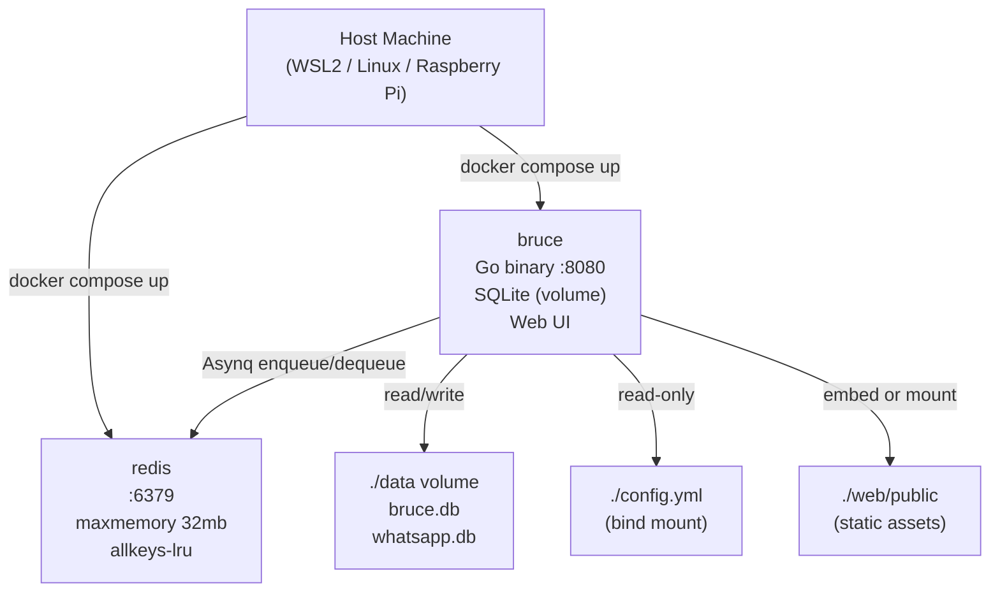

# Spec 01: Docker and Scaffolding

## Objective
Establish the project foundation: `docker-compose.yml` optimized for low-memory environments
(≤128MB RAM target), the full Go package layout, SQLite WAL configuration, and a graceful
shutdown sequence. Everything in this spec must work before any other spec begins.

---

## 1. Container Architecture



**Data flow summary**: The host starts two containers via `docker compose up`. The `bruce`
container reads `config.yml` via a bind mount, connects to Redis for Asynq job queuing,
and persists all state (sessions, messages, WhatsApp device store) in a `./data` volume
containing two SQLite databases. The web UI static files are either embedded in the binary
(preferred) or served from a mount.

---

## 2. `docker-compose.yml` — Full Specification

```yaml
version: "3.8"

services:
  redis:
    image: redis:7-alpine
    container_name: bruce-redis
    restart: unless-stopped
    command: >
      redis-server
      --maxmemory 32mb
      --maxmemory-policy allkeys-lru
      --save ""
      --appendonly no
    ports:
      - "6379:6379"
    healthcheck:
      test: ["CMD", "redis-cli", "ping"]
      interval: 10s
      timeout: 5s
      retries: 3

  bruce:
    image: ghcr.io/demitriusquadros/bruce:latest   # or build: . for local dev
    container_name: bruce
    restart: unless-stopped
    ports:
      - "8080:8080"
    volumes:
      - ./data:/app/data
      - ./config.yml:/app/config.yml:ro
    environment:
      - CONFIG_PATH=/app/config.yml
    depends_on:
      redis:
        condition: service_healthy
    healthcheck:
      test: ["CMD", "wget", "-qO-", "http://localhost:8080/health"]
      interval: 15s
      timeout: 5s
      retries: 3

volumes:
  data:
```

**Key decisions:**
- `redis:7-alpine` — minimal image, ~30MB. `save ""` + `appendonly no` disables disk
  persistence (queue is ephemeral — tasks re-enqueue on restart via connectors).
- `depends_on: condition: service_healthy` — bruce will not start until Redis is healthy,
  preventing Asynq connection errors at boot.
- `config.yml` is `:ro` (read-only) — config changes flow through the API and are written
  to SQLite, not back to the YAML file at runtime.

---

## 3. `config.yml` — Full Schema

```yaml
server:
  port: 8080

redis:
  address: "redis:6379"      # container name resolves inside compose network
  max_retries: 3

sqlite:
  dsn: "./data/bruce.db"     # main app database

claude:
  api_key: ""                # required — set before first run
  model: "claude-opus-4-6"   # override with claude-haiku-4-5-20251001 for lower cost
  max_tokens: 1024
  context_window: 15         # number of prior messages to send as history

connectors:
  whatsapp:
    enabled: false
    device_store_dsn: "./data/whatsapp.db"
  discord:
    enabled: false
    bot_token: ""

ui:
  default_system_prompt: "You are Bruce, a personal AI assistant."
```

All keys are loaded at startup via Viper. Unknown keys are ignored. Missing required keys
(`claude.api_key`) should log a warning but not panic — the app should boot and surface the
missing config via the web UI.

---

## 4. Go Package Layout

```
bruce/
├── cmd/
│   └── bruce/
│       └── main.go              # Entrypoint — wires all modules
├── internal/
│   ├── config/
│   │   └── config.go            # Viper loader + Config struct
│   ├── database/
│   │   ├── sqlite.go            # SQLite connection + PRAGMA setup
│   │   └── schema.sql           # DDL run on boot if tables missing
│   ├── domain/
│   │   ├── session.go
│   │   ├── message.go
│   │   └── config_entry.go
│   ├── repository/
│   │   ├── session_repo.go
│   │   ├── message_repo.go
│   │   └── config_repo.go
│   ├── ai/
│   │   └── claude.go            # LLMService interface + Anthropic implementation
│   ├── worker/
│   │   ├── payloads.go          # Asynq task payload structs
│   │   ├── processor.go         # HandleProcessIncomingMessageTask
│   │   └── dispatcher.go        # Dispatcher interface + registry
│   ├── connectors/
│   │   ├── whatsapp/
│   │   │   └── connector.go
│   │   └── discord/
│   │       └── connector.go
│   └── api/
│       ├── router.go            # Gorilla Mux setup + middleware
│       └── handlers/
│           ├── config.go
│           ├── sessions.go
│           └── messages.go
└── web/
    └── public/
        ├── index.html
        ├── style.css
        └── app.js
```

**Scope creep trap**: Resist splitting `internal/` into sub-modules with their own `go.mod`.
A single module is correct at this stage.

---

## 5. SQLite Connection & WAL Mode (`internal/database/sqlite.go`)

```go
func NewSQLiteDB(dsn string) (*sql.DB, error) {
    db, err := sql.Open("sqlite3", dsn+"?_journal_mode=WAL&_synchronous=NORMAL&_foreign_keys=ON")
    if err != nil {
        return nil, fmt.Errorf("sqlite open: %w", err)
    }
    // Prevent "database is locked" — Asynq and HTTP handlers share the same DB
    db.SetMaxOpenConns(1)
    db.SetMaxIdleConns(1)
    db.SetConnMaxLifetime(0)
    return db, nil
}
```

**Why `MaxOpenConns(1)`?** SQLite in WAL mode supports concurrent readers but only one
writer at a time. Limiting to 1 connection serializes all access and eliminates `SQLITE_BUSY`
errors between the Asynq processor goroutine and the HTTP handler goroutines.

**PRAGMAs explained:**
- `journal_mode=WAL` — readers don't block writers; essential for concurrent goroutine access.
- `synchronous=NORMAL` — fsync on checkpoint only, not every write. Acceptable durability
  for this workload; not financial data.
- `foreign_keys=ON` — enforces `session_id` FK in `messages`.

---

## 6. Graceful Shutdown Sequence (`main.go`)

```go
func main() {
    // 1. Load config
    cfg := config.Load()

    // 2. Init SQLite
    db, _ := database.NewSQLiteDB(cfg.SQLite.DSN)
    defer db.Close()

    // 3. Init Asynq client + server
    asynqClient := asynq.NewClient(asynq.RedisClientOpt{Addr: cfg.Redis.Address})
    asynqServer := asynq.NewServer(...)
    defer asynqClient.Close()

    // 4. Init connectors (conditional)
    // 5. Init HTTP server (Gorilla Mux)

    // 6. Graceful shutdown
    quit := make(chan os.Signal, 1)
    signal.Notify(quit, syscall.SIGINT, syscall.SIGTERM)
    <-quit

    log.Println("Shutting down...")
    ctx, cancel := context.WithTimeout(context.Background(), 10*time.Second)
    defer cancel()

    httpServer.Shutdown(ctx)   // drain in-flight HTTP requests
    asynqServer.Shutdown()     // let running tasks finish
    // db.Close() via defer
}
```

**Shutdown order matters**: HTTP server first (stops accepting new work), then Asynq server
(finishes in-flight tasks), then DB (safe to close after no writers remain).

---

## 7. `/health` Endpoint

Add a simple liveness check used by Docker's healthcheck:

```
GET /health
  Auth: none
  Returns: 200 { "status": "ok", "uptime_seconds": 142 }
  Notes: Always returns 200 if the process is alive. No DB ping — keep it cheap.
```

---

## ADRs

**ADR-001: SQLite over PostgreSQL**
- Decision: Use SQLite as the sole database.
- Alternatives: PostgreSQL (already in go-base-project docker-compose).
- Rationale: Bruce targets single-user, resource-constrained environments. SQLite adds
  zero infra overhead, the `./data` volume makes backups trivial (`cp bruce.db`), and the
  workload (message logs, session state) is low-concurrency by nature.
- Consequences: Cannot scale to multi-user SaaS without a migration. Acceptable — PRD
  explicitly parks multi-user as Won't Have.

**ADR-002: Redis maxmemory 32mb**
- Decision: Hard-cap Redis at 32MB with `allkeys-lru` eviction.
- Alternatives: Default Redis (no limit, grows unbounded).
- Rationale: On a 512MB WSL2 instance, an unbounded Redis is a risk. Asynq only uses Redis
  for the task queue — tasks are short-lived and small. 32MB holds thousands of pending
  tasks comfortably.
- Consequences: If queue depth grows past ~32MB of task payloads (pathological case), oldest
  tasks are evicted. Acceptable for a personal agent.

---

## Deliverable

`docker compose up` starts both containers cleanly. Bruce logs `"Starting HTTP server at :8080"`,
`GET /health` returns `200`, SQLite WAL mode is confirmed via `PRAGMA journal_mode;` returning
`"wal"`, and `docker compose down` triggers a clean shutdown with `"Shutting down..."` logged.
