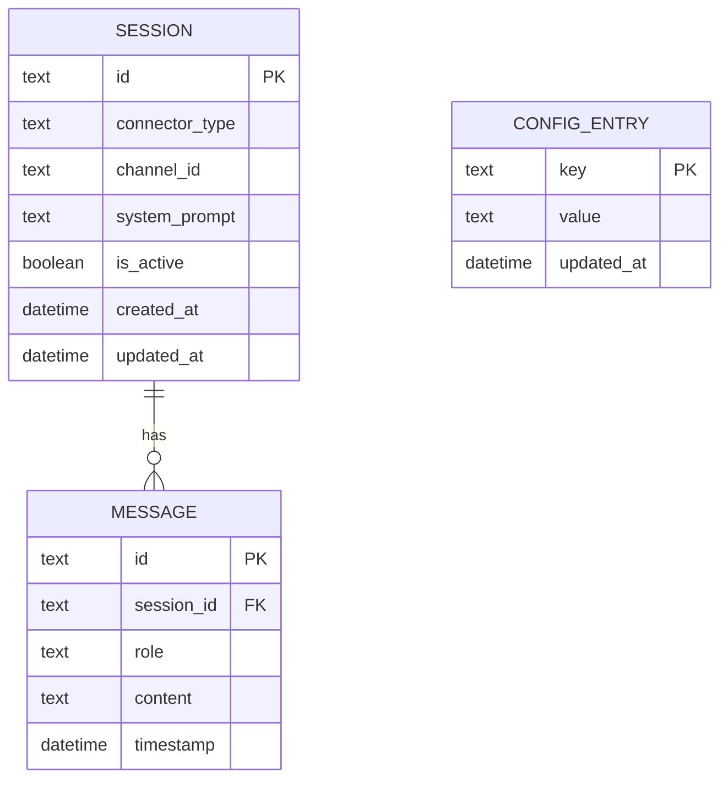

# Spec 02: Domain Models and Repositories

## Objective
Define the core entities, SQLite schema, and repository contracts that every other spec
depends on. This is the single source of truth for how data is structured and accessed.
No ORM — raw `database/sql` with `sqlx` for struct scanning.

---

## 1. Entity Relationship Diagram



**No join tables** — all relationships are 1:N. The schema is intentionally minimal. Do not
add tables speculatively.

---

## 2. Core Domain Structs (`internal/domain/`)

### `Session` (`session.go`)

```go
type Session struct {
    ID            string    `db:"id"`
    ConnectorType string    `db:"connector_type"` // "whatsapp" | "discord"
    ChannelID     string    `db:"channel_id"`     // phone number or Discord channel ID
    SystemPrompt  string    `db:"system_prompt"`
    IsActive      bool      `db:"is_active"`
    CreatedAt     time.Time `db:"created_at"`
    UpdatedAt     time.Time `db:"updated_at"`
}
```

### `Message` (`message.go`)

```go
type Message struct {
    ID        string    `db:"id"`
    SessionID string    `db:"session_id"`
    Role      string    `db:"role"`    // "user" | "assistant" | "system"
    Content   string    `db:"content"`
    Timestamp time.Time `db:"timestamp"`
}
```

### `ConfigEntry` (`config_entry.go`)

```go
type ConfigEntry struct {
    Key       string    `db:"key"`
    Value     string    `db:"value"`
    UpdatedAt time.Time `db:"updated_at"`
}
```

**All IDs are `string` UUIDs** generated with `github.com/google/uuid`. Do not use
auto-increment integers — UUIDs are safe to generate in the application layer without a
DB round-trip.

---

## 3. SQLite Schema (`internal/database/schema.sql`)

```sql
CREATE TABLE IF NOT EXISTS sessions (
    id             TEXT PRIMARY KEY,
    connector_type TEXT NOT NULL,
    channel_id     TEXT NOT NULL,
    system_prompt  TEXT NOT NULL DEFAULT '',
    is_active      BOOLEAN NOT NULL DEFAULT 1,
    created_at     DATETIME NOT NULL DEFAULT (datetime('now')),
    updated_at     DATETIME NOT NULL DEFAULT (datetime('now'))
);

CREATE UNIQUE INDEX IF NOT EXISTS idx_sessions_connector_channel
    ON sessions(connector_type, channel_id);

CREATE TABLE IF NOT EXISTS messages (
    id         TEXT PRIMARY KEY,
    session_id TEXT NOT NULL REFERENCES sessions(id) ON DELETE CASCADE,
    role       TEXT NOT NULL CHECK(role IN ('user', 'assistant', 'system')),
    content    TEXT NOT NULL,
    timestamp  DATETIME NOT NULL DEFAULT (datetime('now'))
);

-- Composite index: the worker fetches messages ORDER BY timestamp DESC LIMIT N
-- for a specific session_id. This index covers both predicates.
CREATE INDEX IF NOT EXISTS idx_messages_session_time
    ON messages(session_id, timestamp DESC);

CREATE TABLE IF NOT EXISTS config_entries (
    key        TEXT PRIMARY KEY,
    value      TEXT NOT NULL DEFAULT '',
    updated_at DATETIME NOT NULL DEFAULT (datetime('now'))
);
```

This SQL runs on every startup inside a `RunMigrations(db *sql.DB) error` function.
`IF NOT EXISTS` makes it idempotent — safe to call on every boot.

---

## 4. Schema Design Decisions

| Decision | Choice | Rationale |
|----------|--------|-----------|
| ID type | UUID string | App-generated, no DB round-trip needed |
| Timestamp type | `DATETIME` (SQLite) | Stored as ISO-8601 text; `database/sql` scanner handles it |
| Soft delete | Not implemented | Sessions and messages are never deleted in MVP |
| Audit trail | `updated_at` on sessions only | Messages are immutable once written |
| Cascade delete | `ON DELETE CASCADE` on messages | If a session is deleted, its messages go with it |
| Message role constraint | `CHECK(role IN (...))` | Prevent invalid roles at the DB level |
| `idx_messages_session_time` | Composite DESC | Covers the exact query: `WHERE session_id = ? ORDER BY timestamp DESC LIMIT ?` |
| `idx_sessions_connector_channel` | UNIQUE composite | Enforces one session per (connector, channel) pair |

**Tables that will grow large**: `messages` — every conversation turn inserts a row.
At 100 messages/day, this is ~36,500 rows/year. SQLite handles millions of rows without
issue. No partitioning needed for MVP. Add a scheduled cleanup job in Phase 3 if desired.

---

## 5. Repository Interfaces & Implementations

### `SessionRepository` (`internal/repository/session_repo.go`)

```go
type SessionRepository interface {
    FindOrCreate(connectorType, channelID string) (*domain.Session, error)
    GetAll() ([]*domain.Session, error)
    GetByID(id string) (*domain.Session, error)
    UpdateSystemPrompt(id, prompt string) error
    SetActive(id string, active bool) error
}
```

**`FindOrCreate` implementation note:**
```sql
-- Use INSERT OR IGNORE to avoid a race condition between SELECT and INSERT.
-- Then always SELECT to return the current row.
INSERT OR IGNORE INTO sessions (id, connector_type, channel_id, system_prompt)
VALUES (?, ?, ?, '');

SELECT * FROM sessions WHERE connector_type = ? AND channel_id = ?;
```
The UUID is pre-generated in Go before the INSERT. If the row already exists, the INSERT
is ignored and we fall through to the SELECT.

---

### `MessageRepository` (`internal/repository/message_repo.go`)

```go
type MessageRepository interface {
    Insert(msg *domain.Message) error
    GetContextWindow(sessionID string, limit int) ([]*domain.Message, error)
    GetRecent(sessionID string, limit int) ([]*domain.Message, error)
}
```

**`GetContextWindow` vs `GetRecent`:**
- `GetContextWindow` — fetches the last N messages **in chronological order** (oldest first).
  This is what gets sent to Claude. Uses a subquery to reverse the DESC result:
  ```sql
  SELECT * FROM (
      SELECT * FROM messages WHERE session_id = ? ORDER BY timestamp DESC LIMIT ?
  ) ORDER BY timestamp ASC;
  ```
- `GetRecent` — fetches the last N messages in reverse-chronological order (newest first).
  This is what the web UI debug view shows.

---

### `ConfigRepository` (`internal/repository/config_repo.go`)

```go
type ConfigRepository interface {
    Upsert(key, value string) error
    Get(key string) (string, error)
    GetAll() ([]*domain.ConfigEntry, error)
}
```

**`Upsert` implementation:**
```sql
INSERT INTO config_entries (key, value, updated_at)
VALUES (?, ?, datetime('now'))
ON CONFLICT(key) DO UPDATE SET value = excluded.value, updated_at = excluded.updated_at;
```

Config keys are arbitrary strings (e.g. `"claude.api_key"`, `"ui.default_system_prompt"`).
The Viper config at startup provides defaults; the DB config overrides at runtime. Merge
strategy: DB wins over `config.yml` for any key that exists in both.

---

## 6. Database Initialization Flow

```go
// internal/database/sqlite.go
func Initialize(dsn string) (*sql.DB, error) {
    db, err := NewSQLiteDB(dsn)
    if err != nil {
        return nil, err
    }
    if err := RunMigrations(db); err != nil {
        return nil, fmt.Errorf("migrations: %w", err)
    }
    return db, nil
}

func RunMigrations(db *sql.DB) error {
    _, err := db.Exec(schemaSQL) // schemaSQL is the schema.sql content embedded via go:embed
    return err
}
```

Use `//go:embed schema.sql` to embed the SQL at compile time — no need to ship a separate
SQL file with the binary.

---

## 7. Testing Strategy

- Repository tests use an **in-memory SQLite** instance: `sql.Open("sqlite3", ":memory:")`.
- `RunMigrations` is called in `TestMain` to set up schema before each test suite.
- Each test case operates on a fresh DB (call `RunMigrations` on a new `:memory:` DB per
  `TestXxx` function to avoid shared state).
- No mocks for repositories — test the real SQL queries.

**Key tests to write:**
- `TestFindOrCreate_CreatesOnFirstCall`
- `TestFindOrCreate_ReturnsExistingOnSecondCall` (idempotency)
- `TestGetContextWindow_ReturnsChronologicalOrder`
- `TestGetContextWindow_RespectsLimit`
- `TestConfigUpsert_OverwritesExistingValue`

---

## Deliverable

All three repository implementations pass their unit tests against an in-memory SQLite DB.
`FindOrCreate` is idempotent. `GetContextWindow(sessionID, 15)` returns messages oldest-first.
`Upsert` on `config_entries` updates in place. `RunMigrations` is safe to call multiple times.
