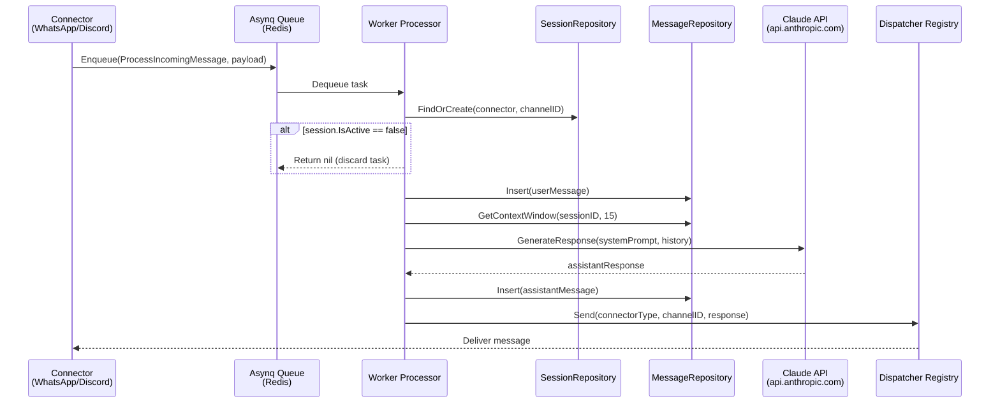

# Spec 03: Claude Service and Asynq Worker

## Objective
Implement the AI inference service and the background task processor that decouples
incoming connector events from slow LLM HTTP calls. This is the core intelligence loop
of Bruce — every message from every connector flows through here.

---

## 1. System Flow Diagram



---

## 2. LLM Service Interface (`internal/ai/claude.go`)

```go
// LLMService is the abstraction over any LLM provider.
// Claude is the only implementation for MVP. The interface exists to make
// testing the worker without hitting the real API trivial.
type LLMService interface {
    GenerateResponse(ctx context.Context, systemPrompt string, history []domain.Message) (string, error)
}

type claudeService struct {
    apiKey    string
    model     string
    maxTokens int
    httpClient *http.Client
}

func NewClaudeService(cfg *config.Config) LLMService {
    return &claudeService{
        apiKey:    cfg.Claude.APIKey,
        model:     cfg.Claude.Model,     // default: "claude-opus-4-6"
        maxTokens: cfg.Claude.MaxTokens, // default: 1024
        httpClient: &http.Client{Timeout: 60 * time.Second},
    }
}
```

### Anthropic API Request Mapping

```go
type anthropicRequest struct {
    Model     string             `json:"model"`
    MaxTokens int                `json:"max_tokens"`
    System    string             `json:"system"`
    Messages  []anthropicMessage `json:"messages"`
}

type anthropicMessage struct {
    Role    string `json:"role"`    // "user" | "assistant"
    Content string `json:"content"`
}
```

**Mapping rules:**
- `domain.Message{Role: "user"}` → `anthropicMessage{Role: "user"}`
- `domain.Message{Role: "assistant"}` → `anthropicMessage{Role: "assistant"}`
- `domain.Message{Role: "system"}` → **not included in `messages`**, used as the top-level
  `system` field instead. If multiple system messages exist, concatenate them.
- The Anthropic API requires messages to alternate user/assistant. If `GetContextWindow`
  returns two consecutive `user` messages (can happen if Claude failed to respond previously),
  merge them with a newline before sending.

### Error Handling

```go
func (c *claudeService) GenerateResponse(ctx context.Context, systemPrompt string, history []domain.Message) (string, error) {
    // Build request, POST to https://api.anthropic.com/v1/messages
    // On non-200: return fmt.Errorf("claude API %d: %s", resp.StatusCode, body)
    // On 429 (rate limit): return a sentinel error type so the worker can backoff
    // On 529 (overloaded): treat same as 429
    // On 5xx: return wrapped error for Asynq retry
}
```

Define a sentinel: `var ErrRateLimited = errors.New("claude: rate limited")`. The worker
checks for this and returns it to Asynq, which will retry with backoff.

---

## 3. Asynq Task Payload (`internal/worker/payloads.go`)

```go
const TaskProcessIncomingMessage = "message:process"

type ProcessIncomingMessagePayload struct {
    ConnectorType string `json:"connector_type"` // "whatsapp" | "discord"
    ChannelID     string `json:"channel_id"`     // phone number or Discord channel ID
    Content       string `json:"content"`        // raw text from the user
}

func NewProcessIncomingMessageTask(p ProcessIncomingMessagePayload) (*asynq.Task, error) {
    payload, err := json.Marshal(p)
    if err != nil {
        return nil, err
    }
    return asynq.NewTask(TaskProcessIncomingMessage, payload,
        asynq.MaxRetry(3),
        asynq.Timeout(90*time.Second),  // must exceed Claude's 60s HTTP timeout
    ), nil
}
```

**Asynq server configuration:**
```go
asynq.NewServer(
    asynq.RedisClientOpt{Addr: cfg.Redis.Address},
    asynq.Config{
        Concurrency: 2,          // 2 goroutines max — constrained environment
        RetryDelayFunc: asynq.DefaultRetryDelayFunc,  // exponential: 1s, 2s, 4s
        Queues: map[string]int{"default": 1},
    },
)
```

**Why Concurrency: 2?** Each task makes a blocking HTTP call to Claude (up to 60s). On a
512MB machine, 2 concurrent tasks = 2 in-flight Claude requests. This is sufficient for a
single-user personal agent and avoids memory pressure from goroutine proliferation.

---

## 4. Dispatcher Interface & Registry (`internal/worker/dispatcher.go`)

```go
// Dispatcher sends a response back to a specific channel on a specific connector.
type Dispatcher interface {
    Send(channelID string, message string) error
}

// DispatcherRegistry maps connector type strings to their Dispatcher implementations.
// Registered at startup in main.go before the worker starts.
type DispatcherRegistry struct {
    dispatchers map[string]Dispatcher
    mu          sync.RWMutex
}

func (r *DispatcherRegistry) Register(connectorType string, d Dispatcher) {
    r.mu.Lock()
    defer r.mu.Unlock()
    r.dispatchers[connectorType] = d
}

func (r *DispatcherRegistry) Dispatch(connectorType, channelID, message string) error {
    r.mu.RLock()
    d, ok := r.dispatchers[connectorType]
    r.mu.RUnlock()
    if !ok {
        return fmt.Errorf("no dispatcher registered for connector: %s", connectorType)
    }
    return d.Send(channelID, message)
}
```

---

## 5. Worker Processor (`internal/worker/processor.go`)

```go
func (p *Processor) HandleProcessIncomingMessageTask(ctx context.Context, t *asynq.Task) error {
    var payload ProcessIncomingMessagePayload
    if err := json.Unmarshal(t.Payload(), &payload); err != nil {
        return fmt.Errorf("unmarshal payload: %w", err) // don't retry on bad payload
    }

    // 1. Find or create session
    session, err := p.sessionRepo.FindOrCreate(payload.ConnectorType, payload.ChannelID)
    if err != nil {
        return fmt.Errorf("session: %w", err)
    }

    // 2. Skip if agent is paused for this session
    if !session.IsActive {
        log.Printf("session %s is paused, discarding message", session.ID)
        return nil
    }

    // 3. Resolve system prompt: session-level overrides global config default
    systemPrompt := session.SystemPrompt
    if systemPrompt == "" {
        systemPrompt, _ = p.configRepo.Get("ui.default_system_prompt")
    }

    // 4. Log incoming user message
    userMsg := &domain.Message{
        ID:        uuid.New().String(),
        SessionID: session.ID,
        Role:      "user",
        Content:   payload.Content,
        Timestamp: time.Now().UTC(),
    }
    if err := p.messageRepo.Insert(userMsg); err != nil {
        return fmt.Errorf("insert user message: %w", err)
    }

    // 5. Fetch context window for Claude
    history, err := p.messageRepo.GetContextWindow(session.ID, p.cfg.Claude.ContextWindow)
    if err != nil {
        return fmt.Errorf("context window: %w", err)
    }

    // 6. Call Claude
    response, err := p.llm.GenerateResponse(ctx, systemPrompt, history)
    if err != nil {
        // Rate limited — Asynq will retry with exponential backoff
        if errors.Is(err, ai.ErrRateLimited) {
            return fmt.Errorf("rate limited: %w", err)
        }
        return fmt.Errorf("llm: %w", err)
    }

    // 7. Log assistant response
    assistantMsg := &domain.Message{
        ID:        uuid.New().String(),
        SessionID: session.ID,
        Role:      "assistant",
        Content:   response,
        Timestamp: time.Now().UTC(),
    }
    if err := p.messageRepo.Insert(assistantMsg); err != nil {
        return fmt.Errorf("insert assistant message: %w", err)
    }

    // 8. Dispatch response back to connector
    if err := p.dispatcher.Dispatch(payload.ConnectorType, payload.ChannelID, response); err != nil {
        // Log but don't fail the task — message is already saved, send failure is best-effort
        log.Printf("dispatch error (connector=%s, channel=%s): %v",
            payload.ConnectorType, payload.ChannelID, err)
    }

    return nil
}
```

**Critical design note on step 8**: Dispatch errors are logged but do not fail the Asynq task.
If we returned an error here, Asynq would retry the whole task — which would re-call Claude,
log duplicate messages, and re-attempt dispatch. The message is already persisted; a send
failure is a connector-layer concern, not a worker concern.

---

## 6. Context Window Strategy

The context window is the N most recent messages sent to Claude. Key concerns:

| Concern | Strategy |
|---------|----------|
| Token cost | Default `context_window: 15`. User can reduce via config. |
| Conversation coherence | Always send in chronological order (oldest first) |
| Alternating role requirement | Sanitize before sending: merge consecutive same-role messages |
| System prompt | Passed as top-level `system` field, not in `messages` array |
| First message in session | Only 1 message in history — that's fine, Claude handles it |

**Do not** implement token counting or truncation in Phase 1. The 15-message default is
conservative enough that it won't exceed `max_tokens: 1024` for typical messages.

---

## 7. Testing Strategy

Worker tests mock both `LLMService` and `DispatcherRegistry` — no real Claude calls, no
real connectors:

```go
type mockLLM struct{}
func (m *mockLLM) GenerateResponse(_ context.Context, _ string, _ []domain.Message) (string, error) {
    return "mocked response", nil
}
```

**Key tests:**
- `TestProcessor_SkipsInactiveSession` — session with `is_active=false` returns nil, no LLM call
- `TestProcessor_InsertsUserAndAssistantMessages` — both messages written to DB
- `TestProcessor_UsesSessionSystemPromptOverDefault` — per-session prompt takes precedence
- `TestProcessor_RateLimitedErrorReturnsForRetry` — LLM returning `ErrRateLimited` propagates

---

## ADRs

**ADR-003: Asynq over direct goroutine dispatch**
- Decision: All incoming messages go through an Asynq task queue before processing.
- Alternatives: Spawn a goroutine directly in the connector event handler.
- Rationale: Direct goroutines have no retry, no backoff, no observability, and no
  protection against Claude being slow/unavailable. Asynq provides all of this with
  Redis already in the stack.
- Consequences: Adds ~1-5ms of Redis round-trip latency per message. Negligible.

**ADR-004: Dispatch errors are non-fatal to the worker**
- Decision: If `Dispatcher.Send` fails, log and return `nil` (task succeeds).
- Alternatives: Return error and let Asynq retry the entire task.
- Rationale: Retrying the full task would re-invoke Claude and duplicate messages in the DB.
  The message content is safe in SQLite regardless of delivery failure.
- Consequences: A failed dispatch is silent to the user. Phase 2 can surface delivery
  failures via the web UI session log.

---

## Deliverable

An Asynq task processor that, given a `ProcessIncomingMessagePayload` with a valid
`claude.api_key` in config, successfully calls Claude, inserts both the user message and
assistant response into SQLite, and calls `Dispatcher.Dispatch`. All tests pass without
making real HTTP calls to Anthropic.
