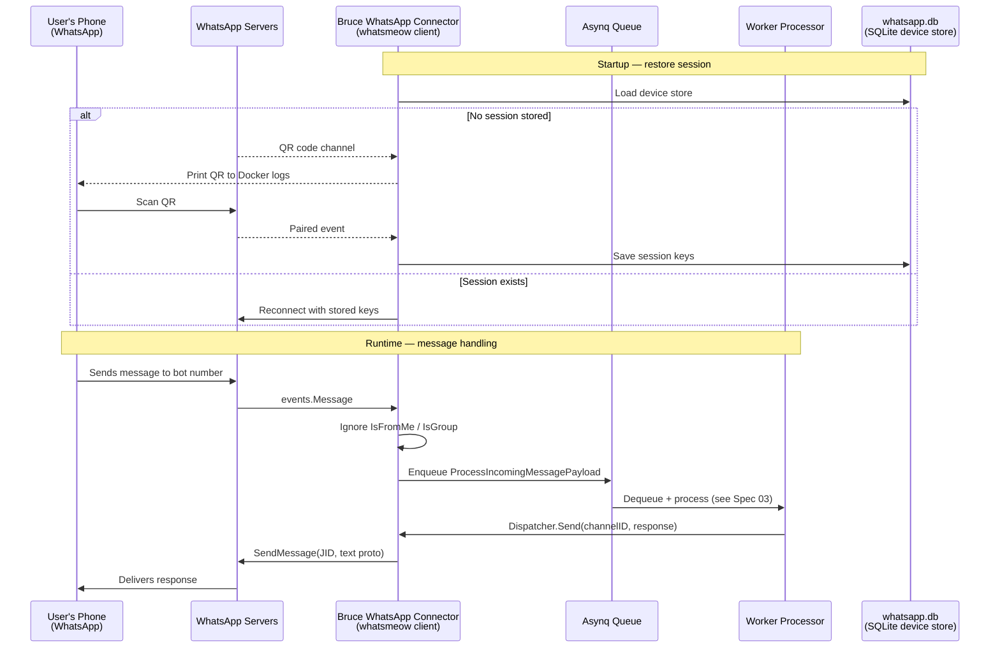

# Spec 04: WhatsApp Connector

## Objective
Implement `go-whatsmeow` as the primary input/output channel. A user scans a QR code once,
Bruce persists the device session, and every subsequent 1:1 WhatsApp message to the linked
number flows through the Asynq processor and back.

---

## 1. Architecture & Data Flow



---

## 2. Dependencies

```go
// go.mod additions
require (
    go.mau.fi/whatsmeow v0.0.0-latest
    github.com/mattn/go-sqlite3 v1.14.22  // already in go.mod
    google.golang.org/protobuf v1.36.1    // already in go.mod
)
```

`whatsmeow` uses its own SQLite-backed device store (separate from Bruce's main `bruce.db`).
This isolation is intentional — the device store schema is owned by `whatsmeow` and should
not be mixed with application tables.

---

## 3. Package Structure

```
internal/connectors/whatsapp/
├── connector.go      # WhatsAppConnector struct — implements Dispatcher
├── auth.go           # QR code flow + session restore logic
└── handler.go        # events.Message handler + Asynq enqueue
```

---

## 4. Connector Struct & Initialization (`connector.go`)

```go
type WhatsAppConnector struct {
    client       *whatsmeow.Client
    asynqClient  *asynq.Client
    deviceStore  *sqlstore.Container
    logger       *zap.Logger
}

func New(cfg *config.Config, asynqClient *asynq.Client) (*WhatsAppConnector, error) {
    // 1. Open whatsmeow device store in its own SQLite file
    dbLog := waLog.Stdout("Database", "DEBUG", true)
    container, err := sqlstore.New("sqlite3",
        fmt.Sprintf("file:%s?_foreign_keys=on&_journal_mode=WAL", cfg.Connectors.WhatsApp.DeviceStoreDSN),
        dbLog,
    )
    if err != nil {
        return nil, fmt.Errorf("whatsapp device store: %w", err)
    }

    // 2. Get or create device
    deviceStore, err := container.GetFirstDevice()
    if err != nil {
        return nil, fmt.Errorf("whatsapp device: %w", err)
    }

    // 3. Create whatsmeow client
    clientLog := waLog.Stdout("Client", "INFO", true)
    client := whatsmeow.NewClient(deviceStore, clientLog)

    return &WhatsAppConnector{
        client:      client,
        asynqClient: asynqClient,
        deviceStore: container,
    }, nil
}
```

---

## 5. Authentication & QR Flow (`auth.go`)

```go
func (c *WhatsAppConnector) Connect() error {
    // Register event handler before connecting
    c.client.AddEventHandler(c.handleEvent)

    if c.client.Store.ID == nil {
        // Not logged in — need QR pairing
        qrChan, _ := c.client.GetQRChannel(context.Background())
        if err := c.client.Connect(); err != nil {
            return fmt.Errorf("connect: %w", err)
        }
        for evt := range qrChan {
            switch evt.Event {
            case "code":
                // Print QR to stdout — visible via `docker compose logs -f bruce`
                printQRToTerminal(evt.Code)
                log.Printf("Scan the QR code above with WhatsApp on your phone")
            case "success":
                log.Printf("WhatsApp QR pairing successful")
                return nil
            case "timeout":
                return fmt.Errorf("QR code expired — restart Bruce to retry")
            }
        }
    } else {
        // Already paired — just reconnect
        if err := c.client.Connect(); err != nil {
            return fmt.Errorf("reconnect: %w", err)
        }
        log.Printf("WhatsApp reconnected as %s", c.client.Store.ID)
    }
    return nil
}

func printQRToTerminal(qrCode string) {
    // Use github.com/mdp/qrterminal/v3 to print ASCII QR to stdout
    qrterminal.GenerateHalfBlock(qrCode, qrterminal.L, os.Stdout)
}
```

**Phase 2 upgrade**: Expose the QR code as a `GET /api/v1/connectors/whatsapp/qr` endpoint
that returns the raw QR string. The web UI renders it as an `` via a QR JS library.
For Phase 1, terminal output is sufficient.

---

## 6. Event Handler (`handler.go`)

```go
func (c *WhatsAppConnector) handleEvent(evt interface{}) {
    switch v := evt.(type) {
    case *events.Message:
        c.handleMessage(v)
    case *events.Disconnected:
        log.Printf("WhatsApp disconnected — will attempt reconnect")
        // whatsmeow handles reconnect internally with backoff
    case *events.LoggedOut:
        log.Printf("WhatsApp logged out — QR re-scan required on next start")
        // Clear device store so next boot triggers QR flow
        c.client.Store.Delete()
    }
}

func (c *WhatsAppConnector) handleMessage(msg *events.Message) {
    // Filter rules
    if msg.Info.IsFromMe {
        return // Ignore messages we sent (prevents echo loops)
    }
    if msg.Info.IsGroup {
        return // Phase 1: ignore group chats entirely
    }

    // Extract text — handle both plain text and extended text messages
    text := msg.Message.GetConversation()
    if text == "" {
        text = msg.Message.GetExtendedTextMessage().GetText()
    }
    if text == "" {
        return // Non-text message (image, audio, sticker) — ignore in Phase 1
    }

    // Enqueue for async processing
    payload := worker.ProcessIncomingMessagePayload{
        ConnectorType: "whatsapp",
        ChannelID:     msg.Info.Sender.User, // e.g. "5511999999999"
        Content:       text,
    }
    task, err := worker.NewProcessIncomingMessageTask(payload)
    if err != nil {
        log.Printf("failed to create task: %v", err)
        return
    }
    if _, err := c.asynqClient.Enqueue(task); err != nil {
        log.Printf("failed to enqueue message from %s: %v", msg.Info.Sender.User, err)
    }
}
```

**`msg.Info.Sender.User`** is the raw phone number without the `@s.whatsapp.net` JID suffix.
Storing just the number makes it human-readable in the session table and avoids JID parsing
complexity in the repository layer.

---

## 7. Dispatcher Implementation (`connector.go`)

```go
// Send implements worker.Dispatcher
func (c *WhatsAppConnector) Send(channelID string, message string) error {
    // Reconstruct JID from stored phone number
    jid, err := types.ParseJID(channelID + "@s.whatsapp.net")
    if err != nil {
        return fmt.Errorf("invalid jid for channel %s: %w", channelID, err)
    }

    ctx, cancel := context.WithTimeout(context.Background(), 15*time.Second)
    defer cancel()

    _, err = c.client.SendMessage(ctx, jid, &waProto.Message{
        Conversation: proto.String(message),
    })
    if err != nil {
        return fmt.Errorf("whatsapp send: %w", err)
    }
    return nil
}
```

**Message length limit**: WhatsApp supports up to ~65,000 characters per message. Claude's
`max_tokens: 1024` produces at most ~4,000 characters. No chunking needed in Phase 1.

---

## 8. Startup Integration (`main.go`)

```go
if cfg.Connectors.WhatsApp.Enabled {
    wa, err := whatsapp.New(cfg, asynqClient)
    if err != nil {
        log.Fatalf("whatsapp init: %v", err)
    }
    if err := wa.Connect(); err != nil {
        log.Fatalf("whatsapp connect: %v", err)
    }
    dispatcherRegistry.Register("whatsapp", wa)
    defer wa.client.Disconnect()
}
```

---

## 9. Technical Risks & Mitigations

| Risk | Impact | Mitigation |
|------|--------|------------|
| WhatsApp ToS ban on automated clients | Bot number banned | Use a dedicated SIM/number, not personal. Don't spam. |
| `whatsmeow` API breaks on WhatsApp update | Connector stops working | Pin to a specific commit hash, not `latest`. Monitor upstream. |
| QR code expiry during Docker startup | User must restart | Log clear instructions: `docker compose restart bruce` |
| `LoggedOut` event mid-session | All sessions need re-pairing | Handle the event, log clearly, persist the state |
| WSL2 network NAT issues | WhatsApp can't reach the container | Not a code issue — document: run `docker compose up` from WSL2, not Windows |

---

## Deliverable

1. `docker compose logs -f bruce` shows a QR code on first run.
2. Scan with personal phone → logs show "WhatsApp QR pairing successful".
3. Send "hello" to the bot number → logs show Asynq task enqueued.
4. Worker processes task → Claude responds → message delivered back to the sender's phone.
5. `docker compose down && docker compose up` → Bruce reconnects without re-scanning QR.
