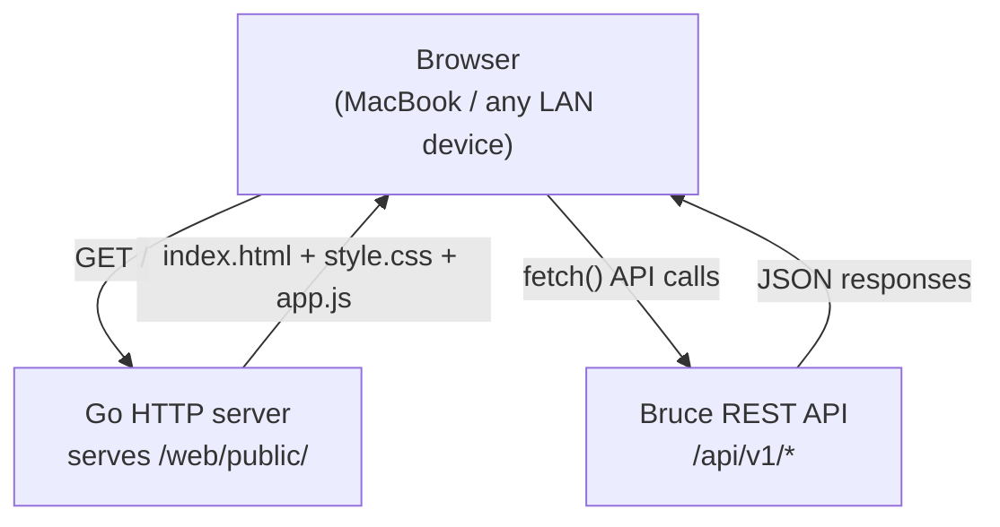

# Spec 06: Web Configuration UI

## Objective
A lightweight single-page dashboard served from inside the Bruce binary. No React, no
bundler, no build step. Pure HTML + CSS + Vanilla JS. The entire UI must be readable and
modifiable by a developer in under 30 minutes. Target: ~500 lines of JS total.

---

## 1. UI Architecture



The browser loads three static files once, then all subsequent interaction is via `fetch()`
calls to the same origin — no CORS issues, no auth needed.

---

## 2. File Structure

```
web/public/
├── index.html     (~150 lines)  — layout, tab structure, DOM hooks
├── style.css      (~200 lines)  — layout, typography, status badges
└── app.js         (~400 lines)  — all fetch calls, DOM manipulation, state
```

No external dependencies. If a CSS micro-framework is needed, inline
[Pico.css](https://picocss.com/) via a single `<link>` CDN tag — it's 10KB and classless.

---

## 3. Page Layout (Single Page, Tab Navigation)

```
┌─────────────────────────────────────────────────────┐
│  🐶 Bruce                              v0.1.0        │
├─────────────────────────────────────────────────────┤
│  [Connectors]  [Sessions]  [Logs]  [Settings]        │
├─────────────────────────────────────────────────────┤
│                                                      │
│  (active tab content)                                │
│                                                      │
└─────────────────────────────────────────────────────┘
```

Tab switching is pure DOM show/hide — `section.hidden`. No routing, no history API needed.

---

## 4. Tab: Connectors

**Purpose**: Show live connector status and let the user enable/disable them.

**DOM structure:**
```html
<section id="tab-connectors">
  <div class="connector-card" data-type="whatsapp">
    <h3>WhatsApp</h3>
    <span class="badge" id="wa-status">Loading...</span>
    <div id="wa-qr-container" class="hidden">
      <!-- Phase 2: QR code image -->
      <p>Restart Bruce and scan the QR code from <code>docker compose logs -f bruce</code></p>
    </div>
  </div>
  <div class="connector-card" data-type="discord">
    <h3>Discord</h3>
    <span class="badge" id="discord-status">Loading...</span>
    <label>Bot Token</label>
    <input type="password" id="discord-token" placeholder="Bot token">
    <button onclick="saveDiscordToken()">Save (requires restart)</button>
  </div>
</section>
```

**JS behavior:**
```js
async function loadConnectors() {
    const res = await fetch('/api/v1/connectors');
    const connectors = await res.json();
    connectors.forEach(c => {
        const badge = document.getElementById(`${c.type}-status`);
        badge.textContent = c.status;
        badge.className = `badge badge-${c.status}`; // CSS colors status
    });
}

// Poll connector status every 10 seconds
setInterval(loadConnectors, 10000);
```

**Status badge colors** (via CSS class):
- `badge-connected` → green
- `badge-disconnected` → red
- `badge-needs_qr` → orange
- `badge-disabled` → grey

---

## 5. Tab: Sessions

**Purpose**: List all active conversations, view and edit their system prompts, and pause/resume.

**DOM structure:**
```html
<section id="tab-sessions">
  <div id="sessions-list">
    <!-- Populated by JS -->
  </div>
  <div id="session-detail" class="hidden">
    <h3 id="detail-channel-id"></h3>
    <label>System Prompt</label>
    <textarea id="detail-prompt" rows="4"></textarea>
    <label class="toggle-label">
      <input type="checkbox" id="detail-active"> Agent Active
    </label>
    <button onclick="saveSession()">Save Changes</button>
  </div>
</section>
```

**JS behavior:**
```js
let selectedSessionID = null;

async function loadSessions() {
    const res = await fetch('/api/v1/sessions');
    const sessions = await res.json();
    const list = document.getElementById('sessions-list');
    list.innerHTML = sessions.map(s => `
        <div class="session-row ${s.is_active ? '' : 'paused'}"
             onclick="selectSession('${s.id}')">
            <span class="connector-badge">${s.connector_type}</span>
            <span>${s.channel_id}</span>
            <span class="session-status">${s.is_active ? 'Active' : 'Paused'}</span>
        </div>
    `).join('');
}

function selectSession(id) {
    selectedSessionID = id;
    fetch(`/api/v1/sessions/${id}`)
        .then(r => r.json())
        .then(s => {
            document.getElementById('detail-channel-id').textContent =
                `${s.connector_type} / ${s.channel_id}`;
            document.getElementById('detail-prompt').value = s.system_prompt;
            document.getElementById('detail-active').checked = s.is_active;
            document.getElementById('session-detail').classList.remove('hidden');
        });
}

async function saveSession() {
    await fetch(`/api/v1/sessions/${selectedSessionID}`, {
        method: 'PATCH',
        headers: {'Content-Type': 'application/json'},
        body: JSON.stringify({
            system_prompt: document.getElementById('detail-prompt').value,
            is_active: document.getElementById('detail-active').checked,
        })
    });
    await loadSessions(); // Refresh list
}
```

---

## 6. Tab: Logs

**Purpose**: Debug view showing the raw conversation for a selected session.

**Behavior:**
1. Load sessions list in a `<select>` dropdown.
2. On selection, `fetch('/api/v1/sessions/{id}/messages?limit=50')`.
3. Render messages in a scrollable `<div>` like a chat UI.
4. Add a "Refresh" button (no auto-poll — logs are debug-only, not real-time in Phase 1).

```js
async function loadMessages(sessionID) {
    const res = await fetch(`/api/v1/sessions/${sessionID}/messages?limit=50`);
    const messages = await res.json();
    const container = document.getElementById('messages-container');
    // Reverse for chronological display (API returns newest-first)
    container.innerHTML = [...messages].reverse().map(m => `
        <div class="message message-${m.role}">
            <span class="role">${m.role}</span>
            <span class="timestamp">${new Date(m.timestamp).toLocaleTimeString()}</span>
            <p>${escapeHTML(m.content)}</p>
        </div>
    `).join('');
    container.scrollTop = container.scrollHeight; // Scroll to bottom
}

function escapeHTML(str) {
    return str.replace(/&/g,'&amp;').replace(/</g,'&lt;').replace(/>/g,'&gt;');
}
```

**Security note**: Always `escapeHTML` before inserting LLM-generated content into the DOM.
Claude's output is untrusted from an XSS perspective.

---

## 7. Tab: Settings

**Purpose**: Edit global config values (Claude API key, default system prompt, model).

```js
async function loadSettings() {
    const res = await fetch('/api/v1/config');
    const entries = await res.json();
    entries.forEach(entry => {
        const input = document.getElementById(`config-${entry.key.replace(/\./g, '-')}`);
        if (input) input.value = entry.value;
    });
}

async function saveSetting(key) {
    const inputId = `config-${key.replace(/\./g, '-')}`;
    const value = document.getElementById(inputId).value;
    const res = await fetch('/api/v1/config', {
        method: 'PUT',
        headers: {'Content-Type': 'application/json'},
        body: JSON.stringify({ key, value })
    });
    if (res.ok) showToast('Saved. Restart Bruce to apply API key changes.');
}
```

**Settings fields rendered:**
- `claude.api_key` — `<input type="password">` — displays as `****` from API
- `claude.model` — `<select>` with options: claude-opus-4-6, claude-sonnet-4-6, claude-haiku-4-5-20251001
- `claude.max_tokens` — `<input type="number" min="256" max="4096">`
- `claude.context_window` — `<input type="number" min="1" max="50">`
- `ui.default_system_prompt` — `<textarea>`

---

## 8. Shared JS Utilities

```js
// Toast notification (pure CSS/JS, no library)
function showToast(message, type = 'success') {
    const toast = document.createElement('div');
    toast.className = `toast toast-${type}`;
    toast.textContent = message;
    document.body.appendChild(toast);
    setTimeout(() => toast.remove(), 3000);
}

// Initialize on page load
document.addEventListener('DOMContentLoaded', () => {
    loadConnectors();
    loadSessions();
    loadSettings();
    // Default to Connectors tab
    switchTab('connectors');
});

function switchTab(name) {
    document.querySelectorAll('section[id^="tab-"]').forEach(s => s.classList.add('hidden'));
    document.getElementById(`tab-${name}`).classList.remove('hidden');
    document.querySelectorAll('.tab-btn').forEach(b => b.classList.remove('active'));
    document.querySelector(`.tab-btn[data-tab="${name}"]`).classList.add('active');
}
```

---

## 9. CSS Highlights (`style.css`)

```css
:root {
    --color-connected: #22c55e;
    --color-disconnected: #ef4444;
    --color-needs-qr: #f97316;
    --color-disabled: #94a3b8;
}

.badge-connected    { background: var(--color-connected); }
.badge-disconnected { background: var(--color-disconnected); }
.badge-needs_qr     { background: var(--color-needs-qr); }
.badge-disabled     { background: var(--color-disabled); }

.message-user      { background: #f1f5f9; align-self: flex-end; }
.message-assistant { background: #eff6ff; align-self: flex-start; }
.message-system    { background: #fef9c3; font-style: italic; }

.session-row.paused { opacity: 0.5; }
```

---

## ADR

**ADR-007: No JavaScript framework**
- Decision: Vanilla JS only. No React, Vue, or build tooling.
- Alternatives: React with Vite (fast DX), HTMX (server-driven, minimal JS).
- Rationale: The UI has ~4 views and ~15 API interactions. A framework adds 100KB+ of JS,
  a build step, and `node_modules` to a project explicitly designed to avoid Node.js
  dependencies. HTMX is an interesting alternative for Phase 2 if the UI grows.
- Consequences: More verbose DOM manipulation code. Acceptable — the UI is a control panel,
  not a product. Developers who want to extend it can read and modify it in minutes.

---

## Deliverable

A working single-page dashboard accessible at `http://localhost:8080` (or LAN IP) that:
1. Shows connector status (including WhatsApp "needs_qr" state).
2. Lists sessions and allows editing system prompt + pausing agent.
3. Shows message history for any selected session.
4. Allows saving Claude API key and model via the Settings tab.
5. No build step — edit `app.js` and refresh the browser.
