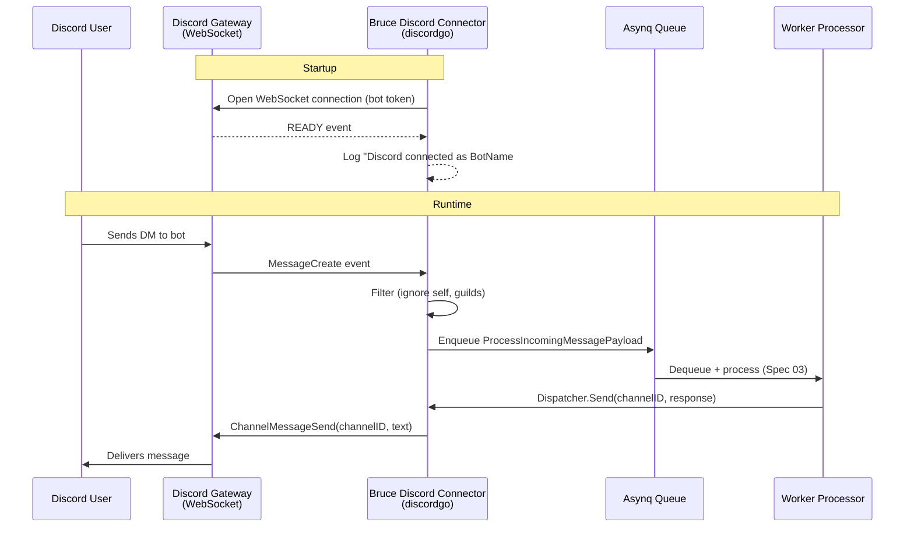

# Spec 07: Discord Connector

## Objective
Implement a Discord bot connector using `bwmarrin/discordgo` as the second messaging channel.
Discord has an official API, stable Go SDK, and no QR code auth — making it the more reliable
connector and a good fallback if WhatsApp integration is unstable. Phase 1 scope: Direct
Messages only.

---

## 1. Architecture & Data Flow



---

## 2. Dependencies

```go
// go.mod addition
require (
    github.com/bwmarrin/discordgo v0.28.1
)
```

`discordgo` is pure Go — no CGO, no external binary dependencies. It handles WebSocket
reconnection internally.

---

## 3. Package Structure

```
internal/connectors/discord/
├── connector.go    # DiscordConnector struct — initialization + implements Dispatcher
└── handler.go      # MessageCreate event handler + Asynq enqueue
```

---

## 4. Connector Struct & Initialization (`connector.go`)

```go
type DiscordConnector struct {
    session     *discordgo.Session
    asynqClient *asynq.Client
    botUserID   string   // populated after READY event
}

func New(token string, asynqClient *asynq.Client) (*DiscordConnector, error) {
    if token == "" {
        return nil, fmt.Errorf("discord bot token is required")
    }

    dg, err := discordgo.New("Bot " + token)
    if err != nil {
        return nil, fmt.Errorf("discordgo init: %w", err)
    }

    // Only request the intents we need — principle of least privilege
    dg.Identify.Intents = discordgo.IntentsDirectMessages |
                          discordgo.IntentsDirectMessageReactions

    return &DiscordConnector{
        session:     dg,
        asynqClient: asynqClient,
    }, nil
}

func (c *DiscordConnector) Connect() error {
    c.session.AddHandler(c.handleMessage)
    c.session.AddHandler(func(s *discordgo.Session, r *discordgo.Ready) {
        c.botUserID = r.User.ID
        log.Printf("Discord connected as %s#%s", r.User.Username, r.User.Discriminator)
    })

    if err := c.session.Open(); err != nil {
        return fmt.Errorf("discord open: %w", err)
    }
    return nil
}

func (c *DiscordConnector) Disconnect() {
    c.session.Close()
}
```

**Intent scoping**: Only `IntentsDirectMessages` is requested. This means the bot cannot
see guild (server) messages — intentional for Phase 1. Requesting guild message intents
requires Discord's bot to be "verified" for large servers and adds noise.

---

## 5. Message Handler (`handler.go`)

```go
func (c *DiscordConnector) handleMessage(s *discordgo.Session, m *discordgo.MessageCreate) {
    // Ignore messages from the bot itself
    if m.Author.ID == c.botUserID {
        return
    }

    // Phase 1: Direct Messages only
    // A DM channel has Type == discordgo.ChannelTypeDM
    channel, err := s.State.Channel(m.ChannelID)
    if err != nil {
        // Channel not in state cache — fetch it
        channel, err = s.Channel(m.ChannelID)
        if err != nil {
            log.Printf("discord: failed to fetch channel %s: %v", m.ChannelID, err)
            return
        }
    }
    if channel.Type != discordgo.ChannelTypeDM {
        return // Ignore guild messages in Phase 1
    }

    // Ignore empty messages (attachments, embeds without text)
    content := strings.TrimSpace(m.Content)
    if content == "" {
        return
    }

    // Enqueue for async processing — identical payload structure to WhatsApp
    payload := worker.ProcessIncomingMessagePayload{
        ConnectorType: "discord",
        ChannelID:     m.ChannelID, // Discord DM channel ID (stable per user pair)
        Content:       content,
    }
    task, err := worker.NewProcessIncomingMessageTask(payload)
    if err != nil {
        log.Printf("discord: failed to create task: %v", err)
        return
    }
    if _, err := c.asynqClient.Enqueue(task); err != nil {
        log.Printf("discord: failed to enqueue from channel %s: %v", m.ChannelID, err)
    }
}
```

**Why `m.ChannelID` instead of `m.Author.ID`?** The DM channel ID is the stable identifier
for the conversation between the bot and the user. `m.Author.ID` is the user — but to send
a reply, you need the channel ID. Storing `ChannelID` as the `channel_id` in the session
table means `Dispatcher.Send` can call `ChannelMessageSend` directly without a lookup.

---

## 6. Dispatcher Implementation (`connector.go`)

```go
// Send implements worker.Dispatcher
func (c *DiscordConnector) Send(channelID string, message string) error {
    // Discord message length limit: 2000 characters
    // Claude max_tokens: 1024 ≈ ~4000 chars worst case — must chunk
    chunks := chunkMessage(message, 1900) // 1900 to leave room for formatting
    for _, chunk := range chunks {
        _, err := c.session.ChannelMessageSend(channelID, chunk)
        if err != nil {
            // Check for rate limit (HTTP 429)
            if restErr, ok := err.(*discordgo.RESTError); ok {
                if restErr.Response.StatusCode == 429 {
                    // discordgo handles rate limits internally — this shouldn't happen
                    // but if it does, log and continue
                    log.Printf("discord rate limited on channel %s", channelID)
                    time.Sleep(1 * time.Second)
                    _, err = c.session.ChannelMessageSend(channelID, chunk)
                }
            }
            if err != nil {
                return fmt.Errorf("discord send to %s: %w", channelID, err)
            }
        }
    }
    return nil
}

// chunkMessage splits a message into chunks of maxLen characters,
// breaking on word boundaries where possible.
func chunkMessage(msg string, maxLen int) []string {
    if len(msg) <= maxLen {
        return []string{msg}
    }
    var chunks []string
    for len(msg) > maxLen {
        split := maxLen
        // Walk back to find a space
        for split > 0 && msg[split] != ' ' {
            split--
        }
        if split == 0 {
            split = maxLen // No space found, hard cut
        }
        chunks = append(chunks, msg[:split])
        msg = msg[split:]
    }
    if len(msg) > 0 {
        chunks = append(chunks, msg)
    }
    return chunks
}
```

**Discord vs WhatsApp message limits:**
- Discord DM: **2,000 characters** per message
- WhatsApp: ~65,000 characters per message
- Claude `max_tokens: 1024` → worst case ~4,000 characters (code blocks, verbose answers)

Discord is the only connector that needs message chunking. WhatsApp does not.

---

## 7. Startup Integration (`main.go`)

```go
if cfg.Connectors.Discord.Enabled {
    token, err := resolveDiscordToken(cfg, configRepo)
    if err != nil || token == "" {
        log.Printf("discord: bot_token not configured — connector disabled")
    } else {
        dc, err := discord.New(token, asynqClient)
        if err != nil {
            log.Fatalf("discord init: %v", err)
        }
        if err := dc.Connect(); err != nil {
            log.Fatalf("discord connect: %v", err)
        }
        dispatcherRegistry.Register("discord", dc)
        defer dc.Disconnect()
    }
}

// Token resolution: DB config overrides config.yml
func resolveDiscordToken(cfg *config.Config, repo repository.ConfigRepository) (string, error) {
    if t, err := repo.Get("connectors.discord.bot_token"); err == nil && t != "" {
        return t, nil
    }
    return cfg.Connectors.Discord.BotToken, nil
}
```

---

## 8. Bot Setup Instructions (for `/docs` or README)

For the web UI Settings tab — show these instructions when Discord token field is empty:

1. Go to [Discord Developer Portal](https://discord.com/developers/applications)
2. Create a New Application → name it "Bruce"
3. Go to Bot → Reset Token → copy token
4. Under Privileged Gateway Intents: enable **Message Content Intent**
5. Go to OAuth2 → URL Generator → Scopes: `bot` → Bot Permissions: `Send Messages`, `Read Message History`
6. Copy the generated URL → open in browser → add bot to your server (or skip if DM only)
7. Paste the token in Bruce Settings → Save → `docker compose restart bruce`

---

## 9. Technical Risks & Mitigations

| Risk | Impact | Mitigation |
|------|--------|------------|
| Bot token leaked via `GET /api/v1/config` | Token compromised | Mask any key containing "token" same as "api_key" |
| Discord changes DM channel type enum | DM filter breaks | Add integration test that creates a mock channel event |
| Guild message intent required for some DM types | Some DMs not received | Document: DM-only mode is the supported configuration |
| discordgo WebSocket disconnect | Bot goes offline | discordgo handles reconnect internally; log disconnects |
| Rate limiting during chunked sends | Some chunks dropped | Add exponential backoff on 429; log lost chunks |

---

## ADR

**ADR-008: Direct Messages only in Phase 1**
- Decision: Filter out all non-DM messages in the Discord connector.
- Alternatives: Allow guild (server) channel messages.
- Rationale: Guild messages require the bot to be invited to a server, set up channel
  permissions, and manage which channels Bruce responds in. This is significant UX and
  configuration complexity. DMs keep Phase 1 scope identical to WhatsApp (1:1 conversations).
- Consequences: Users cannot use Bruce in a Discord server channel until Phase 2.
  Document clearly.

---

## Deliverable

1. Configure a Discord bot token via Settings UI → save → `docker compose restart bruce`.
2. Logs show `"Discord connected as Bruce#XXXX"`.
3. Send a DM to the bot from Discord desktop or mobile.
4. Logs show the task enqueued in Asynq.
5. Worker processes via Claude → Discord bot replies in the same DM thread.
6. Messages longer than 2,000 characters are chunked into multiple Discord messages.
7. Sending a message to a guild channel the bot is in produces no response (filtered).
