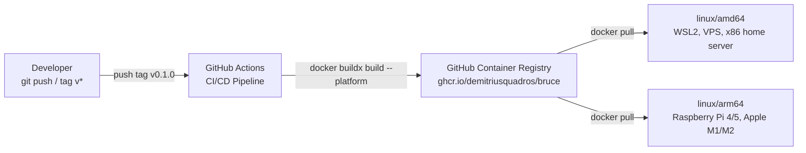

# Spec 08: CI/CD & Deployment

## Objective
Make Bruce distributable as a pre-built Docker image for `linux/amd64` and `linux/arm64`.
A first-time user with any Linux machine or Raspberry Pi should be able to run Bruce with
three commands and no Go toolchain installed.

---

## 1. Deployment Architecture



---

## 2. Multi-Stage Dockerfile

The existing `Dockerfile` must be rewritten for multi-stage builds. The key constraint:
`mattn/go-sqlite3` uses CGO and requires `gcc` to compile — the builder stage must have it,
but the final image must not.

```dockerfile
# ─── Stage 1: Builder ──────────────────────────────────────────────────────────
FROM golang:1.23-alpine AS builder

# CGO requires gcc + sqlite headers
RUN apk add --no-cache build-base sqlite-dev

WORKDIR /app

# Copy dependency manifests first for Docker layer caching
COPY go.mod go.sum ./
RUN go mod download

# Copy source and web assets
COPY . .

# Build the binary with CGO enabled
# -ldflags "-s -w" strips debug symbols → reduces binary size ~30%
RUN CGO_ENABLED=1 GOOS=linux go build \
    -ldflags="-s -w -extldflags '-static'" \
    -o bruce ./cmd/bruce/main.go

# ─── Stage 2: Runtime ──────────────────────────────────────────────────────────
FROM alpine:3.21

# CA certificates required to reach api.anthropic.com (HTTPS)
RUN apk add --no-cache ca-certificates tzdata

WORKDIR /app

# Copy binary from builder
COPY --from=builder /app/bruce .

# Copy static web UI assets
COPY --from=builder /app/web/public ./web/public

# Data directory for SQLite volumes
RUN mkdir -p /app/data

EXPOSE 8080

ENTRYPOINT ["./bruce"]
```

**Binary size targets:**
- With `-s -w -extldflags '-static'`: ~15–25MB for the Go binary
- Final image: ~20–30MB (alpine base ~8MB + binary + CA certs + web assets)

**Why static linking (`-extldflags '-static'`)?** The alpine runtime image has `musl libc`,
not `glibc`. Linking statically avoids `libc` version mismatches between builder and runtime.

---

## 3. GitHub Actions Workflow (`.github/workflows/docker-build.yml`)

```yaml
name: Build and Push Docker Image

on:
  push:
    tags:
      - 'v*'           # Trigger on version tags: v0.1.0, v1.2.3
  workflow_dispatch:   # Manual trigger from GitHub UI

env:
  REGISTRY: ghcr.io
  IMAGE_NAME: ${{ github.repository }}   # demitriusquadros/bruce

jobs:
  build-and-push:
    runs-on: ubuntu-latest
    permissions:
      contents: read
      packages: write   # Required to push to GHCR

    steps:
      - name: Checkout
        uses: actions/checkout@v4

      - name: Set up QEMU
        uses: docker/setup-qemu-action@v3
        # QEMU enables ARM64 emulation on the x86 GitHub Actions runner

      - name: Set up Docker Buildx
        uses: docker/setup-buildx-action@v3

      - name: Log in to GHCR
        uses: docker/login-action@v3
        with:
          registry: ${{ env.REGISTRY }}
          username: ${{ github.actor }}
          password: ${{ secrets.GITHUB_TOKEN }}

      - name: Extract metadata (tags, labels)
        id: meta
        uses: docker/metadata-action@v5
        with:
          images: ${{ env.REGISTRY }}/${{ env.IMAGE_NAME }}
          tags: |
            type=semver,pattern={{version}}         # v0.1.0
            type=semver,pattern={{major}}.{{minor}} # v0.1
            type=raw,value=latest,enable=${{ github.ref == format('refs/tags/{0}', github.ref_name) }}

      - name: Build and push multi-platform image
        uses: docker/build-push-action@v6
        with:
          context: .
          platforms: linux/amd64,linux/arm64
          push: true
          tags: ${{ steps.meta.outputs.tags }}
          labels: ${{ steps.meta.outputs.labels }}
          cache-from: type=gha    # GitHub Actions cache for faster rebuilds
          cache-to: type=gha,mode=max
```

**Build time estimate**: First build ~8–12 min (ARM64 cross-compilation via QEMU is slow).
Cached builds: ~3–5 min. The `cache-from/cache-to: type=gha` directives reuse the Go
module download and Docker layer caches between runs.

---

## 4. CI Workflow for Tests (`.github/workflows/test.yml`)

Separate from the Docker build — runs on every PR and push to `main`:

```yaml
name: Test

on:
  push:
    branches: [main]
  pull_request:
    branches: [main]

jobs:
  test:
    runs-on: ubuntu-latest
    steps:
      - uses: actions/checkout@v4

      - name: Set up Go
        uses: actions/setup-go@v5
        with:
          go-version: '1.23'
          cache: true

      - name: Install SQLite build dependencies
        run: sudo apt-get install -y gcc libsqlite3-dev

      - name: Run tests
        run: CGO_ENABLED=1 go test ./... -v -race -timeout 60s

      - name: Build check
        run: CGO_ENABLED=1 go build ./...
```

---

## 5. End-User Install Package (`install/`)

Create an `install/` directory with two files users download:

### `install/docker-compose.yml`

```yaml
version: "3.8"

services:
  redis:
    image: redis:7-alpine
    restart: unless-stopped
    command: >
      redis-server
      --maxmemory 32mb
      --maxmemory-policy allkeys-lru
      --save ""
      --appendonly no
    healthcheck:
      test: ["CMD", "redis-cli", "ping"]
      interval: 10s
      retries: 3

  bruce:
    image: ghcr.io/demitriusquadros/bruce:latest
    restart: unless-stopped
    ports:
      - "8080:8080"
    volumes:
      - ./data:/app/data
      - ./config.yml:/app/config.yml:ro
    depends_on:
      redis:
        condition: service_healthy

volumes: {}
```

### `install/config.yml` (template)

```yaml
server:
  port: 8080

redis:
  address: "redis:6379"

sqlite:
  dsn: "./data/bruce.db"

claude:
  api_key: "PASTE_YOUR_CLAUDE_API_KEY_HERE"
  model: "claude-haiku-4-5-20251001"   # Use Haiku for cost efficiency
  max_tokens: 1024
  context_window: 15

connectors:
  whatsapp:
    enabled: true
    device_store_dsn: "./data/whatsapp.db"
  discord:
    enabled: false
    bot_token: ""

ui:
  default_system_prompt: "You are Bruce, a personal AI assistant."
```

---

## 6. One-Command Install Script

Create `install/install.sh` — users can `curl | bash` this from the README:

```bash
#!/bin/sh
set -e

echo "Installing Bruce..."
mkdir -p bruce && cd bruce
mkdir -p data

# Download install files
curl -fsSL "https://raw.githubusercontent.com/DemitriusQuadros/bruce/main/install/docker-compose.yml" \
    -o docker-compose.yml

curl -fsSL "https://raw.githubusercontent.com/DemitriusQuadros/bruce/main/install/config.yml" \
    -o config.yml

echo ""
echo "Bruce downloaded. Next steps:"
echo "  1. Edit config.yml and add your Claude API key"
echo "  2. Run: docker compose up -d"
echo "  3. Open: http://localhost:8080"
echo "  4. Check logs for WhatsApp QR: docker compose logs -f bruce"
```

---

## 7. ARM64 / Raspberry Pi Notes

**Verified target**: Raspberry Pi 4 (4GB RAM) running Raspberry Pi OS 64-bit (Debian Bookworm).

**Prerequisites on Pi:**
```bash
# Install Docker
curl -fsSL https://get.docker.com | sh
sudo usermod -aG docker $USER
# Logout and back in, then:
docker compose version  # Verify
```

**Known constraints on Pi:**
- ARM64 QEMU cross-compiled builds may have minor performance differences from native.
  If issues arise, add a `linux/arm64` native runner using a self-hosted GitHub Actions
  runner on the Pi itself (Phase 3 optimization).
- SQLite `mattn/go-sqlite3` requires CGO. The Docker image handles this — users never
  compile from source.

---

## 8. Versioning Strategy

Follow [Semantic Versioning](https://semver.org/):
- `v0.x.y` — pre-1.0, breaking changes allowed between minor versions
- `v0.1.0` — Phase 1 complete (WhatsApp + Claude loop)
- `v0.2.0` — Phase 2 complete (Discord + Web UI + config)
- `v1.0.0` — Phase 3 complete (tool execution + Telegram)

Tag format: `git tag v0.1.0 && git push origin v0.1.0` → triggers Docker build automatically.

---

## 9. Technical Risks & Mitigations

| Risk | Impact | Mitigation |
|------|--------|------------|
| QEMU ARM64 build fails on GHA | No ARM64 image | Add self-hosted Pi runner as fallback in Phase 2 |
| CGO static linking fails on musl | Build error in CI | Pin to `golang:1.23-alpine` (uses musl); test locally with `--platform linux/arm64` |
| `go-sqlite3` CGO breaks cross-compile | Build fails for ARM64 | Use `CGO_ENABLED=1 CC=aarch64-linux-musl-gcc` with cross-compiler if pure QEMU fails |
| GHCR image not public | Users can't pull | Set package visibility to Public in GitHub repo settings after first push |
| config.yml contains secrets in git | API key leaked | Add `config.yml` to `.gitignore` (already present); use `config.example.yml` as template |

---

## Deliverable

```bash
# First-time user on any Linux machine or Raspberry Pi:
curl -fsSL https://raw.githubusercontent.com/DemitriusQuadros/bruce/main/install/install.sh | sh
cd bruce
# Edit config.yml with Claude API key
docker compose up -d
docker compose logs -f bruce  # See WhatsApp QR code
# Open http://localhost:8080
```

CI passes on every PR (`go test ./...` + `go build ./...`). Tagging `v0.1.0` triggers a
multi-platform Docker build that publishes `ghcr.io/demitriusquadros/bruce:0.1.0` and
`ghcr.io/demitriusquadros/bruce:latest` to GHCR within ~10 minutes.
