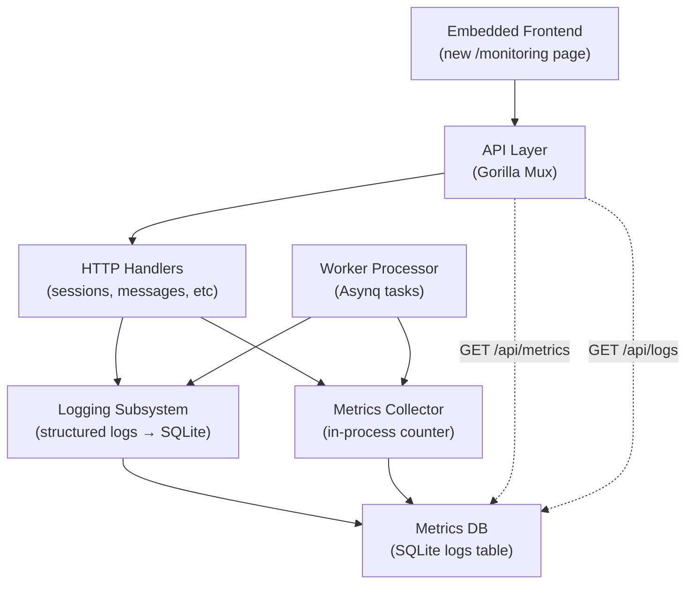
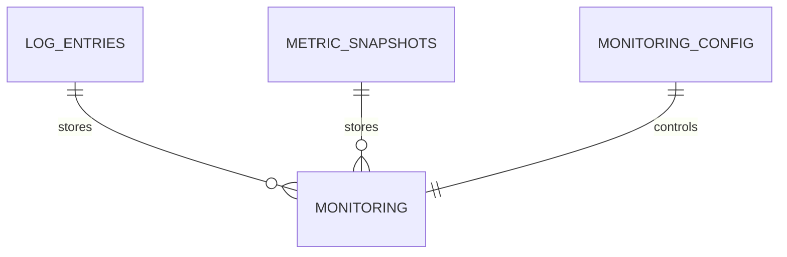

# Spec 10: Monitoring System

## Objective

Implement a lightweight monitoring system with structured logging, metrics collection, and an
embedded dashboard — all backed by SQLite. Enable/disable logs at runtime, collect metrics
in-process with periodic flush to DB, and expose logs + metrics via REST API and web UI.
This spec must not introduce external dependencies beyond what already exists (Redis, Asynq).

---

## 1. System Architecture Overview



**Data flow**: Every HTTP request and background task writes a log entry and updates
in-process metrics counters. At configurable intervals (or on-demand), aggregated metrics
are flushed to the `metric_snapshots` table in SQLite. The frontend polls `/api/metrics`
and `/api/logs` to render a dashboard. Logs can be toggled on/off via `monitoring_config`
or API endpoint.

---

## 2. Core Domain Model

**Entity: LogEntry**
| Field       | Type        | Notes                                      |
|-------------|-------------|--------------------------------------------|
| id          | UUID        | PK                                         |
| timestamp   | Timestamp   | auto, indexed (range queries)              |
| level       | Enum        | DEBUG \| INFO \| WARN \| ERROR             |
| logger      | String      | source (e.g., "http.handler", "worker")    |
| message     | String      | log message                                |
| context     | JSON        | structured fields (request_id, user_id)    |
| enabled     | Bool        | global switch; if false, logs discarded    |

**Entity: MetricSnapshot**
| Field            | Type        | Notes                                      |
|------------------|-------------|-------------------------------------------|
| id               | UUID        | PK                                         |
| timestamp        | Timestamp   | auto, indexed (aggregation queries)        |
| metric_name      | String      | e.g., "http_request_count", "task_error"  |
| metric_type      | Enum        | COUNTER \| GAUGE \| HISTOGRAM              |
| value            | Float       | the actual metric value                    |
| labels           | JSON        | tags (route, status, connector_type)       |
| aggregation_window | Integer   | window size in seconds (e.g., 60)          |

**In-process Metrics State** (not persisted until flush)
| Counter              | Type    | Notes                                      |
|----------------------|---------|-------------------------------------------|
| http_request_total   | Counter | by status, method, route                   |
| http_request_duration_ms | Histogram | by route (p50, p95, p99)                |
| task_processed_total | Counter | by task_type, status (success/error)       |
| task_duration_ms     | Histogram | by task_type                               |
| connector_events     | Counter | by connector_type, event_type              |

---

## 3. Database Schema Design



**New tables to add to `schema.sql`:**

```sql
CREATE TABLE log_entries (
    id TEXT PRIMARY KEY,
    timestamp DATETIME DEFAULT CURRENT_TIMESTAMP,
    level TEXT NOT NULL CHECK(level IN ('DEBUG', 'INFO', 'WARN', 'ERROR')),
    logger TEXT NOT NULL,
    message TEXT NOT NULL,
    context TEXT,  -- JSON: {request_id, user_id, session_id, error, ...}
    enabled BOOLEAN DEFAULT 1
);
CREATE INDEX idx_log_entries_timestamp ON log_entries(timestamp DESC);
CREATE INDEX idx_log_entries_level ON log_entries(level);
CREATE INDEX idx_log_entries_logger ON log_entries(logger);

CREATE TABLE metric_snapshots (
    id TEXT PRIMARY KEY,
    timestamp DATETIME DEFAULT CURRENT_TIMESTAMP,
    metric_name TEXT NOT NULL,
    metric_type TEXT NOT NULL CHECK(metric_type IN ('COUNTER', 'GAUGE', 'HISTOGRAM')),
    value REAL NOT NULL,
    labels TEXT,  -- JSON: {route, status, connector_type, percentile, ...}
    aggregation_window_seconds INTEGER DEFAULT 60
);
CREATE INDEX idx_metric_snapshots_timestamp ON metric_snapshots(timestamp DESC);
CREATE INDEX idx_metric_snapshots_name ON metric_snapshots(metric_name);
CREATE INDEX idx_metric_snapshots_composite ON metric_snapshots(metric_name, timestamp DESC);

CREATE TABLE monitoring_config (
    key TEXT PRIMARY KEY,
    value TEXT NOT NULL,
    updated_at DATETIME DEFAULT CURRENT_TIMESTAMP
);
-- Seed data:
-- INSERT INTO monitoring_config (key, value) VALUES ('log_enabled', 'true');
-- INSERT INTO monitoring_config (key, value) VALUES ('metrics_enabled', 'true');
-- INSERT INTO monitoring_config (key, value) VALUES ('retention_days', '30');
```

**Schema design decisions:**
- `log_entries` has no FK — logs are append-only and independent
- `context` JSON avoids schema bloat for optional fields (error stack, headers, etc.)
- Composite index on `metric_snapshots(metric_name, timestamp)` for efficient time-series queries
- `monitoring_config` allows runtime toggle of logs/metrics without restart
- Log retention is enforced by a background cleanup job (runs daily, deletes entries older than `retention_days`)
- Single writer via `MaxOpenConns(1)` ensures no contention on log writes

---

## 4. API Contract Definitions

### Monitoring Endpoints

```
GET /api/metrics
  Auth: Session (any user)
  Query params:
    ?metric_name=http_request_total          (filter by metric)
    ?start_time=2026-03-10T00:00:00Z         (ISO8601, default: now - 24h)
    ?end_time=2026-03-11T00:00:00Z           (ISO8601, default: now)
    &aggregation_window=300                  (seconds, default: 60)
  Returns:
    {
      "metrics": [
        {
          "name": "http_request_total",
          "type": "COUNTER",
          "datapoints": [
            { "timestamp": "2026-03-11T15:30:00Z", "value": 145, "labels": {"status": "200", "route": "/api/sessions"} },
            ...
          ]
        }
      ]
    }
  Notes: Returns raw metric snapshots; client does aggregation if needed
  Errors: 400 (bad time format), 401 (unauth)

GET /api/logs
  Auth: Session (any user)
  Query params:
    ?level=ERROR                             (filter by log level)
    ?logger=worker.processor                 (filter by logger name)
    ?start_time=2026-03-11T00:00:00Z
    &end_time=2026-03-11T23:59:59Z
    &limit=100                               (default: 50, max: 500)
  Returns:
    {
      "logs": [
        {
          "timestamp": "2026-03-11T15:45:23Z",
          "level": "ERROR",
          "logger": "worker.processor",
          "message": "task failed after 3 retries",
          "context": { "task_id": "...", "error": "timeout", "user_id": "..." }
        }
      ]
    }
  Errors: 400 (bad query), 401 (unauth)

PATCH /api/monitoring/config
  Auth: Session (admin only — new ADMIN role required)
  Body:
    {
      "log_enabled": true,
      "metrics_enabled": true,
      "retention_days": 30
    }
  Returns: { "status": "updated" }
  Notes: Updates monitoring_config table; takes effect immediately
  Errors: 400 (invalid value), 401 (unauth), 403 (forbidden)

GET /api/monitoring/config
  Auth: Session (any user — read-only)
  Returns:
    {
      "log_enabled": true,
      "metrics_enabled": true,
      "retention_days": 30
    }
  Errors: 401 (unauth)
```

---

## 5. Background Jobs & Async Flows

```
Job: FlushMetrics
  Trigger: Timer (every 60 seconds)
  Input: none
  Steps:
    1. Acquire lock (prevent concurrent flushes)
    2. Read in-process metrics (counters, histograms)
    3. Aggregate into metric_snapshots table
    4. Reset in-process counters
    5. Release lock
  Retry: N/A (scheduled)
  Failure handling: Log error; keep counters in memory; retry on next cycle

Job: CleanupOldLogs
  Trigger: Daily (e.g., 2am UTC)
  Input: retention_days (from config)
  Steps:
    1. Fetch monitoring_config['retention_days']
    2. DELETE FROM log_entries WHERE timestamp < (now - retention_days)
    3. DELETE FROM metric_snapshots WHERE timestamp < (now - retention_days)
    4. Log rows deleted
  Retry: 3x on failure; alert if cleanup fails 3x in a row
  Failure handling: Log error to stderr; surface in dashboard as warning

Job: CaptureMetric (synchronous, inline)
  Trigger: Every HTTP handler and task processor completion
  Input: metric_name, value, labels (context)
  Steps:
    1. Check if metrics_enabled in config (cache with 1-min TTL)
    2. If enabled, update in-process counter (atomic)
    3. Queue FlushMetrics if counter for this (metric_name, labels) reaches threshold
  Retry: N/A (in-process only)
  Failure handling: Silently drop metric (non-critical)
```

---

## 6. Auth & Authorization Model

**Auth mechanism**: Reuse existing session-based auth (no changes needed).

**New role**: `ADMIN`
- Can toggle logs/metrics on and off
- Can query logs and metrics with no restrictions
- Can delete old logs manually (future enhancement)

**Permission matrix:**

| Endpoint           | User   | Admin  |
|--------------------|--------|--------|
| GET /api/metrics   | Read   | Read   |
| GET /api/logs      | Read   | Read   |
| PATCH /api/config  | ❌     | Write  |
| GET /api/config    | Read   | Read   |

**Implementation**: Add middleware to `/api/monitoring/*` routes that checks session role
(same pattern used by `/api/config` handlers).

---

## 7. Step-by-Step Implementation Plan

### Phase 1 — Logging Foundation

**Step 1: Add schema and migrations**
- Add `log_entries`, `monitoring_config` tables to `schema.sql`
- Seed `monitoring_config` with defaults (`log_enabled=true`, `metrics_enabled=true`, `retention_days=30`)
- Run schema on local DB and verify tables exist
- Deliverable: `sqlite` schema updated; local db has new tables

**Step 2: Implement logging interface + SQLite writer**
- Create `internal/logging/logger.go` with `Logger` interface:
  ```go
  type Logger interface {
    Debug(ctx context.Context, msg string, fields map[string]interface{})
    Info(ctx context.Context, msg string, fields map[string]interface{})
    Warn(ctx context.Context, msg string, fields map[string]interface{})
    Error(ctx context.Context, msg string, fields map[string]interface{})
  }
  ```
- Implement SQLite-backed logger that writes to `log_entries` table
- Implement in-memory logger for tests
- Inject logger into handlers and worker processor
- Deliverable: All handlers and worker log their operations to SQLite

**Step 3: Implement log query endpoints**
- Add `GET /api/logs` handler with filters (level, logger, time range, limit)
- Add `GET /api/monitoring/config` (read-only)
- Test with curl queries
- Deliverable: `curl "http://localhost:8080/api/logs?level=ERROR"` returns logs

### Phase 2 — Metrics Collection

**Step 4: Implement metrics collector (in-process)**
- Create `internal/metrics/collector.go` with `Collector` interface:
  ```go
  type Collector interface {
    IncrementCounter(name string, labels map[string]string)
    RecordHistogram(name string, value float64, labels map[string]string)
    Flush() map[string][]MetricSnapshot
  }
  ```
- Use `sync.Mutex` for concurrent safety
- Implement histogram percentile calculation (p50, p95, p99)
- Deliverable: Collector increments and flushes in unit tests

**Step 5: Integrate metrics into HTTP handlers + worker**
- Add metrics recording middleware to `internal/api/router.go` (record request latency, status)
- Add metrics recording to `internal/worker/processor.go` (record task duration, errors)
- Use request context to pass request_id/user_id to collector
- Deliverable: Metrics counters increment on every request/task; no errors

**Step 6: Implement FlushMetrics background job**
- Create `internal/worker/jobs/flush_metrics.go` (Asynq task)
- On app startup, enqueue FlushMetrics to run every 60 seconds
- Read in-process counters, persist to `metric_snapshots`, reset counters
- Test with logs showing successful flushes
- Deliverable: Metrics persisted to DB every 60 seconds; check with `sqlite3 data/bruce.db "SELECT * FROM metric_snapshots"`

**Step 7: Implement metrics query endpoints**
- Add `GET /api/metrics` handler with filters (name, time range, aggregation_window)
- Implement basic aggregation (sum, avg, percentile for histograms)
- Test with curl queries
- Deliverable: `curl "http://localhost:8080/api/metrics?metric_name=http_request_total"` returns data

### Phase 3 — Monitoring Dashboard + Cleanup

**Step 8: Implement monitoring config endpoints + ADMIN role**
- Add `PATCH /api/monitoring/config` (requires new ADMIN middleware)
- Extend session auth to support `ADMIN` role (or create dedicated `monitoring_admin` role)
- Add `GET /api/monitoring/config` (read-only)
- Test curl with valid/invalid auth
- Deliverable: `curl -X PATCH http://localhost:8080/api/monitoring/config` toggles logs on/off

**Step 9: Implement log cleanup background job**
- Create `internal/worker/jobs/cleanup_logs.go` (Asynq task)
- On app startup, enqueue CleanupLogs to run daily (e.g., 2am UTC)
- Delete logs and metrics older than `retention_days` from config
- Test by manually advancing system time or setting retention_days to 0
- Deliverable: Old logs purged automatically; verify with SQL query

**Step 10: Build monitoring dashboard UI**
- Create `web/public/monitoring.html` with:
  - Toggle buttons for log_enabled, metrics_enabled
  - Metric graph (simple HTML canvas or SVG) showing http_request_total, task_error_rate over last 24h
  - Log viewer with level/logger filters and time range picker
  - Auto-refresh every 30 seconds
- Implement JS client (in `web/public/app.js` or separate file) to call `/api/metrics` and `/api/logs`
- Link to dashboard from main nav (update `index.html`)
- Deliverable: Open `http://localhost:8080/monitoring.html`, see real-time metrics and logs

**Step 11: Update config schema and docs**
- Update `config.example.yml` with monitoring section:
  ```yaml
  monitoring:
    log_enabled: true
    metrics_enabled: true
    retention_days: 30
    metrics_flush_interval_seconds: 60
  ```
- Load these values into `monitoring_config` on app boot if not already present
- Update CLAUDE.md with monitoring section
- Test end-to-end: run app, generate requests, check dashboard
- Deliverable: Monitoring system fully operational

---

## 8. Integration Architecture

**Integration: SQLite Database**
- Role: Persistent storage for logs and metrics
- Pattern: Direct writes from logger and metrics collector; batched reads by API handlers
- Key concerns:
  - Single writer limitation (WAL mode mitigates, but one connection for writes)
  - Querying large log tables can block without proper indexing
  - Metrics table can grow quickly; cleanup job is critical
- Failure mode: If log writes fail, silently drop (non-critical); metrics flush failures are retried

**Integration: Asynq Task Queue**
- Role: Scheduling FlushMetrics and CleanupLogs jobs
- Pattern: Outbound (enqueue periodic tasks on app startup)
- Key concerns:
  - FlushMetrics must be idempotent (deletes old snapshots, inserts new ones)
  - CleanupLogs should not run concurrently with app shutdown (handled by graceful shutdown)
- Failure mode: Metrics not flushed → in-memory counters reset, data loss; cleanup failures log but don't crash app

**Integration: HTTP Router (Gorilla Mux)**
- Role: Expose `/api/metrics`, `/api/logs`, `/api/monitoring/config` endpoints
- Pattern: Add new routes to `internal/api/router.go`
- Key concerns:
  - Query endpoints must be fast (use indexed columns, limit result sets)
  - `/api/logs` with large time ranges can return thousands of rows; pagination advised
- Failure mode: Slow queries block HTTP server; add 5s query timeout to all monitoring endpoints

---

## 9. ADRs

**ADR-001: Metrics stored in SQLite, not external system**
- Decision: Persist metrics snapshots to the same SQLite DB; no Prometheus or external monitoring
- Alternatives: Prometheus/Grafana, InfluxDB, CloudWatch
- Rationale: Bruce is single-binary; external deps add ops burden. SQLite storage is simpler and
  sufficient for observability of a small system. Time-series queries are basic (filter by name/time, aggregate).
- Consequences: No built-in visualizations (custom dashboard required); query performance may degrade
  if tables grow very large (> 1M rows); no cross-system correlation

**ADR-002: In-process metrics collection with periodic flush**
- Decision: Keep metrics counters in-process, flush aggregated snapshots to DB every 60 seconds
- Alternatives: Write each metric event to DB immediately; use external metrics agent
- Rationale: Reduces DB write pressure; in-process counters are fast and lock-free. 60s window is good
  tradeoff between freshness and DB load.
- Consequences: Metrics have ~60s lag; in-process counters reset on app restart (data loss);
  must handle concurrent increments safely with atomic operations

**ADR-003: Logging is configurable (not always-on)**
- Decision: Add `log_enabled` flag to `monitoring_config`; discard logs if disabled
- Alternatives: Always log; allow log level filtering instead
- Rationale: Production deployments may want to disable logs to reduce disk I/O and DB writes.
  Config toggle allows runtime on/off without restart.
- Consequences: Operators must remember to enable logs for debugging; no audit trail if logs are disabled

**ADR-004: SQLite for metrics storage instead of in-memory-only**
- Decision: Persist metrics to DB so they survive app restarts and can be queried historically
- Alternatives: Keep metrics only in-memory; export to external system
- Rationale: Simple, no extra infrastructure. Allows dashboards to show trends over time.
- Consequences: Older metrics consume disk space; cleanup job is mandatory; large metric tables slow down queries

**ADR-005: Role-based access control for monitoring config**
- Decision: Only ADMIN role can toggle logs/metrics; read is allowed for any authenticated user
- Alternatives: No auth for monitoring endpoints; fine-grained role matrix
- Rationale: Logs and metrics are sensitive (reveal system internals, user behavior); toggling should
  be restricted to prevent abuse. Read is safe (observability only).
- Consequences: Requires new ADMIN role; operators must manage role assignments

---

## 10. Technical Risks & Mitigations

**Risk: Metrics table grows unbounded**
- Impact: Slow queries; high disk usage
- Mitigation: Daily cleanup job enforced; set reasonable `retention_days` default (30 days);
  add table size monitoring in dashboard

**Risk: Concurrent writes to log_entries table block other DB operations**
- Impact: HTTP handlers stall waiting for DB lock; visible slowdown
- Rationale: SQLite WAL mode improves concurrency but doesn't eliminate contention
- Mitigation: Batch log writes (queue in-memory, flush every 5s); monitor slow query logs;
  consider async log writes if contention becomes real issue

**Risk: Metrics histogram percentile calculation is expensive**
- Impact: FlushMetrics job takes long time if many samples
- Mitigation: Use approximate percentile algorithms (simple sampling); pre-aggregate histograms
  before storing snapshots

**Open question: Should metrics be queryable by non-logged-in users?**
- Blocks: Step 7 (auth for `/api/metrics`)
- Assumption: Requires session auth, but could be loosened for public metrics

**Open question: Do logs need to include HTTP request/response bodies?**
- Blocks: Step 2 (logger interface design)
- Decision: Full request logging can be verbose; sample or limit body size

---

## Deliverable

**Phase 1 complete:**
- `sqlite` schema updated with `log_entries` and `monitoring_config` tables
- All handlers and worker processor log their operations
- `curl "http://localhost:8080/api/logs?level=ERROR"` returns recent errors
- `GET /api/monitoring/config` shows current settings

**Phase 2 complete:**
- Metrics are collected in-process on every HTTP request and task
- `curl "http://localhost:8080/api/metrics?metric_name=http_request_total"` returns aggregated data
- `metric_snapshots` table grows every 60 seconds with fresh data

**Phase 3 complete:**
- `PATCH /api/monitoring/config` (admin only) toggles logs and metrics on/off
- Old logs/metrics auto-delete daily based on retention policy
- `http://localhost:8080/monitoring.html` displays a real-time dashboard with:
  - Logs viewer (filterable by level, logger, time range)
  - Metrics graphs (request count, latency percentiles, error rates)
  - Config toggles (enable/disable logs and metrics)
