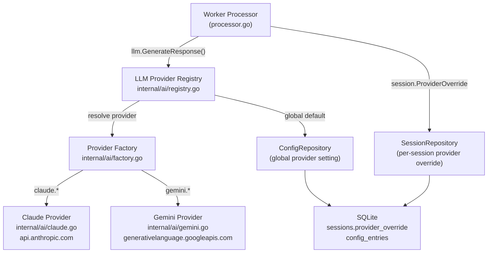

# Spec 09: Multi-Provider LLM (Claude + Gemini)

## Objective
Extend the AI inference layer from Spec 03 to support multiple LLM providers — starting with
**Anthropic Claude** and **Google Gemini** — without changing the worker processor or connector
code. Provider selection is configurable globally and overridable per session. The `LLMService`
interface from Spec 03 remains unchanged; all new complexity lives in the `internal/ai/` package.

---

## 1. Architecture Overview



**Data flow**: The worker processor calls `LLMService.GenerateResponse()` exactly as in Spec 03
— it has no knowledge of which provider is active. The `LLMService` implementation is now a
`ProviderRegistry` that resolves the correct provider at call time: first checking the session's
`provider_override`, then falling back to the global `llm.provider` config key. The registry
holds pre-initialized provider instances and routes the call. No change to the processor, no
change to connectors.

---

## 2. Provider Abstraction Layer (`internal/ai/`)

### Package structure

```
internal/ai/
├── provider.go       # LLMService interface + shared types + sentinel errors
├── registry.go       # ProviderRegistry — implements LLMService, routes to providers
├── factory.go        # NewProvider(name, cfg) — constructs provider by name
├── claude.go         # claudeProvider — Anthropic implementation
├── gemini.go         # geminiProvider — Google Gemini implementation
└── sanitize.go       # Shared message sanitization (alternating-role enforcement)
```

### `provider.go` — shared types

```go
package ai

import (
    "context"
    "errors"
    "bruce/internal/domain"
)

// LLMService is unchanged from Spec 03.
// The interface is the stable contract — all complexity is behind it.
type LLMService interface {
    GenerateResponse(ctx context.Context, systemPrompt string, history []domain.Message) (string, error)
}

// Sentinel errors — provider-agnostic, used by the worker for retry decisions.
var (
    ErrRateLimited   = errors.New("ai: rate limited")        // 429 from any provider
    ErrProviderDown  = errors.New("ai: provider unavailable") // 5xx from any provider
    ErrBadRequest    = errors.New("ai: bad request")          // 4xx non-auth (don't retry)
    ErrUnknownProvider = errors.New("ai: unknown provider")
)

// ProviderName is the canonical string key for each provider.
// Used in config, session overrides, and the registry.
type ProviderName string

const (
    ProviderClaude ProviderName = "claude"
    ProviderGemini ProviderName = "gemini"
)
```

---

## 3. Provider Registry (`internal/ai/registry.go`)

The registry implements `LLMService` and is the single object injected into the worker.
It holds all initialized providers and resolves which one to use per call.

```go
type ProviderRegistry struct {
    providers  map[ProviderName]LLMService
    configRepo repository.ConfigRepository  // reads "llm.provider" for global default
    sessionRepo repository.SessionRepository
    mu          sync.RWMutex
}

func NewProviderRegistry(
    configRepo repository.ConfigRepository,
    sessionRepo repository.SessionRepository,
    providers map[ProviderName]LLMService,
) *ProviderRegistry {
    return &ProviderRegistry{
        providers:   providers,
        configRepo:  configRepo,
        sessionRepo: sessionRepo,
    }
}

// GenerateResponse resolves the provider for this call and delegates.
// sessionID is passed via context — see ResolveContext below.
func (r *ProviderRegistry) GenerateResponse(
    ctx context.Context,
    systemPrompt string,
    history []domain.Message,
) (string, error) {
    provider, err := r.resolveProvider(ctx)
    if err != nil {
        return "", err
    }
    return provider.GenerateResponse(ctx, systemPrompt, history)
}

func (r *ProviderRegistry) resolveProvider(ctx context.Context) (LLMService, error) {
    // 1. Check session-level override (set via web UI per session)
    if sessionID, ok := ctx.Value(contextKeySessionID).(string); ok && sessionID != "" {
        session, err := r.sessionRepo.GetByID(sessionID)
        if err == nil && session.ProviderOverride != "" {
            name := ProviderName(session.ProviderOverride)
            if p, ok := r.providers[name]; ok {
                return p, nil
            }
        }
    }

    // 2. Fall back to global config default
    globalDefault, _ := r.configRepo.Get("llm.provider") // e.g. "claude"
    if globalDefault == "" {
        globalDefault = string(ProviderClaude) // hardcoded fallback
    }

    name := ProviderName(globalDefault)
    r.mu.RLock()
    p, ok := r.providers[name]
    r.mu.RUnlock()

    if !ok {
        return nil, fmt.Errorf("%w: %s", ErrUnknownProvider, name)
    }
    return p, nil
}

// contextKey type for session ID propagation
type contextKey string
const contextKeySessionID contextKey = "session_id"

// WithSessionID injects a session ID into the context for provider resolution.
func WithSessionID(ctx context.Context, sessionID string) context.Context {
    return context.WithValue(ctx, contextKeySessionID, sessionID)
}
```

**Why context for session ID?** The `LLMService` interface must not change — it cannot accept
a `sessionID` parameter without breaking the abstraction. Injecting it via context follows Go
idioms for request-scoped values and keeps the interface stable.

---

## 4. Provider Factory (`internal/ai/factory.go`)

```go
// BuildProviders constructs all configured providers at startup.
// Only providers with valid API keys are registered.
func BuildProviders(cfg *config.Config) map[ProviderName]LLMService {
    providers := make(map[ProviderName]LLMService)

    if cfg.Claude.APIKey != "" {
        providers[ProviderClaude] = NewClaudeProvider(cfg.Claude)
        log.Printf("ai: registered provider %s (model: %s)", ProviderClaude, cfg.Claude.Model)
    }

    if cfg.Gemini.APIKey != "" {
        providers[ProviderGemini] = NewGeminiProvider(cfg.Gemini)
        log.Printf("ai: registered provider %s (model: %s)", ProviderGemini, cfg.Gemini.Model)
    }

    if len(providers) == 0 {
        log.Printf("WARNING: no LLM providers configured. Set claude.api_key or gemini.api_key in config.")
    }

    return providers
}
```

---

## 5. Claude Provider (`internal/ai/claude.go`)

Identical to the implementation in Spec 03 with one addition: wrap all errors into the
provider-agnostic sentinel types defined in `provider.go`.

```go
type claudeProvider struct {
    apiKey     string
    model      string
    maxTokens  int
    httpClient *http.Client
}

func NewClaudeProvider(cfg config.ClaudeConfig) LLMService {
    return &claudeProvider{
        apiKey:     cfg.APIKey,
        model:      cfg.Model,
        maxTokens:  cfg.MaxTokens,
        httpClient: &http.Client{Timeout: 60 * time.Second},
    }
}

func (c *claudeProvider) GenerateResponse(ctx context.Context, systemPrompt string, history []domain.Message) (string, error) {
    messages := sanitizeHistory(history) // from sanitize.go
    reqBody := anthropicRequest{
        Model:     c.model,
        MaxTokens: c.maxTokens,
        System:    systemPrompt,
        Messages:  mapToAnthropicMessages(messages),
    }
    // ... HTTP POST to api.anthropic.com/v1/messages ...

    // Error mapping — normalize to provider-agnostic sentinels:
    switch resp.StatusCode {
    case 429, 529:
        return "", ErrRateLimited
    case 500, 502, 503:
        return "", ErrProviderDown
    case 400:
        return "", fmt.Errorf("%w: %s", ErrBadRequest, body)
    }
}
```

---

## 6. Gemini Provider (`internal/ai/gemini.go`)

### API Differences vs Claude

| Concern | Claude | Gemini |
|---------|--------|--------|
| Endpoint | `api.anthropic.com/v1/messages` | `generativelanguage.googleapis.com/v1beta/models/{model}:generateContent` |
| Auth | `x-api-key` header | `?key=API_KEY` query param |
| System prompt | Top-level `system` field | `system_instruction.parts[].text` field |
| Message roles | `"user"` / `"assistant"` | `"user"` / `"model"` |
| Message content | `content: string` | `parts: [{text: string}]` |
| Rate limit status | `429`, `529` | `429` with `retryInfo` in body |
| Response path | `.content[0].text` | `.candidates[0].content.parts[0].text` |

### Request/Response structs

```go
// Gemini API request shape
type geminiRequest struct {
    SystemInstruction *geminiContent  `json:"system_instruction,omitempty"`
    Contents          []geminiContent `json:"contents"`
    GenerationConfig  geminiGenConfig `json:"generation_config"`
}

type geminiContent struct {
    Role  string       `json:"role,omitempty"` // "user" | "model"
    Parts []geminiPart `json:"parts"`
}

type geminiPart struct {
    Text string `json:"text"`
}

type geminiGenConfig struct {
    MaxOutputTokens int     `json:"maxOutputTokens"`
    Temperature     float32 `json:"temperature,omitempty"`
}

// Gemini API response shape
type geminiResponse struct {
    Candidates []struct {
        Content geminiContent `json:"content"`
    } `json:"candidates"`
    PromptFeedback *struct {
        BlockReason string `json:"blockReason"`
    } `json:"promptFeedback"`
}
```

### Implementation

```go
type geminiProvider struct {
    apiKey     string
    model      string
    maxTokens  int
    httpClient *http.Client
    baseURL    string
}

func NewGeminiProvider(cfg config.GeminiConfig) LLMService {
    return &geminiProvider{
        apiKey:     cfg.APIKey,
        model:      cfg.Model, // default: "gemini-2.0-flash"
        maxTokens:  cfg.MaxTokens,
        httpClient: &http.Client{Timeout: 60 * time.Second},
        baseURL:    "https://generativelanguage.googleapis.com/v1beta/models",
    }
}

func (g *geminiProvider) GenerateResponse(ctx context.Context, systemPrompt string, history []domain.Message) (string, error) {
    messages := sanitizeHistory(history)

    reqBody := geminiRequest{
        GenerationConfig: geminiGenConfig{MaxOutputTokens: g.maxTokens},
        Contents:         mapToGeminiContents(messages),
    }

    // System prompt — Gemini uses system_instruction, not a message role
    if systemPrompt != "" {
        reqBody.SystemInstruction = &geminiContent{
            Parts: []geminiPart{{Text: systemPrompt}},
        }
    }

    // URL: /v1beta/models/{model}:generateContent?key={apiKey}
    url := fmt.Sprintf("%s/%s:generateContent?key=%s", g.baseURL, g.model, g.apiKey)

    data, _ := json.Marshal(reqBody)
    req, _ := http.NewRequestWithContext(ctx, http.MethodPost, url, bytes.NewReader(data))
    req.Header.Set("Content-Type", "application/json")

    resp, err := g.httpClient.Do(req)
    if err != nil {
        return "", fmt.Errorf("%w: %v", ErrProviderDown, err)
    }
    defer resp.Body.Close()
    body, _ := io.ReadAll(resp.Body)

    // Error mapping
    switch resp.StatusCode {
    case 429:
        return "", ErrRateLimited
    case 500, 502, 503:
        return "", ErrProviderDown
    case 400:
        return "", fmt.Errorf("%w: %s", ErrBadRequest, body)
    }

    var geminiResp geminiResponse
    if err := json.Unmarshal(body, &geminiResp); err != nil {
        return "", fmt.Errorf("gemini: decode response: %w", err)
    }

    // Safety filter check
    if geminiResp.PromptFeedback != nil && geminiResp.PromptFeedback.BlockReason != "" {
        return "", fmt.Errorf("%w: content blocked by Gemini safety filter (%s)",
            ErrBadRequest, geminiResp.PromptFeedback.BlockReason)
    }

    if len(geminiResp.Candidates) == 0 || len(geminiResp.Candidates[0].Content.Parts) == 0 {
        return "", fmt.Errorf("gemini: empty response")
    }

    return geminiResp.Candidates[0].Content.Parts[0].Text, nil
}

// mapToGeminiContents converts domain.Message slice to Gemini contents.
// Maps "assistant" role → "model" (Gemini's term).
func mapToGeminiContents(messages []domain.Message) []geminiContent {
    contents := make([]geminiContent, 0, len(messages))
    for _, m := range messages {
        role := m.Role
        if role == "assistant" {
            role = "model"
        }
        if role == "system" {
            continue // system messages handled via system_instruction
        }
        contents = append(contents, geminiContent{
            Role:  role,
            Parts: []geminiPart{{Text: m.Content}},
        })
    }
    return contents
}
```

---

## 7. Shared Message Sanitizer (`internal/ai/sanitize.go`)

Both providers require messages to alternate between user and assistant/model roles.
This logic is provider-agnostic and lives in one place.

```go
// sanitizeHistory ensures messages alternate roles.
// If two consecutive messages share the same role, merge them.
// Strips system-role messages (handled separately by each provider).
func sanitizeHistory(history []domain.Message) []domain.Message {
    var filtered []domain.Message
    for _, m := range history {
        if m.Role == "system" {
            continue
        }
        filtered = append(filtered, m)
    }

    var result []domain.Message
    for _, m := range filtered {
        if len(result) > 0 && result[len(result)-1].Role == m.Role {
            // Merge consecutive same-role messages
            result[len(result)-1].Content += "\n" + m.Content
        } else {
            result = append(result, m)
        }
    }
    return result
}
```

---

## 8. Schema Changes

### `sessions` table — add `provider_override` column

```sql
-- Add to schema.sql (idempotent migration)
ALTER TABLE sessions ADD COLUMN provider_override TEXT NOT NULL DEFAULT '';
```

```go
// Updated Session domain struct
type Session struct {
    ID               string    `db:"id"`
    ConnectorType    string    `db:"connector_type"`
    ChannelID        string    `db:"channel_id"`
    SystemPrompt     string    `db:"system_prompt"`
    IsActive         bool      `db:"is_active"`
    ProviderOverride string    `db:"provider_override"` // "" | "claude" | "gemini"
    CreatedAt        time.Time `db:"created_at"`
    UpdatedAt        time.Time `db:"updated_at"`
}
```

### `config_entries` — new keys

| Key | Default | Description |
|-----|---------|-------------|
| `llm.provider` | `"claude"` | Global default provider |
| `gemini.api_key` | `""` | Google AI Studio API key |
| `gemini.model` | `"gemini-2.0-flash"` | Gemini model to use |
| `gemini.max_tokens` | `1024` | Max output tokens |

---

## 9. Config Changes (`config.yml`)

```yaml
# Existing Claude section (unchanged)
claude:
  api_key: ""
  model: "claude-opus-4-6"
  max_tokens: 1024
  context_window: 15

# New Gemini section
gemini:
  api_key: ""
  model: "gemini-2.0-flash"
  max_tokens: 1024

# New top-level LLM section
llm:
  provider: "claude"   # "claude" | "gemini" — global default
```

Updated `Configuration` struct in `internal/config/config.go`:

```go
type GeminiConfig struct {
    APIKey    string
    Model     string
    MaxTokens int
}

type LLMConfig struct {
    Provider string // global default provider name
}

type Configuration struct {
    Server  ServerConfig
    Redis   RedisConfig
    SQLite  SQLiteConfig
    Claude  ClaudeConfig
    Gemini  GeminiConfig  // NEW
    LLM     LLMConfig     // NEW
    Connectors ConnectorsConfig
    UI      UIConfig
}
```

---

## 10. Updated Worker Processor

The processor requires one small change: inject `session.ID` into context before calling the LLM,
so the registry can resolve the session's provider override.

```go
// In HandleProcessIncomingMessageTask, after session is found:

// Inject session ID into context for provider resolution
ctx = ai.WithSessionID(ctx, session.ID)

// Call LLM — identical call site, registry handles provider routing internally
response, err := p.llm.GenerateResponse(ctx, systemPrompt, history)
```

**This is the only change to `processor.go`** — one line added before the LLM call. All
other processor logic is unchanged.

---

## 11. Updated API Endpoints

### Updated `PATCH /api/v1/sessions/{id}`

Add `provider_override` to the patchable fields:

```
PATCH /api/v1/sessions/{id}
  Body: {
    "system_prompt": "...",         // optional
    "is_active": true,              // optional
    "provider_override": "gemini"   // optional — "" | "claude" | "gemini"
  }
  Returns: 200 (updated Session)
  Errors: 400 (invalid provider name), 404 (session not found)
  Notes:
    - Empty string "" clears the override (uses global default)
    - Rejected if provider name is not in the registered provider list
```

### Updated `GET /api/v1/config` — new keys exposed

The following new keys appear in the config response:
- `gemini.api_key` → masked as `"****"` if set
- `gemini.model`
- `llm.provider`

### New `GET /api/v1/providers`

```
GET /api/v1/providers
  Auth: none
  Returns: 200
  Body: [
    { "name": "claude", "available": true,  "model": "claude-opus-4-6" },
    { "name": "gemini", "available": false, "model": "gemini-2.0-flash" }
  ]
  Notes:
    - "available": true means the provider has a valid API key configured and is registered
    - Used by the web UI to populate provider selectors
```

---

## 12. Web UI Changes

### Settings Tab — add Gemini fields

Add alongside existing Claude settings:
- `gemini.api_key` — `<input type="password">`
- `gemini.model` — `<select>`: `gemini-2.0-flash`, `gemini-1.5-pro`, `gemini-1.5-flash`
- `llm.provider` — `<select>`: `claude`, `gemini` (global default)

### Sessions Tab — add per-session provider selector

Below the system prompt textarea, add:

```html
<label>AI Provider</label>
<select id="detail-provider">
  <option value="">Use global default</option>
  <option value="claude">Claude</option>
  <option value="gemini">Gemini</option>
</select>
```

Populated dynamically from `GET /api/v1/providers` — only show providers with `available: true`.

---

## 13. Model Reference

| Provider | Recommended Default | Notes |
|----------|--------------------|-|
| Claude | `claude-opus-4-6` | Most capable. Use `claude-haiku-4-5-20251001` to cut cost ~10x |
| Gemini | `gemini-2.0-flash` | Fast and cheap. Use `gemini-1.5-pro` for complex reasoning |

**Cost comparison for context**: At 15-message context window with ~200 token avg messages:
- `claude-haiku-4-5-20251001`: ~$0.0003/conversation
- `gemini-2.0-flash`: ~$0.00004/conversation (substantially cheaper, viable for high-volume)

---

## 14. Testing Strategy

### Unit tests for each provider

```go
// Test Claude provider with mock HTTP server
func TestClaudeProvider_Success(t *testing.T) {
    server := httptest.NewServer(http.HandlerFunc(func(w http.ResponseWriter, r *http.Request) {
        assert.Equal(t, "POST", r.Method)
        assert.Equal(t, "test-key", r.Header.Get("x-api-key"))
        json.NewEncoder(w).Encode(anthropicResponse{
            Content: []struct{ Text string }{{Text: "Hello from Claude"}},
        })
    }))
    defer server.Close()
    // Override baseURL to mock server...
}

// Test Gemini provider with mock HTTP server
func TestGeminiProvider_Success(t *testing.T) { ... }
func TestGeminiProvider_ContentBlocked(t *testing.T) { ... }
func TestGeminiProvider_RateLimited_ReturnsSentinel(t *testing.T) { ... }
```

### Unit tests for the registry

```go
func TestRegistry_UsesSessionOverride(t *testing.T) {
    mockClaude := &mockLLM{response: "from claude"}
    mockGemini := &mockLLM{response: "from gemini"}
    registry := NewProviderRegistry(configRepo, sessionRepo, map[ProviderName]LLMService{
        ProviderClaude: mockClaude,
        ProviderGemini: mockGemini,
    })

    // Session has provider_override = "gemini"
    ctx := WithSessionID(context.Background(), sessionWithGeminiOverride.ID)
    resp, _ := registry.GenerateResponse(ctx, "", nil)
    assert.Equal(t, "from gemini", resp)
    mockGemini.AssertCalled(t)
    mockClaude.AssertNotCalled(t)
}

func TestRegistry_FallsBackToGlobalDefault(t *testing.T) { ... }
func TestRegistry_UnknownProviderReturnsError(t *testing.T) { ... }
```

### Shared sanitizer tests

```go
func TestSanitizeHistory_MergesConsecutiveSameRole(t *testing.T) { ... }
func TestSanitizeHistory_StripsSystemMessages(t *testing.T) { ... }
func TestSanitizeHistory_SingleMessage(t *testing.T) { ... }
```

---

## 15. ADRs

**ADR-009: Provider resolution via context, not interface parameter**
- Decision: Pass `session_id` into the registry via `context.WithValue`, not as a new
  parameter on `LLMService.GenerateResponse`.
- Alternatives: Add `sessionID string` as a second return value or extra parameter.
- Rationale: Changing the interface signature would break all existing mock implementations
  in tests and any future provider implementations. Context is the idiomatic Go mechanism
  for request-scoped values.
- Consequences: Context keys must be typed (not plain `string`) to prevent collisions.
  The `contextKeySessionID` type defined in `registry.go` handles this.

**ADR-010: Provider registry over compile-time selection**
- Decision: Providers are registered at runtime in a map, not selected via build tags or
  compile-time constants.
- Alternatives: Build tag (`//go:build claude`), single-provider config with no registry.
- Rationale: Users should be able to switch providers at runtime without recompiling or
  restarting. Per-session provider selection requires runtime routing.
- Consequences: Both provider implementations are compiled into the binary regardless of
  which is used. Binary size increase is minimal (~50KB for HTTP client code).

**ADR-011: Gemini API key as query parameter, not header**
- Decision: Pass the Gemini API key as `?key=API_KEY` in the URL, as Google requires.
- Alternatives: Use a Bearer token in the Authorization header (Google also supports OAuth2).
- Rationale: API key auth (`?key=`) is the simplest path for a personal tool. OAuth2 would
  require a token refresh loop and browser-based consent flow — overkill for a self-hosted
  single-user agent.
- Consequences: The API key appears in server access logs on the Google side. Use HTTPS only
  (already enforced — the Go HTTP client uses TLS by default).

**ADR-012: Gemini safety filter blocks are non-retryable**
- Decision: When Gemini returns a `blockReason` in `promptFeedback`, return `ErrBadRequest`
  (which the worker does not retry).
- Alternatives: Retry, or silently drop the response.
- Rationale: Safety filters trigger on content, not on transient errors. Retrying the same
  content will produce the same block. Surfacing `ErrBadRequest` stops the retry loop and
  logs a meaningful error without consuming Asynq retry budget.
- Consequences: Blocked messages are silent to the WhatsApp/Discord user. Phase 2 can add
  a fallback response: "I can't respond to that."

---

## 16. Technical Risks & Open Questions

```
Risk: Gemini API key in query param logged by Go's HTTP default transport
  Impact: API key visible in debug logs if http.Transport trace is enabled
  Mitigation: Never enable HTTP transport tracing in production. Consider moving to
              Authorization header + OAuth2 Bearer in Phase 3.

Risk: Gemini model names change (e.g. gemini-2.0-flash → gemini-2.5-flash)
  Impact: Config model name becomes invalid, calls fail with 404
  Mitigation: Validate model name on startup by checking against
              generativelanguage.googleapis.com/v1beta/models (list endpoint).
              Log a warning, don't panic.

Risk: Context window format incompatibility
  Impact: Conversation coherence degrades when switching providers mid-session
  Mitigation: History stored in provider-agnostic format in SQLite — switching providers
              mid-session is safe. Messages stored as domain.Message, mapped at call time.

Open question: Should provider switching mid-session be allowed?
  Context: If a user has 10 Claude messages then switches to Gemini, Gemini receives
           the full history mapped to its format. This is valid technically but may
           produce incoherent responses if the models have different personalities.
  Options: (a) Allow it — most flexible; (b) warn user in web UI; (c) reset context on switch.
  Decision needed by: Before shipping the per-session provider selector in the web UI.

Open question: Should there be a provider health check endpoint?
  Context: If Claude is down, should Bruce automatically failover to Gemini?
  Options: (a) No failover — fail fast and retry via Asynq; (b) auto-failover on ErrProviderDown.
  Current spec: No failover (fail fast). Auto-failover is Phase 3 scope.
```

---

## 17. Deliverable

1. `BuildProviders(cfg)` returns a map with both providers if both API keys are set.
2. Worker processor works identically — one new line (`WithSessionID`) is the only diff.
3. `GET /api/v1/providers` returns provider availability status.
4. Sending a message on WhatsApp with global provider `"gemini"` → Gemini responds.
5. Setting a session's `provider_override = "claude"` while global is `"gemini"` → that
   session uses Claude; all other sessions still use Gemini.
6. All provider unit tests use mock HTTP servers — no real API keys required in CI.
7. `sanitizeHistory` is tested independently and shared by both providers.
