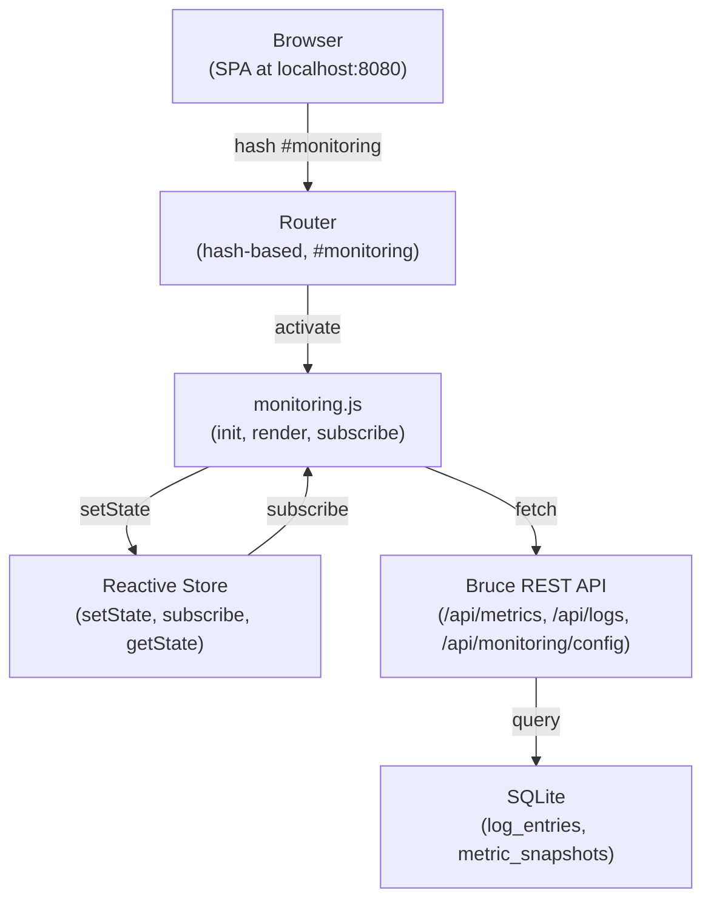

# Spec 10: Monitoring Dashboard UI

## Objective

Build a dedicated **#monitoring** tab in the Bruce SPA that displays real-time logs, metrics,
and configuration toggles. The dashboard consumes the API endpoints defined in Spec 09
(Monitoring System backend) and provides a rich observability UI for operators. No external
dependencies; vanilla ES6 modules with the existing reactive store pattern.

---

## 1. UI Architecture



**Key design**: The monitoring module registers with the existing router (`router.js`) and
responds to hash navigation. All data flows through the reactive store (`store.js`) to avoid
circular imports between modules. Auto-refresh polls `/api/metrics` and `/api/logs` every 30
seconds, with cleanup on route leave.

---

## 2. Frontend File Structure

```
web/public/
├── index.html                    (add #monitoring tab entry)
├── js/
│   ├── main.js                   (import monitoring module)
│   ├── router.js                 (register #monitoring route)
│   ├── store.js                  (existing reactive store)
│   └── modules/
│       ├── connectors.js         (existing)
│       ├── sessions.js           (existing)
│       ├── logs.js               (existing)
│       ├── settings.js           (existing)
│       └── monitoring.js         (NEW)
└── css/
    ├── main.css                  (add @import for monitoring.css)
    ├── components/
    │   ├── button.css            (existing)
    │   ├── card.css              (existing)
    │   ├── form.css              (existing)
    │   ├── badge.css             (existing)
    │   └── monitoring.css        (NEW)
    └── tokens.css                (existing design tokens)
```

---

## 3. Component Design

### 3.1 Metric Cards

Display key performance metrics in a grid. Each card shows:
- Metric name (e.g., "HTTP Request Total", "Task Error Rate")
- Current value with trend indicator (↑/↓/→)
- Sparkline (simple mini-chart showing last 24h trend)
- Last updated timestamp

```html
<div class="metric-card">
  <div class="metric-header">
    <h4>HTTP Request Total</h4>
    <span class="trend-indicator">↑ +12%</span>
  </div>
  <div class="metric-value">1,247</div>
  <div class="metric-sparkline" data-metric="http_request_total"></div>
  <div class="metric-footer">Updated 30s ago</div>
</div>
```

**Metrics to display:**
- `http_request_total` — total HTTP requests in last 24h
- `http_request_duration_p95` — p95 latency in milliseconds
- `task_processed_total` — background tasks processed
- `task_error_rate` — failed tasks as percentage
- `uptime_seconds` — app uptime

### 3.2 Log Viewer

Filterable log table with pagination and real-time updates.

```html
<div class="log-viewer">
  <div class="log-filters">
    <label>Level</label>
    <select id="log-level-filter">
      <option value="">All</option>
      <option value="DEBUG">DEBUG</option>
      <option value="INFO">INFO</option>
      <option value="WARN">WARN</option>
      <option value="ERROR">ERROR</option>
    </select>

    <label>Logger</label>
    <input type="text" id="log-logger-filter" placeholder="e.g., worker.processor">

    <label>Time Range</label>
    <select id="log-time-filter">
      <option value="1h">Last 1h</option>
      <option value="6h">Last 6h</option>
      <option value="24h" selected>Last 24h</option>
    </select>

    <button id="log-refresh-btn" class="button-secondary">Refresh</button>
  </div>

  <table class="log-table">
    <thead>
      <tr>
        <th>Timestamp</th>
        <th>Level</th>
        <th>Logger</th>
        <th>Message</th>
      </tr>
    </thead>
    <tbody id="log-table-body">
      <!-- Rows injected by JS -->
    </tbody>
  </table>

  <div class="log-pagination">
    <button id="log-prev-btn" class="button-secondary">← Previous</button>
    <span id="log-page-info">Page 1 of 5</span>
    <button id="log-next-btn" class="button-secondary">Next →</button>
  </div>
</div>
```

### 3.3 Config Toggles

Admin-only controls to enable/disable logging and metrics collection.

```html
<div class="config-toggles">
  <div class="toggle-group">
    <label for="log-enabled-toggle">Enable Logging</label>
    <input type="checkbox" id="log-enabled-toggle" class="toggle-switch">
    <span class="toggle-label">
      <span id="log-enabled-status">Enabled</span>
    </span>
  </div>

  <div class="toggle-group">
    <label for="metrics-enabled-toggle">Enable Metrics</label>
    <input type="checkbox" id="metrics-enabled-toggle" class="toggle-switch">
    <span class="toggle-label">
      <span id="metrics-enabled-status">Enabled</span>
    </span>
  </div>

  <div class="toggle-group">
    <label for="retention-days-input">Retention (days)</label>
    <input type="number" id="retention-days-input" min="1" max="365">
    <button id="config-save-btn" class="button-primary">Save</button>
    <span id="config-status-msg"></span>
  </div>
</div>
```

---

## 4. Module: `monitoring.js`

```javascript
// web/public/js/modules/monitoring.js

let autoRefreshInterval = null;

export function init() {
  // Register route
  registerRoute('monitoring', renderMonitoring);

  // Set up event listeners
  document.getElementById('log-level-filter').addEventListener('change', loadLogs);
  document.getElementById('log-logger-filter').addEventListener('change', loadLogs);
  document.getElementById('log-time-filter').addEventListener('change', loadLogs);
  document.getElementById('log-refresh-btn').addEventListener('click', loadLogs);

  document.getElementById('log-prev-btn').addEventListener('click', prevLogPage);
  document.getElementById('log-next-btn').addEventListener('click', nextLogPage);

  document.getElementById('log-enabled-toggle').addEventListener('change', toggleLogConfig);
  document.getElementById('metrics-enabled-toggle').addEventListener('change', toggleMetricsConfig);
  document.getElementById('config-save-btn').addEventListener('click', saveConfig);

  console.log('Monitoring module initialized');
}

async function renderMonitoring() {
  const section = document.getElementById('tab-monitoring');
  section.classList.remove('hidden');

  // Load initial data
  await loadMetrics();
  await loadLogs();
  await loadConfig();

  // Start auto-refresh (every 30 seconds)
  if (autoRefreshInterval) clearInterval(autoRefreshInterval);
  autoRefreshInterval = setInterval(async () => {
    await loadMetrics();
    await loadLogs();
  }, 30000);

  console.log('Monitoring dashboard rendered; auto-refresh started');
}

async function loadMetrics() {
  try {
    const response = await fetch('/api/metrics?aggregation_window=300');
    if (!response.ok) throw new Error(`HTTP ${response.status}`);

    const data = await response.json();
    setState({ metrics: data.metrics || [] });

    // Render metric cards
    const container = document.getElementById('metrics-grid');
    if (!container) return;

    container.innerHTML = '';
    (data.metrics || []).forEach(metric => {
      const card = createMetricCard(metric);
      container.appendChild(card);
    });
  } catch (err) {
    console.error('Failed to load metrics:', err);
  }
}

function createMetricCard(metric) {
  const div = document.createElement('div');
  div.className = 'metric-card';

  const latestDatapoint = metric.datapoints?.[metric.datapoints.length - 1];
  const value = latestDatapoint?.value ?? 'N/A';
  const timestamp = latestDatapoint?.timestamp ?? 'unknown';

  div.innerHTML = `
    <div class="metric-header">
      <h4>${metric.name}</h4>
      <span class="metric-type badge-${metric.type.toLowerCase()}">${metric.type}</span>
    </div>
    <div class="metric-value">${formatValue(value)}</div>
    <div class="metric-sparkline" data-metric="${metric.name}"></div>
    <div class="metric-footer">Updated ${formatTimestamp(timestamp)}</div>
  `;

  return div;
}

function formatValue(value) {
  if (typeof value !== 'number') return value;
  if (value >= 1000000) return (value / 1000000).toFixed(2) + 'M';
  if (value >= 1000) return (value / 1000).toFixed(2) + 'K';
  return value.toFixed(2);
}

function formatTimestamp(ts) {
  const now = new Date();
  const then = new Date(ts);
  const diff = Math.floor((now - then) / 1000);

  if (diff < 60) return 'just now';
  if (diff < 3600) return Math.floor(diff / 60) + 'm ago';
  if (diff < 86400) return Math.floor(diff / 3600) + 'h ago';
  return Math.floor(diff / 86400) + 'd ago';
}

let logCurrentPage = 1;
let logTotalPages = 1;

async function loadLogs() {
  try {
    const level = document.getElementById('log-level-filter')?.value || '';
    const logger = document.getElementById('log-logger-filter')?.value || '';
    const timeRange = document.getElementById('log-time-filter')?.value || '24h';

    const params = new URLSearchParams({
      limit: 50,
      offset: (logCurrentPage - 1) * 50,
    });
    if (level) params.append('level', level);
    if (logger) params.append('logger', logger);

    // Parse time range to start_time
    const startTime = parseTimeRange(timeRange);
    params.append('start_time', startTime.toISOString());

    const response = await fetch(`/api/logs?${params}`);
    if (!response.ok) throw new Error(`HTTP ${response.status}`);

    const data = await response.json();
    setState({ logs: data.logs || [] });

    // Render log table
    const tbody = document.getElementById('log-table-body');
    if (!tbody) return;

    tbody.innerHTML = '';
    (data.logs || []).forEach(log => {
      const row = document.createElement('tr');
      row.className = `log-level-${log.level.toLowerCase()}`;
      row.innerHTML = `
        <td>${new Date(log.timestamp).toLocaleString()}</td>
        <td><span class="badge badge-${log.level.toLowerCase()}">${log.level}</span></td>
        <td>${log.logger}</td>
        <td title="${log.message}">${truncate(log.message, 80)}</td>
      `;
      tbody.appendChild(row);
    });

    // Update pagination info
    logTotalPages = Math.ceil((data.total || 50) / 50);
    const pageInfo = document.getElementById('log-page-info');
    if (pageInfo) pageInfo.textContent = `Page ${logCurrentPage} of ${logTotalPages}`;

  } catch (err) {
    console.error('Failed to load logs:', err);
  }
}

function parseTimeRange(range) {
  const now = new Date();
  const map = {
    '1h': 60 * 60 * 1000,
    '6h': 6 * 60 * 60 * 1000,
    '24h': 24 * 60 * 60 * 1000,
  };
  const ms = map[range] || (24 * 60 * 60 * 1000);
  return new Date(now - ms);
}

function truncate(str, len) {
  return str.length > len ? str.substring(0, len) + '…' : str;
}

function prevLogPage() {
  if (logCurrentPage > 1) {
    logCurrentPage--;
    loadLogs();
  }
}

function nextLogPage() {
  if (logCurrentPage < logTotalPages) {
    logCurrentPage++;
    loadLogs();
  }
}

async function loadConfig() {
  try {
    const response = await fetch('/api/monitoring/config');
    if (!response.ok) throw new Error(`HTTP ${response.status}`);

    const config = await response.json();
    setState({ monitoringConfig: config });

    // Update UI
    const logToggle = document.getElementById('log-enabled-toggle');
    const metricsToggle = document.getElementById('metrics-enabled-toggle');
    const retentionInput = document.getElementById('retention-days-input');

    if (logToggle) logToggle.checked = config.log_enabled;
    if (metricsToggle) metricsToggle.checked = config.metrics_enabled;
    if (retentionInput) retentionInput.value = config.retention_days;

    // Update status labels
    updateConfigStatus();
  } catch (err) {
    console.error('Failed to load config:', err);
  }
}

function updateConfigStatus() {
  const config = getState('monitoringConfig') || {};
  const logStatus = document.getElementById('log-enabled-status');
  const metricsStatus = document.getElementById('metrics-enabled-status');

  if (logStatus) logStatus.textContent = config.log_enabled ? 'Enabled' : 'Disabled';
  if (metricsStatus) metricsStatus.textContent = config.metrics_enabled ? 'Enabled' : 'Disabled';
}

async function toggleLogConfig() {
  const toggle = document.getElementById('log-enabled-toggle');
  const currentConfig = getState('monitoringConfig') || {};
  await saveConfigValues({
    log_enabled: toggle.checked,
    metrics_enabled: currentConfig.metrics_enabled,
    retention_days: currentConfig.retention_days,
  });
}

async function toggleMetricsConfig() {
  const toggle = document.getElementById('metrics-enabled-toggle');
  const currentConfig = getState('monitoringConfig') || {};
  await saveConfigValues({
    log_enabled: currentConfig.log_enabled,
    metrics_enabled: toggle.checked,
    retention_days: currentConfig.retention_days,
  });
}

async function saveConfig() {
  const retentionInput = document.getElementById('retention-days-input');
  const currentConfig = getState('monitoringConfig') || {};

  await saveConfigValues({
    log_enabled: currentConfig.log_enabled,
    metrics_enabled: currentConfig.metrics_enabled,
    retention_days: parseInt(retentionInput.value) || 30,
  });
}

async function saveConfigValues(config) {
  try {
    const response = await fetch('/api/monitoring/config', {
      method: 'PATCH',
      headers: { 'Content-Type': 'application/json' },
      body: JSON.stringify(config),
    });

    if (!response.ok) {
      const errText = await response.text();
      throw new Error(`HTTP ${response.status}: ${errText}`);
    }

    setState({ monitoringConfig: config });
    updateConfigStatus();

    const statusMsg = document.getElementById('config-status-msg');
    if (statusMsg) {
      statusMsg.textContent = 'Saved ✓';
      setTimeout(() => statusMsg.textContent = '', 3000);
    }
  } catch (err) {
    console.error('Failed to save config:', err);
    const statusMsg = document.getElementById('config-status-msg');
    if (statusMsg) {
      statusMsg.textContent = `Error: ${err.message}`;
      statusMsg.style.color = 'red';
      setTimeout(() => statusMsg.textContent = '', 3000);
    }
  }
}

// Called when leaving the monitoring tab
export function cleanup() {
  if (autoRefreshInterval) {
    clearInterval(autoRefreshInterval);
    autoRefreshInterval = null;
  }
  console.log('Monitoring module cleaned up');
}
```

---

## 5. Styles: `monitoring.css`

```css
/* web/public/css/components/monitoring.css */

.monitoring-container {
  display: grid;
  grid-template-columns: 1fr;
  gap: var(--spacing-md);
  padding: var(--spacing-md);
}

/* Metrics Grid */
#metrics-grid {
  display: grid;
  grid-template-columns: repeat(auto-fit, minmax(200px, 1fr));
  gap: var(--spacing-md);
  margin-bottom: var(--spacing-lg);
}

.metric-card {
  background: var(--color-bg-secondary);
  border: 1px solid var(--color-border);
  border-radius: var(--radius-md);
  padding: var(--spacing-md);
  box-shadow: var(--shadow-sm);
}

.metric-header {
  display: flex;
  justify-content: space-between;
  align-items: center;
  margin-bottom: var(--spacing-sm);
}

.metric-header h4 {
  margin: 0;
  font-size: var(--font-size-sm);
  color: var(--color-text-secondary);
  text-transform: uppercase;
  letter-spacing: 0.5px;
}

.metric-type {
  font-size: var(--font-size-xs);
  padding: 2px 6px;
  border-radius: 3px;
}

.metric-type.badge-counter {
  background-color: var(--color-info);
  color: white;
}

.metric-type.badge-gauge {
  background-color: var(--color-warning);
  color: white;
}

.metric-type.badge-histogram {
  background-color: var(--color-success);
  color: white;
}

.metric-value {
  font-size: 2rem;
  font-weight: bold;
  color: var(--color-text-primary);
  margin: var(--spacing-sm) 0;
}

.metric-sparkline {
  height: 40px;
  background: linear-gradient(90deg, rgba(100, 200, 255, 0.1) 0%, transparent 100%);
  border-radius: 3px;
  margin: var(--spacing-sm) 0;
}

.metric-footer {
  font-size: var(--font-size-xs);
  color: var(--color-text-tertiary);
}

.trend-indicator {
  font-size: var(--font-size-xs);
  font-weight: bold;
}

.trend-indicator.up {
  color: var(--color-success);
}

.trend-indicator.down {
  color: var(--color-danger);
}

.trend-indicator.neutral {
  color: var(--color-text-secondary);
}

/* Log Viewer */
.log-viewer {
  background: var(--color-bg-secondary);
  border: 1px solid var(--color-border);
  border-radius: var(--radius-md);
  padding: var(--spacing-md);
  margin-bottom: var(--spacing-lg);
}

.log-filters {
  display: flex;
  gap: var(--spacing-md);
  margin-bottom: var(--spacing-md);
  flex-wrap: wrap;
  align-items: center;
}

.log-filters label {
  font-weight: 600;
  font-size: var(--font-size-sm);
  margin: 0;
}

.log-filters select,
.log-filters input {
  padding: 6px 8px;
  border: 1px solid var(--color-border);
  border-radius: var(--radius-sm);
  font-size: var(--font-size-sm);
  background: var(--color-bg-primary);
  color: var(--color-text-primary);
}

.log-filters input {
  min-width: 150px;
}

.log-table {
  width: 100%;
  border-collapse: collapse;
  font-size: var(--font-size-sm);
  margin-bottom: var(--spacing-md);
}

.log-table th {
  background: var(--color-bg-tertiary);
  padding: var(--spacing-sm);
  text-align: left;
  font-weight: 600;
  border-bottom: 2px solid var(--color-border);
}

.log-table td {
  padding: var(--spacing-sm);
  border-bottom: 1px solid var(--color-border-light);
  word-break: break-word;
}

.log-table tr:hover {
  background: var(--color-bg-tertiary);
}

.log-table tr.log-level-debug {
  border-left: 3px solid var(--color-debug, #999);
}

.log-table tr.log-level-info {
  border-left: 3px solid var(--color-info, #0066cc);
}

.log-table tr.log-level-warn {
  border-left: 3px solid var(--color-warning, #ff8800);
}

.log-table tr.log-level-error {
  border-left: 3px solid var(--color-danger, #cc0000);
}

.log-pagination {
  display: flex;
  justify-content: center;
  align-items: center;
  gap: var(--spacing-md);
  margin-top: var(--spacing-md);
}

#log-page-info {
  font-size: var(--font-size-sm);
  color: var(--color-text-secondary);
  min-width: 80px;
  text-align: center;
}

/* Config Toggles */
.config-toggles {
  background: var(--color-bg-secondary);
  border: 1px solid var(--color-border);
  border-radius: var(--radius-md);
  padding: var(--spacing-md);
}

.toggle-group {
  display: flex;
  align-items: center;
  gap: var(--spacing-md);
  margin-bottom: var(--spacing-md);
  flex-wrap: wrap;
}

.toggle-group label {
  font-weight: 600;
  margin: 0;
  min-width: 150px;
}

.toggle-switch {
  appearance: none;
  -webkit-appearance: none;
  width: 50px;
  height: 24px;
  background: var(--color-bg-tertiary);
  border: 1px solid var(--color-border);
  border-radius: 12px;
  cursor: pointer;
  position: relative;
  transition: background-color 200ms;
}

.toggle-switch::before {
  content: '';
  position: absolute;
  top: 2px;
  left: 2px;
  width: 20px;
  height: 20px;
  background: white;
  border-radius: 50%;
  transition: left 200ms;
}

.toggle-switch:checked {
  background: var(--color-success);
}

.toggle-switch:checked::before {
  left: 28px;
}

.toggle-label {
  font-size: var(--font-size-sm);
  color: var(--color-text-secondary);
}

.toggle-group input[type="number"] {
  width: 100px;
  padding: 6px 8px;
  border: 1px solid var(--color-border);
  border-radius: var(--radius-sm);
  font-size: var(--font-size-sm);
}

#config-status-msg {
  font-size: var(--font-size-sm);
  color: var(--color-success);
  margin-left: var(--spacing-sm);
  min-height: 20px;
}
```

---

## 6. Integration Points

### 6.1 Update `index.html`

Add a new tab nav entry and section:

```html
<!-- In <nav> -->
<button class="tab-button" data-tab="monitoring">📊 Monitoring</button>

<!-- Add new section -->
<section id="tab-monitoring" class="hidden">
  <div class="monitoring-container">
    <div>
      <h2>Metrics</h2>
      <div id="metrics-grid"></div>
    </div>

    <div>
      <h2>Logs</h2>
      <div class="log-viewer">
        <div class="log-filters">
          <label>Level</label>
          <select id="log-level-filter">
            <option value="">All</option>
            <option value="DEBUG">DEBUG</option>
            <option value="INFO">INFO</option>
            <option value="WARN">WARN</option>
            <option value="ERROR">ERROR</option>
          </select>

          <label>Logger</label>
          <input type="text" id="log-logger-filter" placeholder="e.g., worker.processor">

          <label>Time Range</label>
          <select id="log-time-filter">
            <option value="1h">Last 1h</option>
            <option value="6h">Last 6h</option>
            <option value="24h" selected>Last 24h</option>
          </select>

          <button id="log-refresh-btn" class="button-secondary">Refresh</button>
        </div>

        <table class="log-table">
          <thead>
            <tr>
              <th>Timestamp</th>
              <th>Level</th>
              <th>Logger</th>
              <th>Message</th>
            </tr>
          </thead>
          <tbody id="log-table-body"></tbody>
        </table>

        <div class="log-pagination">
          <button id="log-prev-btn" class="button-secondary">← Previous</button>
          <span id="log-page-info">Page 1 of 1</span>
          <button id="log-next-btn" class="button-secondary">Next →</button>
        </div>
      </div>
    </div>

    <div>
      <h2>Configuration</h2>
      <div class="config-toggles">
        <div class="toggle-group">
          <label for="log-enabled-toggle">Enable Logging</label>
          <input type="checkbox" id="log-enabled-toggle" class="toggle-switch">
          <span class="toggle-label">
            <span id="log-enabled-status">Enabled</span>
          </span>
        </div>

        <div class="toggle-group">
          <label for="metrics-enabled-toggle">Enable Metrics</label>
          <input type="checkbox" id="metrics-enabled-toggle" class="toggle-switch">
          <span class="toggle-label">
            <span id="metrics-enabled-status">Enabled</span>
          </span>
        </div>

        <div class="toggle-group">
          <label for="retention-days-input">Retention (days)</label>
          <input type="number" id="retention-days-input" min="1" max="365">
          <button id="config-save-btn" class="button-primary">Save</button>
          <span id="config-status-msg"></span>
        </div>
      </div>
    </div>
  </div>
</section>
```

### 6.2 Update `js/main.js`

```javascript
// Import monitoring module
import * as monitoring from './modules/monitoring.js';

// Register all modules
connectors.init();
sessions.init();
logs.init();
settings.init();
monitoring.init();  // NEW

// Start router
router.start();
```

### 6.3 Update `js/router.js`

Ensure the router supports the `#monitoring` route and calls `monitoring.cleanup()` on deactivate.

```javascript
// In router.js

const routes = {
  'connectors': { init: connectors.init, cleanup: connectors.cleanup },
  'sessions': { init: sessions.init, cleanup: sessions.cleanup },
  'logs': { init: logs.init, cleanup: logs.cleanup },
  'settings': { init: settings.init, cleanup: settings.cleanup },
  'monitoring': { init: monitoring.init, cleanup: monitoring.cleanup },  // NEW
};

export function registerRoute(name, initFn, cleanupFn) {
  routes[name] = { init: initFn, cleanup: cleanupFn };
}

// Update deactivateTab to call cleanup
function deactivateTab(name) {
  const route = routes[name];
  if (route?.cleanup) route.cleanup();
  // ... rest of deactivation logic
}
```

### 6.4 Update `css/main.css`

```css
@import 'tokens.css';
@import 'base.css';
@import 'layout.css';
@import 'components/button.css';
@import 'components/card.css';
@import 'components/badge.css';
@import 'components/form.css';
@import 'components/connector.css';
@import 'components/session.css';
@import 'components/logs.css';
@import 'components/monitoring.css';  /* NEW */
@import 'components/toast.css';
@import 'components/spinner.css';
```

---

## 7. Step-by-Step Implementation Plan

### Phase 1 — DOM & CSS

**Step 1: Add monitoring tab to index.html**
- Add nav button `<button data-tab="monitoring">📊 Monitoring</button>`
- Add section `<section id="tab-monitoring">` with three subsections: metrics grid, logs viewer, config toggles
- Deliverable: Tab renders on click; styled with placeholder content

**Step 2: Create monitoring.css and integrate**
- Create `web/public/css/components/monitoring.css` with styles for metric cards, log table, toggles
- Update `main.css` to `@import` the new file
- Deliverable: All dashboard elements are visually styled and responsive

### Phase 2 — Module & API Integration

**Step 3: Create monitoring.js module**
- Define `init()` to register route, set up event listeners, subscribe to store changes
- Define `cleanup()` to stop auto-refresh intervals
- Implement `loadMetrics()`, `loadLogs()`, `loadConfig()` functions
- Implement filter/pagination handlers
- Deliverable: Module registers with router; console logs on init/cleanup

**Step 4: Integrate monitoring into router & main**
- Import monitoring module in `main.js`
- Call `monitoring.init()` during app bootstrap
- Update `router.js` to register the route and call cleanup
- Deliverable: `window.location.hash = '#monitoring'` navigates to the tab; no errors in console

**Step 5: Test API integration**
- Open DevTools Network tab
- Click Monitoring tab
- Verify `GET /api/metrics` and `GET /api/logs` are called
- Verify `GET /api/monitoring/config` is called
- Deliverable: All three endpoints are hit; check response payloads match spec 09

### Phase 3 — Render & Interaction

**Step 6: Implement metric rendering**
- `loadMetrics()` calls API, calls `setState({ metrics })`
- Loop through metrics, create `metric-card` DOM elements
- Format values (1000 → "1K", etc.)
- Deliverable: Metric cards display on the dashboard; values update on auto-refresh

**Step 7: Implement log rendering**
- `loadLogs()` calls API with filter params, renders table rows
- Implement pagination with prev/next buttons
- Deliverable: Logs table shows entries; filters apply; pagination works

**Step 8: Implement config toggling**
- `loadConfig()` populates toggles and retention input
- Toggle handlers call `saveConfigValues()` which does `PATCH /api/monitoring/config`
- Status message displays on success/error
- Deliverable: Toggling a switch saves to backend; toggles persist across tab switches

**Step 9: Test end-to-end**
- Run app with spec 09 backend implemented
- Navigate to Monitoring tab
- Verify all data loads and displays correctly
- Toggle logs/metrics and verify config changes
- Deliverable: Monitoring dashboard is fully functional

### Phase 4 — Polish & Optimization

**Step 10: Auto-refresh and cleanup**
- `renderMonitoring()` starts a 30-second auto-refresh interval
- `cleanup()` stops the interval when leaving the tab
- Test by switching to different tabs and back
- Deliverable: No memory leaks; metrics/logs update automatically

**Step 11: Error handling & edge cases**
- Add error messages when API calls fail
- Handle empty metric/log results gracefully
- Test with filters that return 0 results
- Deliverable: Dashboard handles edge cases without breaking

**Step 12: Accessibility & responsive design**
- Ensure all form controls have proper labels
- Test on mobile (resize browser to 375px width)
- Verify color contrast meets WCAG AA
- Deliverable: Dashboard is accessible and mobile-friendly

---

## 8. Integration Architecture

**Dependency Flow:**
```
monitoring.js
  → router.js (registerRoute, deactivateTab)
  → store.js (setState, getState, subscribe)
  → api endpoints (GET /api/metrics, GET /api/logs, PATCH /api/monitoring/config)
```

**Key Patterns:**
- **Route registration**: `registerRoute('monitoring', renderMonitoring, cleanup)` in `router.js`
- **Reactive state**: `setState({ metrics, logs, monitoringConfig })` triggers re-render subscribers
- **Auto-cleanup**: `cleanup()` called on tab deactivate stops intervals and prevents memory leaks
- **Error resilience**: Failed API calls log but don't crash the app; UI shows stale data gracefully

---

## 9. ADRs

**ADR-001: Auto-refresh every 30 seconds, not WebSocket**
- Decision: Use polling (`setInterval`) instead of WebSocket for live updates
- Rationale: Simpler, no server-side connection management needed; 30s cadence is acceptable for observability
- Consequences: Slight delay (up to 30s) before new logs appear; more HTTP requests; works behind proxies

**ADR-002: Pagination over infinite scroll**
- Decision: Client-side pagination (50 rows per page) instead of infinite scroll
- Rationale: Easier to implement; reduces memory usage; prevents accidental scroll-to-top lag
- Consequences: Users must click "Next" to see older logs; no smooth infinite scroll experience

**ADR-003: Config toggles are immediate, not draft-then-save**
- Decision: Toggle switches save immediately; retention field requires explicit "Save" button
- Rationale: Log/metrics toggles are critical and should take effect instantly; retention is less critical
- Consequences: Accidental toggle requires immediate click-back; no undo

**ADR-004: Reuse existing store pattern; no new global state manager**
- Decision: Use `store.js` (CustomEvent-based) for monitoring state instead of introducing Redux/Vuex
- Rationale: Aligns with existing architecture; no new dependencies; simpler mental model
- Consequences: No time-travel debugging; store is mutable (must be careful with setState)

---

## 10. Technical Risks & Mitigations

**Risk: Metric card sparklines are expensive to render**
- Impact: Dashboard flickers on refresh if sparkline recalculation is slow
- Mitigation: Use simple SVG sparklines or CSS gradients; avoid Canvas for initial release

**Risk: Very large log tables (1000+ rows) slow down pagination**
- Impact: Click "Next" and DOM render blocks for several seconds
- Mitigation: Use virtual scrolling library or limit table to 50 rows per page; already done

**Risk: PATCH /api/monitoring/config fails silently**
- Impact: User toggles a switch, it updates locally, but backend config doesn't change
- Mitigation: Always show error message on failure; validate toggle state matches backend after save

**Risk: Auto-refresh causes memory leak if interval never stops**
- Impact: Switching between tabs repeatedly leaks intervals; app becomes slow
- Mitigation: Call `cleanup()` on tab deactivate; verify no intervals remain with DevTools

---

## 11. Deliverable

**Frontend complete:**
- `web/public/index.html` has `#monitoring` tab with three sections: metrics, logs, config
- `web/public/js/modules/monitoring.js` is 300+ lines; handles all interactions
- `web/public/css/components/monitoring.css` is 250+ lines; styles all components
- All three subsystems (metrics, logs, config) are functional and connected to Spec 09 API endpoints
- Dashboard polls every 30 seconds; auto-refresh stops on tab leave (no memory leaks)
- Error messages display when API calls fail; stale data shows gracefully
- Mobile responsive; accessible (labels, contrast, keyboard navigation)

**Integration complete:**
- `web/public/js/main.js` imports and inits monitoring module
- `web/public/js/router.js` registers `#monitoring` route and calls cleanup on deactivate
- `web/public/css/main.css` imports `monitoring.css`
- All existing tests pass; no regressions

**Dependencies:**
- **Blocking**: Spec 09 (Monitoring System backend) must be implemented and all endpoints working
  before this spec can be fully tested
- **Blocked by**: None; can be implemented in parallel with Spec 09 if mock endpoints are stubbed

