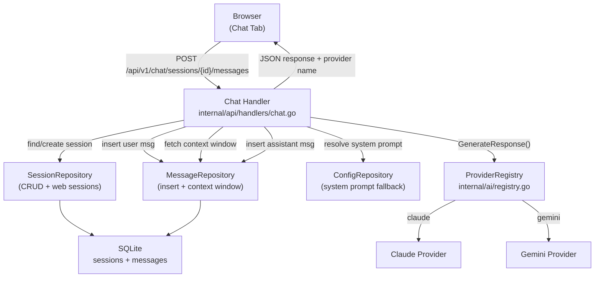

# Spec 35: Web Chat Interface

## Objective
A modern, dark-themed chat interface served inside the Bruce web UI that allows direct interaction
with the LLM without requiring external connectors (WhatsApp, Discord). The chat calls the LLM
synchronously (no Asynq queue), provides real-time feedback on each interaction (typing indicator,
optimistic UI), and displays which AI provider is responding. Primary use case: local testing and
development.

---

## 1. Architecture Overview



**Key difference from connector flow**: The web chat handler calls `LLMService.GenerateResponse()`
directly in the HTTP request goroutine — no Asynq task queue. The browser waits synchronously for
the response. This is acceptable because:
1. Only one user (local testing), so no queue contention.
2. The user expects to see the response inline, not via a push notification.
3. Error handling is simpler — HTTP status codes map directly to LLM errors.

---

## 2. Schema Changes

### `sessions` table — add `title` column, widen `connector_type` CHECK

**Updated DDL** (`internal/database/schema.sql`):

```sql
CREATE TABLE IF NOT EXISTS sessions (
    id               TEXT    PRIMARY KEY,
    connector_type   TEXT    NOT NULL CHECK(connector_type IN ('whatsapp', 'discord', 'web')),
    channel_id       TEXT    NOT NULL,
    title            TEXT    NOT NULL DEFAULT '',
    system_prompt    TEXT    NOT NULL DEFAULT '',
    is_active        INTEGER NOT NULL DEFAULT 1,
    provider_override TEXT    NOT NULL DEFAULT '',
    created_at       DATETIME NOT NULL DEFAULT (datetime('now')),
    updated_at       DATETIME NOT NULL DEFAULT (datetime('now')),
    UNIQUE(connector_type, channel_id)
);
```

### Incremental migrations (`internal/database/migrate.go`)

Two new migrations for existing databases:

1. **`add_title_to_sessions`**: `ALTER TABLE sessions ADD COLUMN title TEXT NOT NULL DEFAULT ''`
   - Guarded by `columnExists(db, "sessions", "title")`

2. **`add_web_connector_type`**: Rebuild sessions table with updated CHECK constraint using the
   SQLite table-rebuild pattern:
   ```sql
   BEGIN TRANSACTION;
   CREATE TABLE sessions_new ( ... with 'web' in CHECK ... );
   INSERT INTO sessions_new SELECT id, connector_type, channel_id, title, ... FROM sessions;
   DROP TABLE sessions;
   ALTER TABLE sessions_new RENAME TO sessions;
   -- Recreate indexes
   COMMIT;
   ```
   - Guarded by checking if `'web'` already appears in the `sqlite_master` CREATE TABLE SQL.

---

## 3. Domain Model Update

**File**: `internal/domain/session.go`

```go
type Session struct {
    ID               string    `db:"id"`
    ConnectorType    string    `db:"connector_type"` // "whatsapp" | "discord" | "web"
    ChannelID        string    `db:"channel_id"`
    Title            string    `db:"title"`
    SystemPrompt     string    `db:"system_prompt"`
    IsActive         bool      `db:"is_active"`
    ProviderOverride string    `db:"provider_override"` // "" | "claude" | "gemini"
    CreatedAt        time.Time `db:"created_at"`
    UpdatedAt        time.Time `db:"updated_at"`
}
```

---

## 4. Repository Changes

**File**: `internal/repository/session_repo.go`

### New interface methods

```go
type SessionRepository interface {
    // Existing methods (unchanged)
    FindOrCreate(connectorType, channelID string) (*domain.Session, error)
    GetAll() ([]*domain.Session, error)
    GetByID(id string) (*domain.Session, error)
    UpdateSystemPrompt(id, prompt string) error
    SetActive(id string, active bool) error
    UpdateProviderOverride(id, provider string) error

    // New methods for web chat
    GetByConnectorType(connectorType string) ([]*domain.Session, error)
    Create(connectorType, channelID, title string) (*domain.Session, error)
    Delete(id string) error
    UpdateTitle(id, title string) error
}
```

### Implementation details

```go
// GetByConnectorType returns sessions filtered by connector type.
func (r *SQLiteSessionRepository) GetByConnectorType(connectorType string) ([]*domain.Session, error) {
    rows, err := r.db.Query(
        `SELECT id, connector_type, channel_id, title, system_prompt, is_active,
                provider_override, created_at, updated_at
         FROM sessions WHERE connector_type = ? ORDER BY updated_at DESC`,
        connectorType,
    )
    // ... scan rows ...
}

// Create inserts a new session (used by web chat — always creates, never finds).
func (r *SQLiteSessionRepository) Create(connectorType, channelID, title string) (*domain.Session, error) {
    id := uuid.New().String()
    _, err := r.db.Exec(
        `INSERT INTO sessions (id, connector_type, channel_id, title, system_prompt, is_active, created_at, updated_at)
         VALUES (?, ?, ?, ?, '', 1, datetime('now'), datetime('now'))`,
        id, connectorType, channelID, title,
    )
    // ... return GetByID(id) ...
}

// Delete removes a session by ID. Messages are cleaned up via ON DELETE CASCADE.
func (r *SQLiteSessionRepository) Delete(id string) error {
    _, err := r.db.Exec(`DELETE FROM sessions WHERE id = ?`, id)
    return err
}

// UpdateTitle sets the title for a session.
func (r *SQLiteSessionRepository) UpdateTitle(id, title string) error {
    _, err := r.db.Exec(
        `UPDATE sessions SET title = ?, updated_at = datetime('now') WHERE id = ?`,
        title, id,
    )
    return err
}
```

### Cross-cutting scan update

Every `SELECT` and `Scan()` in the file must include the `title` column. Column order:
```
id, connector_type, channel_id, title, system_prompt, is_active, provider_override, created_at, updated_at
```

Both `scanSession()` and `scanSessionRows()` add `&s.Title` after `&s.ChannelID`.

---

## 5. Chat Handler (`internal/api/handlers/chat.go`)

An untracked `chat.go` already exists with most logic. Changes needed:

### Handler signature

```go
// Change from ai.LLMService to *ai.ProviderRegistry for provider name access.
func ChatHandler(registry *ai.ProviderRegistry, cfg *config.Config) http.HandlerFunc
```

### Internal routing (already implemented)

```go
switch {
case id == "" && GET:     handleListChatSessions(w, sessionRepo)
case id == "" && POST:    handleCreateChatSession(w, r, sessionRepo)
case id != "" && msgs && GET:   handleGetChatMessages(w, sessionRepo, messageRepo, id)
case id != "" && msgs && POST:  handleSendChatMessage(w, r, ..., id)
case id != "" && !msgs && GET:  handleGetChatSession(w, sessionRepo, messageRepo, id)
case id != "" && !msgs && DELETE: handleDeleteChatSession(w, sessionRepo, id)
}
```

### Send message response — add provider name

After calling `llm.GenerateResponse()`, resolve which provider was used:

```go
providerName := registry.ResolveProviderName(ctx)

writeJSON(w, http.StatusOK, map[string]interface{}{
    "message":  messageToResponse(assistantMsg),
    "session":  sessionToResponse(session),
    "provider": providerName,
})
```

### Auto-title generation (already implemented)

On first user message, if `session.Title == ""`, truncate the content to 50 chars and call
`sessionRepo.UpdateTitle(sessionID, title)`.

---

## 6. Provider Name Resolution (`internal/ai/registry.go`)

New public method on `ProviderRegistry`:

```go
// ResolveProviderName returns the name of the provider that would handle a request
// for the given context. Used by the chat handler to report which provider responded.
func (r *ProviderRegistry) ResolveProviderName(ctx context.Context) string {
    // 1. Check session-level override
    if sessionID, ok := sessionIDFromContext(ctx); ok {
        session, err := r.sessionRepo.GetByID(sessionID)
        if err == nil && session.ProviderOverride != "" {
            return session.ProviderOverride
        }
    }

    // 2. Check global config
    globalDefault, _ := r.configRepo.Get("llm.provider")
    if globalDefault != "" {
        return globalDefault
    }

    // 3. Check static config
    if r.cfg != nil && r.cfg.LLM.Provider != "" {
        return r.cfg.LLM.Provider
    }

    return string(ProviderClaude) // hardcoded fallback
}
```

---

## 7. Handler Response Structs

### Updated `sessionResponse` (`internal/api/handlers/sessions.go`)

```go
type sessionResponse struct {
    ID               string `json:"id"`
    ConnectorType    string `json:"connector_type"`
    ChannelID        string `json:"channel_id"`
    Title            string `json:"title"`            // NEW
    SystemPrompt     string `json:"system_prompt"`
    IsActive         bool   `json:"is_active"`
    ProviderOverride string `json:"provider_override"`
    CreatedAt        string `json:"created_at"`
    UpdatedAt        string `json:"updated_at"`
}
```

---

## 8. Router & Main Wiring

### Router (`internal/api/router.go`)

```go
func NewRouter(startTime time.Time, asynqmonHandler http.Handler, registry *ai.ProviderRegistry, cfg *config.Config) *mux.Router {
    // ... existing routes ...

    // Web chat endpoints
    chatHandler := handlers.ChatHandler(registry, cfg)
    api.HandleFunc("/chat/sessions", chatHandler).Methods(http.MethodGet, http.MethodPost, http.MethodOptions)
    api.HandleFunc("/chat/sessions/{id}", chatHandler).Methods(http.MethodGet, http.MethodDelete, http.MethodOptions)
    api.HandleFunc("/chat/sessions/{id}/messages", chatHandler).Methods(http.MethodGet, http.MethodPost, http.MethodOptions)

    // ... asynqmon, swagger, SPA handler ...
}
```

### Main (`cmd/bruce/main.go`)

```go
// Pass cfg to NewRouter
router := bruceapi.NewRouter(startTime, mon, llmService, cfg)

// Increase WriteTimeout for synchronous LLM calls
httpServer := &http.Server{
    Addr:         addr,
    Handler:      wrappedRouter,
    ReadTimeout:  15 * time.Second,
    WriteTimeout: 120 * time.Second,  // was 15s — LLM calls can take 30-60s
    IdleTimeout:  60 * time.Second,
}
```

---

## 9. API Contract

### `GET /api/v1/chat/sessions`

```
Auth: none
Returns: 200
Body: [
    {
        "id": "uuid",
        "connector_type": "web",
        "channel_id": "uuid",
        "title": "How to deploy Go apps",
        "system_prompt": "",
        "is_active": true,
        "provider_override": "",
        "created_at": "2026-03-12T10:30:00Z",
        "updated_at": "2026-03-12T10:35:00Z"
    }
]
Notes: Only returns sessions with connector_type = "web".
       Ordered by updated_at DESC (most recent first).
```

### `POST /api/v1/chat/sessions`

```
Auth: none
Body: { "title": "Optional title" }   // title is optional, auto-generated on first message
Returns: 201
Body: { "id": "uuid", "connector_type": "web", "title": "", ... }
Notes: Creates a new session with connector_type = "web" and a random channel_id UUID.
```

### `GET /api/v1/chat/sessions/{id}`

```
Auth: none
Returns: 200
Body: {
    "session": { ... sessionResponse ... },
    "messages": [
        { "id": "uuid", "session_id": "uuid", "role": "user", "content": "Hello", "timestamp": "..." },
        { "id": "uuid", "session_id": "uuid", "role": "assistant", "content": "Hi!", "timestamp": "..." }
    ]
}
Errors: 404 if session not found or connector_type != "web"
Notes: Messages returned in chronological order (oldest first), limited to 100.
```

### `DELETE /api/v1/chat/sessions/{id}`

```
Auth: none
Returns: 204
Errors: 404 if session not found or connector_type != "web"
Notes: Messages deleted via ON DELETE CASCADE.
```

### `GET /api/v1/chat/sessions/{id}/messages`

```
Auth: none
Returns: 200
Body: [ { "id", "session_id", "role", "content", "timestamp" }, ... ]
Errors: 404 if session not found or connector_type != "web"
Notes: Returns up to 100 messages in chronological order.
```

### `POST /api/v1/chat/sessions/{id}/messages`

```
Auth: none
Body: { "content": "User message text" }
Returns: 200
Body: {
    "message": { "id", "session_id", "role": "assistant", "content": "...", "timestamp": "..." },
    "session": { ... sessionResponse with possibly updated title ... },
    "provider": "claude"
}
Errors:
    400 — content is empty
    404 — session not found or not a web session
    429 — LLM rate limited
    503 — LLM provider unavailable
Notes:
    - Inserts user message immediately.
    - Calls LLM synchronously (can take 10-60s).
    - Inserts assistant response.
    - Auto-generates title from first user message if empty (truncated to 50 chars).
    - Returns the provider name so the UI can display which agent responded.
```

---

## 10. Frontend — Page Layout

```
┌─────────────────────────────────────────────────────────────┐
│  Bruce                    [Chat] [Connectors] [Sessions]... │
├──────────────┬──────────────────────────────────────────────┤
│ Conversations│  Chat Title                    [claude] [🗑] │
│ [+ New]      ├──────────────────────────────────────────────┤
│              │                                              │
│ ▸ How to...  │  ┌─────────────────────────────────┐        │
│   Mar 12     │  │ How do I deploy a Go app?       │  user  │
│              │  └─────────────────────────────────┘        │
│ ▸ API design │                                              │
│   Mar 11     │  ┌──────────────────────────────────────┐   │
│              │  │ Here are the steps to deploy...      │   │
│              │  │ 1. Build your binary                 │   │
│              │  │ 2. Configure your server              │   │
│              │  └──────────────────────────────────────┘   │
│              │  ⌞ claude ⌟                                  │
│              │                                              │
│              │  ● ● ●  (typing indicator while waiting)    │
│              ├──────────────────────────────────────────────┤
│              │ [Type a message...                    ] [➤]  │
└──────────────┴──────────────────────────────────────────────┘
```

### UI Behavior

1. **Chat tab is the default tab** — opens on first load instead of Connectors.
2. **Sidebar** (280px): lists web chat sessions by title + date, newest first.
3. **"+ New" button**: creates a new session, selects it, focuses the input.
4. **Session selection**: loads messages, shows input area, updates header title + provider badge.
5. **Send message**: Enter sends, Shift+Enter adds newline. On send:
   - User bubble appears immediately (optimistic UI).
   - Typing indicator (3 animated dots) shows below.
   - On response: typing indicator replaced by assistant bubble + provider label.
   - Sidebar title updates if auto-generated.
   - Chat area auto-scrolls to bottom.
6. **Provider badge**: small accent-colored badge in the header showing active provider name.
7. **Provider label**: muted text below each assistant bubble showing which provider responded.
8. **Delete button**: confirmation prompt, deletes session + messages, returns to empty state.
9. **Error handling**: toast notifications for API errors (rate limit, provider down, network).
10. **Input textarea**: auto-resizes up to 120px height, resets on send.

---

## 11. Frontend — File Structure

```
web/public/
├── index.html                          (add chat tab button + section)
├── css/
│   ├── main.css                       (add @import for chat.css)
│   └── components/
│       └── chat.css                   (NEW — all chat-specific styles)
├── js/
│   ├── main.js                        (import + init chat module)
│   ├── router.js                      (change default tab to "chat")
│   └── modules/
│       └── chat.js                    (NEW — chat module)
```

---

## 12. Frontend — CSS (`web/public/css/components/chat.css`)

Key class overview:

| Class | Purpose |
|-------|---------|
| `.chat-layout` | Flex container: sidebar + main, full height |
| `.chat-sidebar` | 280px fixed width, dark bg, border-right |
| `.chat-sidebar-header` | Flex row: title + new button |
| `.chat-session-list` | Scrollable list of sessions |
| `.chat-session-item` | Clickable session row, hover/active states |
| `.chat-main` | Flex column: header + messages + input |
| `.chat-header` | Title + provider badge + delete button |
| `.chat-messages` | Scrollable message area, flex column |
| `.chat-bubble` | Base bubble: max-width 75%, padding, radius |
| `.chat-bubble--user` | Right-aligned, accent-dim bg, accent border |
| `.chat-bubble--assistant` | Left-aligned, bg-card, border |
| `.chat-provider-label` | Muted text below assistant bubbles |
| `.chat-input-area` | Fixed bottom: textarea + send button |
| `.typing-indicator` | 3 dots with bounce animation |
| `.chat-empty-state` | Centered icon + text when no session selected |

Design tokens reused from `tokens.css`: `--bg`, `--bg-card`, `--bg-hover`, `--border`,
`--accent`, `--accent-dim`, `--text`, `--text-muted`, `--radius`, `--transition-fast`, `--font`.

Responsive: at `@media (max-width: 900px)`, sidebar becomes full-width with toggle.

---

## 13. Frontend — JavaScript Module (`web/public/js/modules/chat.js`)

```js
import { req } from '../api.js';
import { registerTab } from '../router.js';
import { setState, subscribe, getState } from '../store.js';
import { showToast } from '../toast.js';

let activeSessionId = null;

export function init() {
    registerTab('chat', onActivate);
    // Wire event listeners: new-chat, send, delete, textarea keydown
    document.getElementById('chat-new-btn').addEventListener('click', createSession);
    document.getElementById('chat-send-btn').addEventListener('click', sendMessage);
    document.getElementById('chat-input').addEventListener('keydown', handleKeydown);
    document.getElementById('chat-delete-btn').addEventListener('click', deleteSession);
    document.getElementById('chat-input').addEventListener('input', autoResizeTextarea);
}

async function onActivate() { await loadSessions(); }

async function loadSessions() {
    const sessions = await req('GET', '/api/v1/chat/sessions');
    renderSidebar(sessions);
}

function renderSidebar(sessions) { /* render session items in #chat-session-list */ }

async function createSession() {
    const session = await req('POST', '/api/v1/chat/sessions', {});
    await loadSessions();
    await selectSession(session.id);
}

async function selectSession(id) {
    activeSessionId = id;
    const data = await req('GET', `/api/v1/chat/sessions/${id}`);
    renderHeader(data.session);
    renderMessages(data.messages);
    showInputArea();
    focusInput();
}

async function sendMessage() {
    const input = document.getElementById('chat-input');
    const content = input.value.trim();
    if (!content || !activeSessionId) return;

    input.value = '';
    autoResizeTextarea();
    disableSend();

    appendBubble({ role: 'user', content });      // Optimistic
    showTypingIndicator();
    scrollToBottom();

    try {
        const data = await req('POST', `/api/v1/chat/sessions/${activeSessionId}/messages`, { content });
        removeTypingIndicator();
        appendBubble(data.message, data.provider); // Assistant + provider label
        updateSidebarTitle(activeSessionId, data.session.title);
        scrollToBottom();
    } catch (err) {
        removeTypingIndicator();
        showToast(`Error: ${err.message}`, 'error');
    } finally {
        enableSend();
        focusInput();
    }
}

function handleKeydown(e) {
    if (e.key === 'Enter' && !e.shiftKey) {
        e.preventDefault();
        sendMessage();
    }
}

function escapeHTML(str) {
    return str.replace(/&/g, '&amp;').replace(/</g, '&lt;').replace(/>/g, '&gt;');
}
```

**Markdown-lite rendering**: For assistant messages, a lightweight function handles:
- `` `code` `` → `<code>`
- ```` ```blocks``` ```` → `<pre><code>`
- `**bold**` → `<strong>`
- `\n` → `<br>`

No external markdown library — keeps the zero-dependency principle.

**XSS protection**: All LLM-generated content is passed through `escapeHTML()` before DOM insertion.
Markdown-lite rendering only applies structural tags after escaping.

---

## 14. Testing Strategy

### Repository tests (`internal/repository/session_repo_test.go`)

```go
func TestCreate_WebSession(t *testing.T) {
    // Creates session with connector_type="web", verifies fields
}

func TestGetByConnectorType_FiltersCorrectly(t *testing.T) {
    // Creates web + discord sessions, GetByConnectorType("web") returns only web
}

func TestDelete_CascadesMessages(t *testing.T) {
    // Creates session + messages, deletes session, verifies messages gone
}

func TestUpdateTitle(t *testing.T) {
    // Creates session, updates title, verifies via GetByID
}
```

### Handler tests (optional — existing handler tests follow same pattern)

```go
func TestChatHandler_SendMessage_ReturnsProviderName(t *testing.T) {
    // Mock LLMService, verify response includes "provider" field
}

func TestChatHandler_NonWebSession_Returns404(t *testing.T) {
    // Try to access a discord session via /chat/sessions/{id} — expect 404
}
```

### E2E manual test

See Verification section below.

---

## 15. ADRs

**ADR-013: Synchronous LLM calls for web chat**
- Decision: Web chat handler calls `LLMService.GenerateResponse()` directly in the HTTP
  request, not via the Asynq task queue.
- Alternatives: (a) Use Asynq + WebSocket/SSE for push notification; (b) Use Asynq + polling.
- Rationale: The web chat is a single-user local testing tool. Adding WebSocket or polling
  infrastructure doubles complexity for no benefit — the user is staring at the page waiting.
  The synchronous model is simpler and provides immediate feedback. `WriteTimeout` is increased
  to 120s to accommodate slow LLM responses.
- Consequences: If the LLM takes >120s, the request times out. Acceptable — this is a testing
  tool, not a production chat service. Phase 2 can add SSE streaming if needed.

**ADR-014: No external markdown library**
- Decision: Assistant message rendering uses a lightweight inline function for code blocks,
  bold, and line breaks instead of importing a markdown library.
- Alternatives: Import `marked.js` (~40KB) or `showdown.js` (~50KB) via CDN.
- Rationale: Consistent with ADR-007 (no external JS dependencies). The chat is a dev testing
  tool — full markdown fidelity (tables, nested lists, images) is not critical. The lite
  renderer handles the 90% case (code blocks and formatting) in ~30 lines.
- Consequences: Complex markdown (tables, nested blockquotes) renders as plain text. Acceptable
  for the testing use case.

**ADR-015: Title auto-generation from first message**
- Decision: Session titles are auto-generated by truncating the first user message to 50 chars.
- Alternatives: (a) Ask the LLM to generate a title; (b) let the user name it manually.
- Rationale: LLM title generation adds latency and cost to every new conversation. Manual naming
  adds friction. Truncating the first message is instant, free, and usually descriptive enough.
- Consequences: Titles may be uninformative for short messages like "hi". Acceptable — the user
  can see the full conversation by clicking the session.

---

## 16. Technical Risks

```
Risk: WriteTimeout of 120s may be too long for non-chat endpoints
  Impact: Slow clients on other endpoints hold goroutines for 2 minutes
  Mitigation: Acceptable for single-user tool. Phase 2 can add per-route timeouts
              via middleware if needed.

Risk: SQLite CHECK constraint migration (table rebuild)
  Impact: If the migration fails mid-transaction, data could be lost
  Mitigation: Use SAVEPOINT within a transaction. Test with both fresh and existing DBs.
              The migration is idempotent — safe to re-run.

Risk: Scan column ordering mismatch after adding `title`
  Impact: Runtime panics if any SELECT/Scan pair misses the new column
  Mitigation: All scan functions are centralized in scanSession() and scanSessionRows().
              Update these two functions and the queries that feed them.
```

---

## 17. Deliverable

A working web chat interface accessible at `http://localhost:8080` that:

1. Opens the Chat tab by default.
2. Allows creating, selecting, and deleting chat sessions in a sidebar.
3. Sends messages to the configured LLM provider and displays responses with typing feedback.
4. Shows which AI provider (Claude, Gemini) responded to each message.
5. Auto-generates session titles from the first user message.
6. Works with existing provider selection (global default + per-session override).
7. No external JS dependencies — consistent with the vanilla ES6 architecture.
8. All existing tabs (Connectors, Sessions, Logs, Settings) remain functional.
