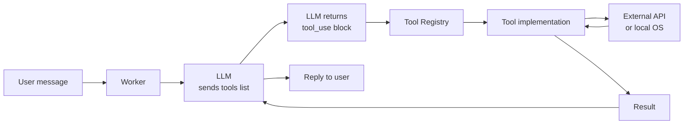

# Bruce Tools

Tools give the LLM the ability to take actions — read files, call APIs, run shell commands, and interact with external services. Bruce routes tool calls from the LLM through a typed registry, executes them, and logs every invocation with latency and success status before feeding results back into the conversation.

## How Bruce invokes tools

The diagram below shows the full path from a user message to a tool result.



## Tool execution logging

Every tool call is recorded in the `tool_executions` table in SQLite. Each row stores the tool name, session ID, input parameters, output, latency in milliseconds, and a success flag. Secrets (API keys, tokens, Authorization headers) are scrubbed before writing. You can view recent executions in the **Logs** tab of the web UI.

## Tool index

| Tool | Sub-tools | Auth method | Config key | Doc |
|---|---|---|---|---|
| **Gmail** | `email_read`, `email_search`, `email_send` | Google OAuth 2.0 | `tools.gmail` | [google.md](google.md) |
| **Calendar** | `calendar_read`, `calendar_create` | Google OAuth 2.0 | `tools.calendar` | [google.md](google.md) |
| **Google Docs** | `docs_read`, `docs_create`, `docs_append` | Google OAuth 2.0 | `tools.docs` | [google.md](google.md) |
| **GitHub** | `github_list_branches`, `github_list_issues`, `github_list_prs`, `github_create_issue` | Personal Access Token | `tools.github` | [github.md](github.md) |
| **Trello** | `trello_board_list`, `trello_card_create`, `trello_card_move`, `trello_card_get` | API key + token | `tools.trello` | [trello.md](trello.md) |
| **Notion** | `notion_read`, `notion_create`, `notion_update` | Integration token | `tools.notion` | [notion.md](notion.md) |
| **n8n** | `n8n_webhook_call`, `n8n_api_trigger`, MCP dynamic tools | Webhook auth / API key / Bearer | `tools.n8n` | [n8n.md](n8n.md) |
| **Bash** | `bash_exec` | None (OS-level) | `tools.bash` | [bash.md](bash.md) |
| **Files** | `file_read`, `file_write` | None (OS-level) | `tools.files` | [files.md](files.md) |
| **Git (local)** | `git_status`, `git_commit`, `git_push`, `git_branch` | SSH / credential helper | `tools.git_local` | [git_local.md](git_local.md) |
| **HTTP client** | `http_request` | Per-request headers | `tools.http_client` | [http_client.md](http_client.md) |

## Enabling a tool

All tools are disabled by default except `http_client`. Flip `enabled: true` for the tool you want:

```yaml
tools:
  github:
    enabled: true
    token: "ghp_..."
    default_owner: "myorg"
    default_repo: "myrepo"
```

Restart Bruce after changing `config.yml`. Tools that require external credentials (Google, Notion, Trello, GitHub, n8n) will fail to initialize if the required credential keys are empty, and a warning will be logged at startup.

## Further reading

- [Google (Gmail, Calendar, Docs)](google.md)
- [GitHub](github.md)
- [Trello](trello.md)
- [Notion](notion.md)
- [n8n](n8n.md)
- [Bash](bash.md)
- [Files](files.md)
- [Git (local)](git_local.md)
- [HTTP client](http_client.md)
