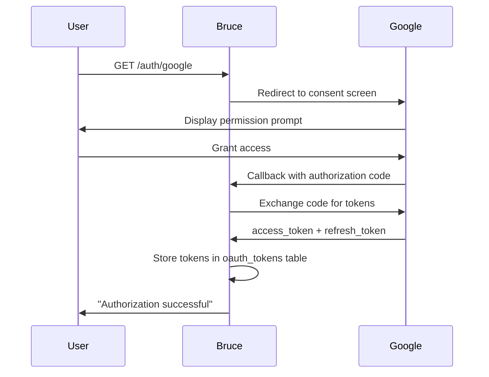

# Google Tools (Gmail, Calendar, Docs)

Three tools share a single Google OAuth 2.0 credential. Set up OAuth once in Google Cloud Console, then enable each tool independently in `config.yml`.

## Creating OAuth credentials

1. Go to [Google Cloud Console](https://console.cloud.google.com) and create a new project (or select an existing one).
2. Navigate to **APIs & Services → Library** and enable:
   - **Gmail API**
   - **Google Calendar API**
   - **Google Docs API**
3. Go to **APIs & Services → Credentials → Create Credentials → OAuth 2.0 Client ID**.
4. Choose **Web application** as the application type.
5. Under **Authorised redirect URIs**, add:
   ```text
   http://localhost:8080/auth/google/callback
   ```
6. Click **Create** and copy the **Client ID** and **Client Secret**.

## Config snippet

```yaml
google:
  oauth_client_id: "your-client-id.apps.googleusercontent.com"
  oauth_client_secret: "your-client-secret"
  oauth_redirect_uri: "http://localhost:8080/auth/google/callback"

tools:
  gmail:
    enabled: true
  calendar:
    enabled: true
  docs:
    enabled: true
```

## Authorizing Bruce

After setting credentials and restarting Bruce, visit the authorization URL once to grant access. The token is stored in SQLite and auto-refreshed from then on.

The diagram below shows the one-time authorization flow.



## Token refresh

Bruce calls `GetToken` before every Google API request. If the access token is expired, it is automatically refreshed using the stored refresh token and the updated token is persisted back to the `oauth_tokens` SQLite table. No manual re-authorization is required unless the user explicitly revokes access in their Google account.

---

## Gmail tools

Required OAuth scope: `https://mail.google.com/` (`gmail.modify`)

### Tool reference

| Tool | Description |
|---|---|
| `email_read` | Fetch a single email by message ID |
| `email_search` | Search emails using Gmail query syntax |
| `email_send` | Send an email |

**`email_read` parameters**

| Parameter | Type | Required | Description |
|---|---|---|---|
| `message_id` | string | Yes | Gmail message ID (e.g. from a search result) |

Returns: `subject`, `from`, `date`, `message_id`, `content` (plain text).

**`email_search` parameters**

| Parameter | Type | Required | Description |
|---|---|---|---|
| `query` | string | Yes | Gmail search query (e.g. `from:alice@example.com`) |
| `max_results` | number | No | Maximum results to return (default 10, max 100) |

Returns: array of message summaries with `message_id`, `subject`, `from`, `date`.

**`email_send` parameters**

| Parameter | Type | Required | Description |
|---|---|---|---|
| `to` | array of strings | Yes | Recipient email addresses |
| `cc` | array of strings | No | CC addresses |
| `bcc` | array of strings | No | BCC addresses |
| `subject` | string | Yes | Email subject line |
| `body` | string | Yes | Plain-text message body |

Returns: `{"message_id": "...", "status": "sent"}`.

### Example prompts

- "Read my last 5 emails from alice@example.com"
- "Search my email for invoices from last month"
- "Send an email to bob@example.com with subject 'Meeting notes'"

### Limitations

- Search returns a maximum of 100 results.
- Email body is plain text only — HTML emails are converted to text.
- Attachments are not supported (read or send).

---

## Calendar tools

Required OAuth scope: `https://www.googleapis.com/auth/calendar`

### Tool reference

| Tool | Description |
|---|---|
| `calendar_read` | List events in a date range |
| `calendar_create` | Create a new event |

**`calendar_read` parameters**

| Parameter | Type | Required | Description |
|---|---|---|---|
| `start_date` | string (RFC3339) | Yes | Range start, e.g. `2026-03-01T00:00:00Z` |
| `end_date` | string (RFC3339) | Yes | Range end |
| `calendar_id` | string | No | Calendar to query (defaults to `"primary"`) |

Returns: array of event objects with `id`, `title`, `start`, `end`, `description`, `attendees`.

**`calendar_create` parameters**

| Parameter | Type | Required | Description |
|---|---|---|---|
| `title` | string | Yes | Event title |
| `start_time` | string (RFC3339) | Yes | Event start time |
| `end_time` | string (RFC3339) | Yes | Event end time |
| `description` | string | No | Event description |
| `attendees` | array of strings | No | Attendee email addresses |
| `calendar_id` | string | No | Target calendar (defaults to `"primary"`) |

Returns: `{"event_id": "...", "status": "created"}`.

### Example prompts

- "What's on my calendar this week?"
- "Schedule a team sync tomorrow at 2 PM for 1 hour"
- "List all events between March 1 and March 31"

### Limitations

- Reads and writes the primary calendar by default; other calendars require specifying `calendar_id`.
- No support for recurring events.
- Adding attendees does not send invite emails — they are listed on the event but not notified.

---

## Google Docs tools

Required OAuth scope: `https://www.googleapis.com/auth/documents`

### Tool reference

| Tool | Description |
|---|---|
| `docs_read` | Read the text content of a document |
| `docs_create` | Create a new document |
| `docs_append` | Append text to an existing document |

**`docs_read` parameters**

| Parameter | Type | Required | Description |
|---|---|---|---|
| `document_id` | string | Yes | Google Docs document ID (from the URL) |

Returns: `document_id`, `title`, `content` (plain text), `last_modified`, `owner_email`, `url`.

**`docs_create` parameters**

| Parameter | Type | Required | Description |
|---|---|---|---|
| `title` | string | Yes | Document title |
| `content` | string | No | Initial text content (markdown accepted) |

Returns: `document_id`, `title`, `url`, `created_at`.

**`docs_append` parameters**

| Parameter | Type | Required | Description |
|---|---|---|---|
| `document_id` | string | Yes | Target document ID |
| `text` | string | Yes | Text to append |

Returns: `document_id`, `content_length`.

### Finding a document ID

The document ID is the long alphanumeric string in the Google Docs URL:

```text
https://docs.google.com/document/d/DOCUMENT_ID_HERE/edit
```

### Example prompts

- "Read the doc at ID `1BxiMVs0XRA5nFMdKvBdBZjgmUUqptlbs74OgVE2upms`"
- "Create a new doc called 'Sprint Notes' with a brief intro"
- "Append a summary paragraph to my weekly report doc"

### Limitations

- Text content only — no images, tables, or formatting are preserved on read.
- No support for Google Sheets or Google Slides.
- `docs_append` inserts text at the end of the document body.

---

## Troubleshooting

| Symptom | Cause | Fix |
|---|---|---|
| `redirect_uri_mismatch` error from Google | Redirect URI in Cloud Console does not exactly match config | Ensure `oauth_redirect_uri` in `config.yml` matches the URI registered in Cloud Console, including protocol and port |
| `invalid_client` on callback | Wrong client ID or secret | Re-copy credentials from Cloud Console; check for leading/trailing spaces |
| `insufficient_scope` on API call | OAuth consent was granted before the tool was enabled | Revoke Bruce's access in Google Account settings, then re-authorize via `/auth/google` |
| 401 on Gmail/Calendar/Docs call | Token revoked externally | Visit `http://localhost:8080/auth/google` to re-authorize |
| API not enabled error | Gmail/Calendar/Docs API not enabled in Cloud Console | Enable the relevant API in **APIs & Services → Library** |
| `access_denied` during consent | App not verified or test user not added | Add the authorizing Google account as a test user in **OAuth consent screen → Test users** |
