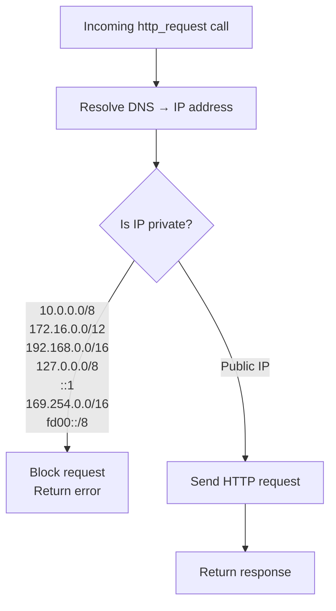

# HTTP Client Tool

Make outbound HTTP requests to external APIs. The HTTP client is the only tool **enabled by default**. SSRF protection blocks requests to private networks unless explicitly overridden.

## Config snippet

```yaml
tools:
  http_client:
    enabled: true
    max_timeout_seconds: 120
    max_response_bytes: 524288    # 512 KB
    follow_redirects: false
    allow_private_networks: false  # blocks RFC 1918 + loopback + link-local
```

## SSRF protection

Before sending any request, Bruce resolves the target hostname to an IP address and checks it against the private network ranges below. If the IP falls within any of these ranges, the request is blocked.

The diagram below shows the decision path.



Set `allow_private_networks: true` to disable this check. This is useful when Bruce needs to call internal APIs in a private network environment (e.g. local microservices, intranet endpoints).

## Tool reference

**`http_request` parameters**

| Parameter | Type | Required | Description |
|---|---|---|---|
| `method` | string | Yes | `GET` \| `POST` \| `PUT` \| `PATCH` \| `DELETE` |
| `url` | string | Yes | Full URL including scheme (e.g. `https://api.example.com/v1/data`) |
| `headers` | object | No | Key-value map of request headers |
| `body` | string | No | Request body (for POST/PUT/PATCH) |
| `timeout_seconds` | integer | No | Request timeout (default 30; capped at `max_timeout_seconds`) |

**Tool output**

| Field | Type | Description |
|---|---|---|
| `status_code` | integer | HTTP response status code |
| `body` | string | Response body (may be truncated) |
| `headers` | object | Response headers |
| `latency_ms` | integer | Round-trip time in milliseconds |
| `truncated` | boolean | `true` if response body exceeded `max_response_bytes` |

Note: The `Authorization` header is scrubbed from tool execution logs — it is sent with the request but not stored.

## Example prompts

- "Fetch the current BTC price from the CoinGecko API"
- "POST this JSON payload to my webhook: `{\"event\": \"deploy\"}`"
- "Make a GET request to https://api.github.com/repos/owner/repo and show me the JSON"

## Limitations

- No streaming — the full response is buffered before being returned.
- Response body is truncated at `max_response_bytes` (default 512 KB) with `truncated: true`.
- Redirects are not followed by default (`follow_redirects: false`). Enable with `follow_redirects: true` if needed.
- Binary responses (images, PDFs, ZIP files) are not decoded — the raw bytes are returned as a string, which may be garbled.

## Troubleshooting

| Symptom | Cause | Fix |
|---|---|---|
| "request blocked: target resolves to private network" | SSRF protection blocked a private IP | Set `allow_private_networks: true` if calling internal services (understand the security implications) |
| Request times out | Target is slow or `timeout_seconds` too low | Increase `timeout_seconds` up to `max_timeout_seconds`; check network connectivity to the target |
| TLS certificate error | Self-signed or expired certificate on target | This is expected behavior — Bruce does not skip TLS verification; use a valid certificate on the target |
| Response truncated | Response exceeds `max_response_bytes` | Increase `max_response_bytes` in `config.yml` (e.g. to `1048576` for 1 MB) |
| 301/302 not followed | Redirect following is disabled by default | Set `follow_redirects: true` in `config.yml` |
