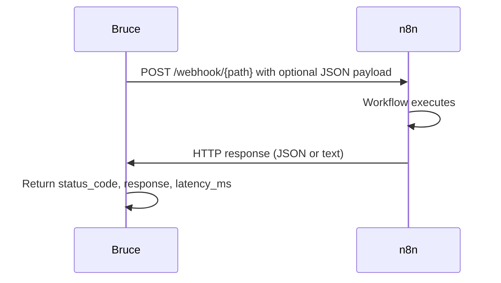
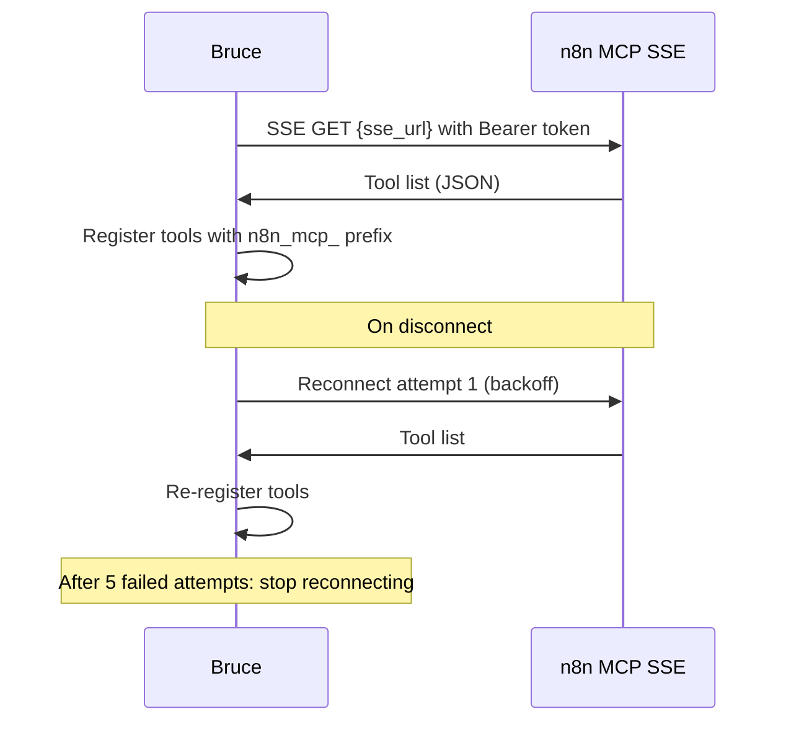

# n8n Tools

Bruce integrates with n8n in three modes: **webhook calls** (fire-and-forget or request-response), **API workflow triggers** (start a workflow by ID), and **MCP dynamic tool discovery** (Bruce discovers tools exposed by n8n MCP Server Trigger nodes at startup).

## Prerequisites

- A running n8n instance (self-hosted or n8n cloud).
- n8n version ≥ 1.x is required for MCP SSE support.
- Bruce must be able to reach the n8n instance over the network.

## Full config snippet

```yaml
tools:
  n8n:
    enabled: true
    base_url: "https://your-n8n.example.com"
    webhook_timeout_seconds: 30
    webhook_auth:
      method: "none"           # none | basic | header
      username: ""             # for method: basic
      password: ""             # for method: basic
      header_name: ""          # for method: header
      header_value: ""         # for method: header
    api_key: "your-api-key"
    mcp:
      enabled: false
      sse_url: "https://your-n8n.example.com/mcp"
      bearer_token: "your-mcp-token"
      tool_name_prefix: "n8n_mcp_"
      max_reconnect_attempts: 5
```

---

## Webhook tool

### What it does

`n8n_webhook_call` sends an HTTP POST to a **Webhook Trigger** node in n8n. It can wait for a response (request-response mode) or fire-and-forget. The full webhook URL is constructed as `{base_url}/webhook/{webhook_path}`.

The diagram below shows the request-response flow.



### Webhook authentication options

| Method | Config keys | Description |
|---|---|---|
| `none` | — | No authentication header sent |
| `basic` | `username`, `password` | HTTP Basic Auth (`Authorization: Basic ...`) |
| `header` | `header_name`, `header_value` | Custom header (e.g. `X-Webhook-Secret`) |

### Tool reference

**`n8n_webhook_call` parameters**

| Parameter | Type | Required | Description |
|---|---|---|---|
| `webhook_path` | string | Yes | Webhook path segment, e.g. `"my-workflow"` → `POST /webhook/my-workflow` |
| `payload` | object | No | JSON object sent as the request body |
| `timeout_seconds` | integer | No | Request timeout (defaults to `webhook_timeout_seconds`; max 120) |

Returns: `status_code`, `response` (parsed JSON or raw text), `raw_response`, `latency_ms`.

### Config snippet for webhook auth

```yaml
tools:
  n8n:
    enabled: true
    base_url: "https://your-n8n.example.com"
    webhook_auth:
      method: "header"
      header_name: "X-Webhook-Secret"
      header_value: "your-secret-here"
```

### SSRF note

The `base_url` must be reachable from the host running Bruce. If Bruce and n8n run in the same Docker network, use the container service name (e.g. `http://n8n:5678`).

---

## API trigger tool

### What it does

`n8n_api_trigger` starts a workflow by its ID via the n8n REST API (`POST /api/v1/workflows/{id}/run`). This is a fire-and-forget call — Bruce receives an execution ID but does not wait for the workflow to complete.

### Getting an API key

In n8n, go to **Settings → API → Create new API key**. Copy the key and add it to `config.yml`:

```yaml
tools:
  n8n:
    api_key: "your-api-key-here"
```

### Finding a workflow ID

- Open n8n and navigate to the **Workflows** list.
- Click on the workflow — the ID is in the URL: `.../workflow/WORKFLOW_ID`.
- Alternatively, use the n8n API: `GET /api/v1/workflows`.

### Tool reference

**`n8n_api_trigger` parameters**

| Parameter | Type | Required | Description |
|---|---|---|---|
| `workflow_id` | string | Yes | n8n workflow ID to trigger |
| `data` | object | No | Input data passed to the workflow's trigger node |

Returns: `execution_id`, `workflow_id`, `queued_at`.

---

## MCP dynamic tools

### What it does

When `mcp.enabled` is `true`, Bruce connects to an n8n **MCP Server Trigger** node via SSE at startup. The tool list returned by that endpoint is parsed and each tool is registered in Bruce's tool registry with the configured prefix (default `n8n_mcp_`). Special characters in tool names are replaced with underscores.

If the SSE connection drops, Bruce reconnects with exponential backoff, up to `max_reconnect_attempts` times (default 5). After the cap is reached, MCP tools are unregistered until the next Bruce restart.

The diagram below shows startup discovery and the reconnect behavior.



### Config snippet

```yaml
tools:
  n8n:
    enabled: true
    base_url: "https://your-n8n.example.com"
    mcp:
      enabled: true
      sse_url: "https://your-n8n.example.com/mcp"
      bearer_token: "your-mcp-bearer-token"
      tool_name_prefix: "n8n_mcp_"
      max_reconnect_attempts: 5
```

---

## Example prompts

- "Call the n8n webhook for my Slack notification workflow"
- "Trigger n8n workflow 42 with data `{\"env\": \"production\"}`"
- "Use the n8n_mcp_send_report tool to send this week's report"

## Limitations

- `n8n_api_trigger` is fire-and-forget — Bruce does not receive the workflow output.
- Webhook response must be JSON or plain text; binary responses are not handled.
- No streaming support for webhooks.
- MCP reconnect stops after `max_reconnect_attempts` — Bruce must be restarted to resume MCP tools after permanent SSE failure.

## Troubleshooting

| Symptom | Cause | Fix |
|---|---|---|
| SSE connection drops repeatedly | n8n MCP Server Trigger node not active | Activate the n8n workflow containing the MCP Server Trigger node |
| 401 on webhook call | Webhook auth misconfigured | Check `webhook_auth.method`, `header_name`, and `header_value` match the n8n Webhook node settings |
| "workflow not found" from API trigger | Incorrect workflow ID or API key lacks access | Verify the workflow ID in the n8n URL and that the API key has workflow execute permissions |
| MCP tools not appearing | `mcp.enabled` is false or `sse_url` unreachable | Set `mcp.enabled: true` and confirm Bruce can reach the SSE URL; check logs at startup for connection errors |
| Tool names with spaces not found | Tool name sanitization | n8n tool names with special characters become underscores — use the sanitized name in prompts |
